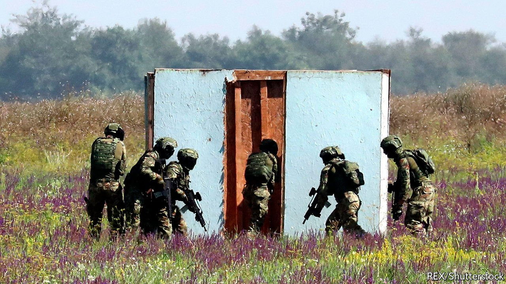
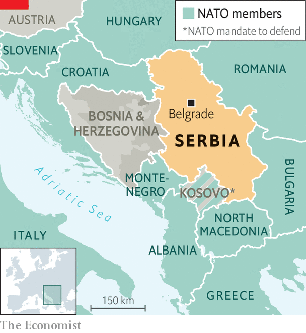

###### A Balkans arms race

# Serbia is on a shopping spree for weapons 

##### And its neighbours don’t like it 

 

> Oct 30th 2021 

“COME WITH me,” says Aleksandar Vucic, Serbia’s president. “Now you are going to see a smile on my face!” From the terrace of Belgrade’s presidency building he points at skyscrapers shooting up and declares triumphantly: “Like a phoenix rising from the ashes!”

Other former Yugoslav states worry that Serbia’s army is also rising from the ashes. During a petty dispute with Kosovo about car number-plates in September, Serbia flew warplanes close to the border and deployed armoured vehicles to cow its smaller neighbour.


Between 2015 and 2021 Serbia’s defence spending jumped by some 70% to $1.4bn a year. Russia and Belarus have given it ten MiG-29 jets. Russia has given it 30 tanks and armoured personnel-carriers and sold it an air-defence system. It has bought Chinese armoured drones, Russian helicopters and a French surface-to-air missile system. This month the defence minister announced that Serbia was negotiating to buy transport planes and helicopters from Airbus. Last month came news that it was talking to Israel about anti-tank missiles. Turkish drones, which were used to devastating effect in last year’s defeat of Armenian forces in Nagorno-Karabakh by Azerbaijan, may be on the shopping list. Serbia’s own defence industry is also producing new kit, as opposed to just churning out more Yugoslav-era stuff.

After the Yugoslav wars of the 1990s Serbia’s military capacity decayed. But in 2014 the government decided to rearm. Russia’s intervention in Ukraine showed that the era of conventional warfare in Europe was not over; and floods in Serbia that year were a “wake-up call”, says Daniel Sunter of the Balkan Security Network, a think-tank. They revealed that the country had barely any helicopters for search-and-rescue missions. In 2015 Croatia, also restoring its armed forces, asked America to supply it with rockets which, if fired at Serbia, could reach deep inside the country.

A modern state needs a modern army, says Mr Vucic. Serbia spends more in absolute terms than before, but its defence spending as a share of GDP has hovered around 2% since 2005. Compared with Bulgaria, Hungary or Romania, that is “peanuts”, says Mr Vucic. But Serbs were not at war with Bulgaria, Hungary or Romania in the 1990s. They were at war with neighbours that now have smaller military budgets. Serbia outspends Albania, Bosnia, Montenegro, Kosovo and North Macedonia combined. It also outspends Croatia, which is buying French jets to restore its almost non-existent air capacity.

If Serbia were merely modernising its armed forces no one would mind. It is the context that sets off alarms. Bosnia is in political turmoil again, and Milorad Dodik, the Bosnian Serb leader, suggested on October 14th that if his part of Bosnia seceded and violence were to follow, Russia would step in to defend it. Serbia’s government-controlled tabloids constantly proclaim that war with the Kosovo Albanians or the Croats is imminent. In October, following a clash between Kosovo Serbs and the Kosovo police, Serbia’s imaginative tabloids linked the presence of British Gurkha troops to the violence.

At the same time nationalists, including Serbia’s minister of the interior, talk about the creation of a “Serbian World”, which many in Kosovo, Montenegro and Bosnia fear is code for a Greater Serbia that might swallow them up. Mr Vucic dismisses that as “propaganda”. He says that all the neighbours know that rearmament is “not against them”.

 


Vuk Vuksanovic, a researcher at the Belgrade Centre for Security Policy, says that the real significance of the country’s rearming is political rather than military. Showy arms deals impress Mr Vucic’s supporters, who tend to hold the armed forces in high esteem.

But Serbia is effectively surrounded by NATO (see map). With a big alliance shielding its small neighbours, Serbia is highly unlikely to send its soldiers into action in the forseeable future. Indeed, Serbia has excellent (if discreet) relations with NATO, and America trains Serbian troops. Having a strong army means that big powers treat you with respect, says Mr Vuksanovic. And if, “God forbid”, the regional status quo were to break down, then “if we can inflict damage on our hypothetical opponents, they will perhaps be more accommodating with us at the negotiating table.” ■

