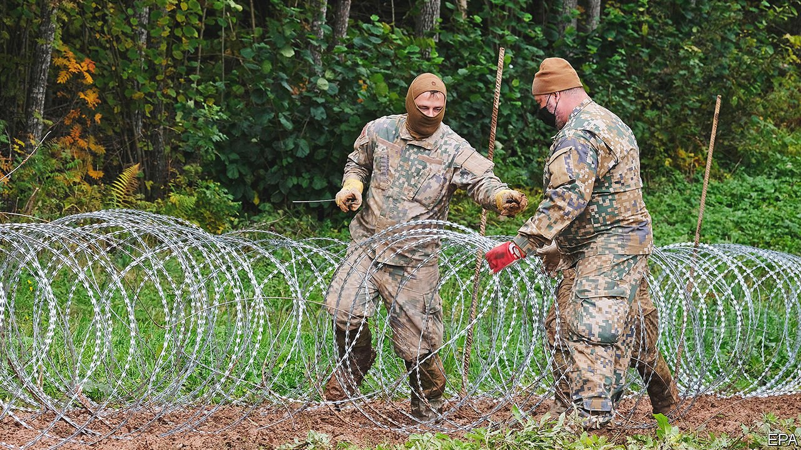

###### Wire transfer

# The EU is being asked to pay for border fences to keep migrants out 

##### It is reluctant, but may have to comply 

 

> Oct 30th 2021 

THE EUROPEAN UNION has a firm stance on paying for border walls: it won’t. Even after Europe’s migration crisis in 2015-16, when 1.4m people arrived, many fleeing Syria’s civil war, the European Commission sent Hungary away with a flea in its national ear when it asked for reimbursement for fencing off its border with Serbia, one of the main entry points.

Nothing in the Schengen Borders Code, which governs border management, a shared responsibility between the EU and its member states, stops the commission from paying for fences. But the view in Brussels is that they are costly and ineffective. They can be climbed. They divert rather than deter migrants. And they get in the way of genuine refugees with the right to asylum. The EU sends border guards and pays for higher-tech solutions instead.


But the commission is now being urged to change its mind. This comes as the number of first-time asylum-seekers this spring has almost doubled compared with 2020 (when covid-19 made moving hard). Meanwhile, Belarus is mischievously trying to herd Iraqi asylum-seekers into Lithuania, Latvia and Poland, perhaps in retaliation for EU sanctions on its election-rigging government. And many Europeans expect a lot of Afghans to arrive soon. This month 12 member states wrote to the commission requesting changes in how the EU tackles border security. Among other things, they want Brussels to pay for fences. A physical barrier “serves the interest of [the] whole EU, not just member states of first arrival”, it argues. Such things, it says, should be “adequately funded from the EU budget as a matter of priority”.

The group, which includes Hungary, Latvia, Austria, Poland and Greece, was led by Lithuania, which wants EU taxpayers to cover 75% of the €152m ($176m) it will spend on a three-metre-high fence on its border with Belarus. The project is scheduled for completion next September. This summer Politico reported that both Lithuania and Greece had asked for funding for their own barriers. Greece wanted help to pay for a €60m extension of its fence along its north-eastern border with Turkey. This is a pre-emptive move, in case those Afghans arrive, and a “necessity” for border protection, said a Greek spokesman.

The commission has not formally responded. But last week its president, Ursula von der Leyen, seemingly rebuffed the request at a summit of EU leaders in Brussels. “There will be no funding for barbed wire and walls,” she reportedly told the leaders. But some observers think that could change if enough member states continue to push hard.

The commission is already taking a tougher approach to migration. The EU’s joint border force, Frontex, is getting more money and people; and the commission has also proposed creating a union-wide deportation co-ordinator, though squabbling over which EU countries should take how many asylum-seekers has held this up. The EU’s commissioner for home affairs, Ylva Johansson of Sweden, has praised fencing as a tactic to slow migration. On a recent visit to Lithuania, she called the country’s fence a “good idea”. EU Commissioners have learned from the migrant crisis of 2015-16 that taking in lots of asylum-seekers comes with a political cost, says Roderick Parkes, of the German Council on Foreign Relations, a Berlin-based think tank. Building a wall doesn’t.

European countries have built about 1,000km (600 miles) of border fencing over the past 30 years, the bulk of it since 2015. Today, more than half of all EU states have some physical barrier at an external border. As fencing becomes more normal, it will be harder for the commission to refuse to fund it, Mr Parkes says. Member states will argue that physical barriers are now part of the routine border protection that the EU shares a responsibility to fund. And even if the EU won’t pay up, some states have found ways to build fences without springing all the costs on their own taxpayers. Lithuania, for example, won’t be paying for its barrier alone. The Czech Republic has already committed to send the country €530,000 to speed up the work. ■

