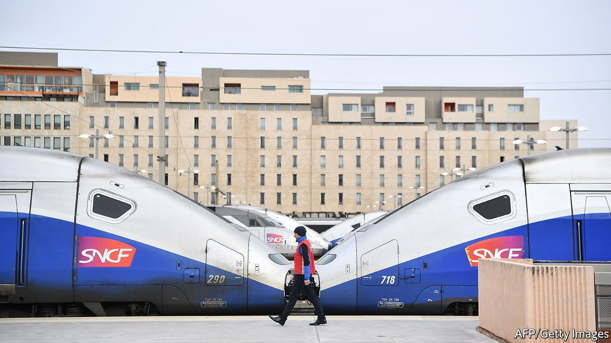

###### PFUE? LOL

# The strange French addiction to acronyms 

##### Why make things simple when they can be complicated, then shortened? 

 

> Oct 30th 2021 

FRENCH OFFICIALDOM is abuzz with preparations for the PFUE, which the MEAE and SGAE are organising for the PR in 2022. Lost? Spare a thought for the outsider who must daily navigate the French passion for acronyms and initialisms. All countries use them, but France has a particular penchant. The latest (PFUE) refers to the French Presidency of the European Union, which starts in January 2022 (and is in fact the presidency of the European Council). No matter. The abbreviation is already everywhere, and, as the opening sentence says, officials from the foreign ministry and a secretariat in the prime minister’s office are preparing this occasion for the president.

The preference of the French for abbreviations is so ingrained that they scarcely notice it. Britain may have its NHS, or America NASA. France has them for every part of life: transport (TGV, RER, SNCF), politics (PS, EELV, LREM, LFI, RN (formerly the FN) and LR), unions (CGT, CFDT), work (SMIC, CDD, CDI, CSE, RTT), the police (BRI, RAID), taxes (CSG, URSSAF, IFI). The principle seems simple: why use a word like budget when an abbreviation like PLF (projet de loi de finances) will do?


What is behind this zeal? Some date it to the organisation of the modern state in the late 19th century, when bodies such as unions (CGT) or the political movements that later joined together as the SFIO, the precursor to the Socialist Party (PS), emerged, and with them the complex names that deserved shortening. Perhaps it is also the result of the state’s tendency to bureaucratic complication; an acronym can simplify rather than confuse. So the Société Nationale des Chemins de fer Français (the national railway) becomes the less indigestible SNCF.

The fact that practitioners of such an elegant language infect it with such abominations has not gone unnoticed. The Académie Française, which polices such matters, recommends that when it comes to acronyms “moderation is a good thing and abuse dangerous.” Curiously, one of the few spheres in which the French leave prolix descriptions alone is food. No CDC for confit de canard, nor BDV for blanquette de veau.Organisational or bureaucratic life, it seems, is to be tolerated and shortened. Gastronomy can take its time.

