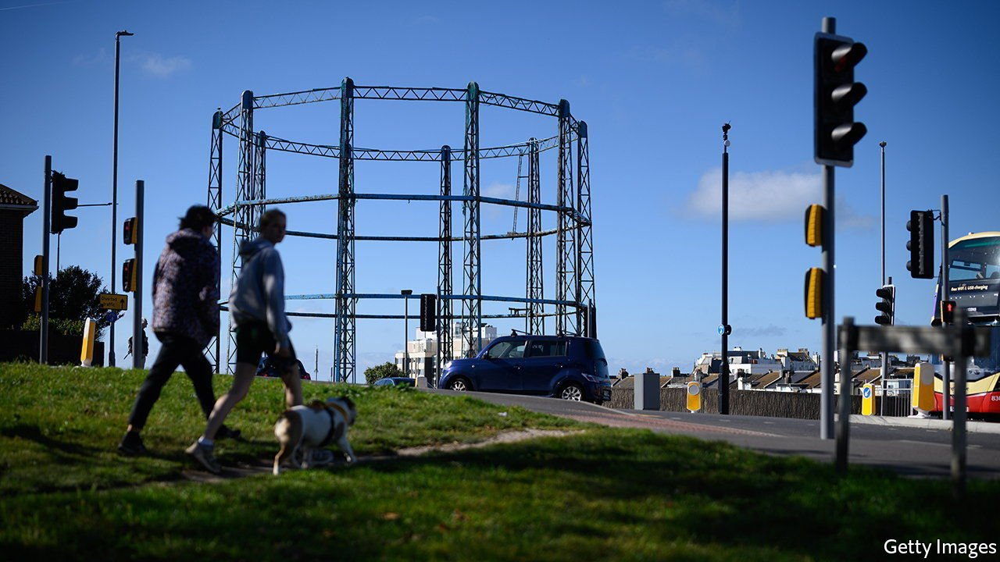
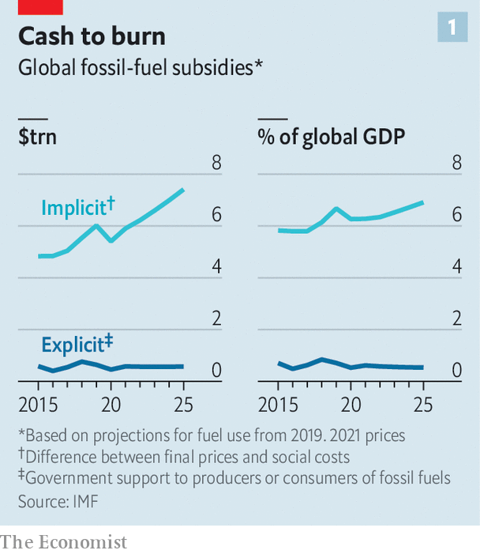
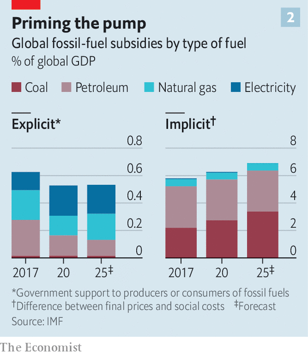

###### Perverse but persistent

# As energy prices spike, governments reach for the dirtiest tool in the box 

##### A new IMF study shows that fossil-fuel subsidies are a climate nightmare 

 

> Oct 30th 2021 

“THIS REFORM will increase our energy security...and it will help us combat the threat posed by climate change.” Those hopeful words were uttered by Barack Obama, then America’s president, at the end of a meeting of the G20 group of countries in Pittsburgh in 2009. The gathered leaders had agreed to phase out subsidies for fossil fuels, which, by encouraging the use of polluting fuels, tilt the playing field against cleaner alternatives. Twelve years later, however, fossil-fuel subsidies are still hanging on. And as a severe energy-supply crunch leads to soaring prices around the world, they are making something of a comeback.

Ministers from the European Union held an emergency meeting this week to discuss how to respond to the price spikes, but failed to agree on a plan. National politicians, however, are turning to subsidies and price caps. Italy is considering spending more than €5bn ($5.8bn, or 0.3% of GDP) this year and next to reduce the price of natural gas and power for consumers. France will extend its cap on household-gas prices until the end of next year.


Most people would agree that fossil-fuel subsidies should, in principle, be ditched. But no politician wants to expose voters to pain at home or at the petrol pump. Even before the energy crisis, the politics of subsidies were veering off track. BloombergNEF, a research outfit, and Bloomberg Philanthropies, a charity, calculate that G20 countries offered direct subsidies on coal, oil, gas and fossil-fuel-fired power worth more than $3.3trn between 2015 and 2019. Tim Gould of the International Energy Agency, an official body, notes that periods of lower energy prices offer governments a chance to reduce subsidies. The fact that they did not use the pandemic-induced drop in energy demand and prices last year to roll back subsidies, he says, was “a missed opportunity”. In July G20 ministers could not even agree on a date by which fossil-fuel subsidies would be phased out.

 


A new study from the IMF powerfully sets out both the scale of the subsidies and their impact. It estimates the effects of two types of support. Explicit subsidies, which include production-tax breaks for oil firms, create a wedge between the cost of supplying fuel and the price consumers pay at the pump. Yet governments are underpricing energy not only relative to supply costs, but also compared with social costs (such as the damage to health and the environment caused by fossil fuels). The researchers call this an implicit subsidy.

 


They estimate that explicit subsidies will amount to just under $600bn this year (or 0.6% of global GDP) but that implicit subsidies could be ten times that (see chart 1). Even if the value of explicit support remains constant as a share of global output, the boffins reckon that the damage from fossil fuels, especially coal, will worsen, and that the value of implicit subsidies will continue to rise (see chart 2).

If governments were to eliminate both explicit and implicit subsidies by 2025—admittedly, a huge if—then global emissions of carbon dioxide would fall by 36%, and global tax revenues would be higher by 3.8% of world GDP, compared with a scenario with no subsidy reform. Rather than a miserable world in which warming is 3°C above pre-industrial levels, the temperature rise would be kept “well below” 2°C and perhaps even on track towards 1.5°C, as the UN’s Paris climate accords intend. As the world’s leaders prepare to assemble in Glasgow for a climate summit, the hope is that these findings re-energise their efforts to tackle subsidy reform. ■

For more expert analysis of the biggest stories in economics, business and markets, , our weekly newsletter. For more coverage of climate change, register for The Climate Issue, our fortnightly , or visit our .

