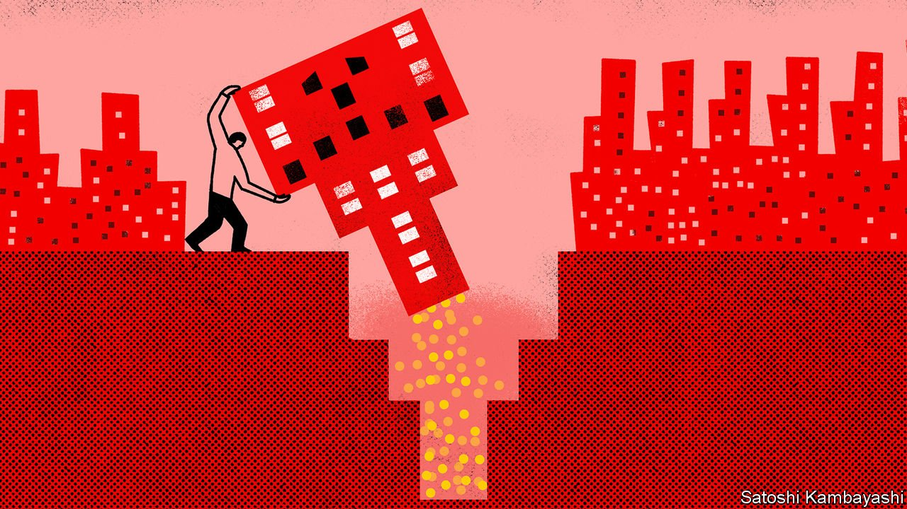

###### Progress and procrastination

# China’s long wait for a tax everyone loves to hate 

##### The government will at last roll out a property tax 

 

> Oct 30th 2021 

IF SUN YAT-SEN had got his way, China would have been a bold pioneer in the taxation of real estate. During his exile in Europe from 1896 to 1898, the republican revolutionary fell under the spell of Henry George, an influential American journalist who believed a single tax on land should replace all others. Sun hoped pre-industrial China could adopt such innovations more easily than the West, because it was “unimpeded by the opposition of entrenched capital”, as one scholar put it.

Instead China has become a timid procrastinator in the taxation of real estate, particularly of the property built on top of land, as opposed to the land itself. It first proposed a recurring tax on the value of property in 2003. And it introduced a half-baked pilot scheme in the cities of Shanghai and Chongqing in 2011. The tax was included in the five-year legislative plan of the National People’s Congress (NPC), China’s rubber-stamp parliament, in 2015. But things went no further. Reform, it seems, was impeded by the opposition of entrenched interests, including no doubt many officials who would prefer not to declare their properties, let alone pay taxes on them.


But in August Xi Jinping, China’s president, expressed support for a property tax as part of his campaign to curb excessive wealth and promote “common prosperity”. And on October 23rd the NPC said pilot schemes would be expanded to new cities (although it did not say when or which).

Such a tax is sorely needed. China raises little money from its personal-income taxes, which are too easily avoided. Indirect levies, such as the value-added tax, are more lucrative but regressive. Local governments in particular lack a stable source of revenue, which leaves them heavily reliant on land sales and transfers from the central government. Although China does impose a variety of property-related taxes (including one on the purchase of land), these levies fall more heavily on the construction and trading of real estate than on the possession of it. As China’s property market matures, and its economy moves beyond breakneck urban expansion, housebuilding and selling will provide fewer feathers to pluck.

The tax could also ameliorate some of the perversities of China’s economic model. About a fifth of its urban housing stood vacant in 2017, according to the China Household Finance Survey, led by Li Gan of Texas A&amp;M University. A property tax would make it more costly to buy second or third homes and keep them empty, in the hope of selling them on for a higher price. It could therefore discourage speculation and invigorate China’s underdeveloped rental market.

But a property tax will also be unpopular. It is the tax “everyone loves to hate”, as Jay Rosengard of Harvard University has put it. Such taxes are not discreetly withheld from a paycheque or embedded in a product’s price. Payments can be lumpy, conspicuous and irksome, especially if the taxpayer doubts that bureaucrats will spend the money well. As property prices have raced ahead of incomes, many homeowners may also be “asset-rich” but relatively “cash-poor”. In 2019, for example, a property tax of 1.2% would have eaten up over 10% of the average urban resident’s disposable income.

Some people also fear that the tax will crash the market. That seems unlikely. It will be some time before any revenue is actually collected. And the tax is not the only lever that policymakers can pull. China’s cities impose a variety of other impediments and deterrents to property purchases, including hefty downpayment requirements, limits on the purchase of additional flats, and rules that oblige buyers to show a history of local social-security contributions. If a property tax were to weigh too heavily on the market, these prudential limits could be eased.

The bigger danger is that the tax will do too little, not too much, to cool speculation. The Chongqing tax, which is levied chiefly on detached and high-end properties and exempts the first 100 square metres of space, depressed prices by 2.5% a year, relative to where they would have been, according to a study in 2015 by Zaichao Du and Lin Zhang of Southwestern University of Finance and Economics in Chengdu. But prices still rose on average. Shanghai’s tax had no effect on prices at all.

Progress and procrastination

To make them more palatable, the Chongqing and Shanghai pilot taxes were both patchy and complicated. The new pilot cities should try cleaner designs. Any flaws, kinks or ill-judged exemptions can be difficult to fix later. Indonesia, Mr Rosengard has pointed out, decided to keep its effective property tax at a meagre 0.1% while it collected better data on property ownership and values. Yet even after the data improved, it found it difficult to raise the rate. Britain’s property tax in the 1980s was based on increasingly anachronistic rental values. But the government was so reluctant to update them that it introduced a disastrous “poll” tax instead. Ontario in Canada spent 30 years talking about reforming its property tax, before eventually taking the plunge in 1998, as detailed by Richard Bird and Enid Slack of the University of Toronto.

Sun Yat-sen hoped that China’s late start in economic modernisation would help it avoid some of the mistakes of the countries that went before it. China’s later start in property taxation gives it plenty more examples to avoid. ■


