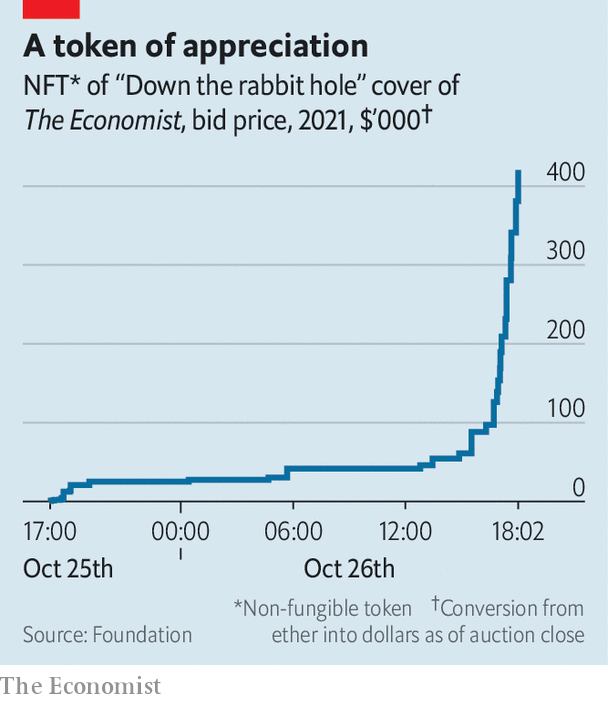

###### Alice’s adventures

# How our NFT auction went 

##### We raised around $420,000 for charity 

> Oct 30th 2021 

“DOWN THE rabbit hole”, were the words on our cover on decentralised finance in September. To illustrate it Justin Metz, a visual artist, looked to the first edition of “Alice in Wonderland” for inspiration. On 25th October we put a non-fungible token (NFT) of that cover up for sale. A little over a day later, after a late flurry of bids, it sold for 99.9 ether (around $420,000).

 


With “Down the rabbit hole” we sought to convey the dizzying sense of adventure and weirdness associated with the world of NFTs and blockchains. The winning bidder, who goes by the alias @9x9x9 and spends many hours a day trading NFTs, told us that the description was bang-on.


The proceeds of the sale, less fees, transaction costs and potential tax liabilities, will be donated to The Economist Educational Foundation, an independent charity that teaches young people to analyse current affairs. The Economist will retain a royalty stake of 10% of all future resales of the NFT, which will also be donated to the educational foundation.


