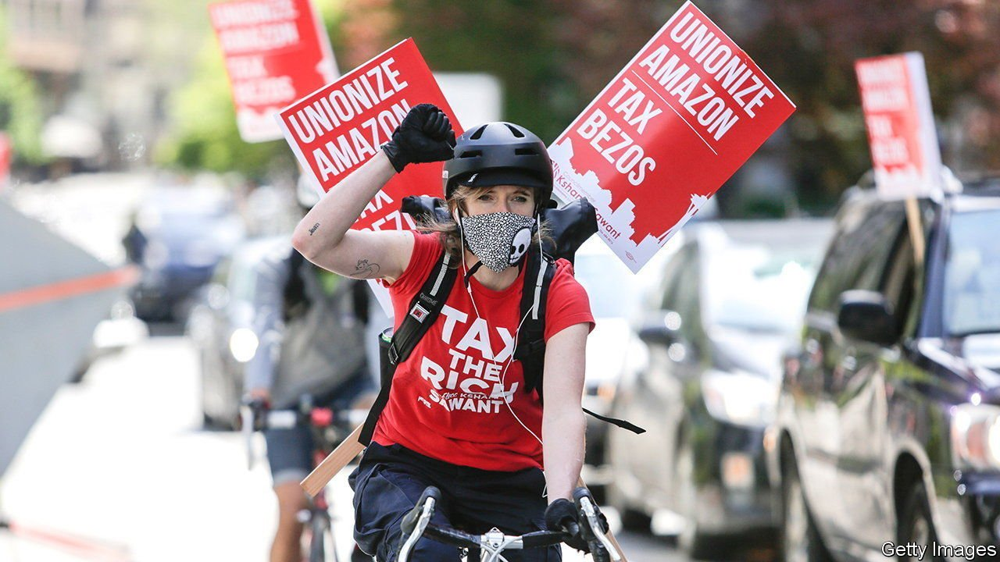

###### Corporate minimum tax

# The Democrats target companies with giant profits but tiny tax bills 

##### A minimum tax on corporate income seems alluring, but is likely to disappoint 

 

> Oct 30th 2021 

ON THE FACE of things, it seems both absurd and unfair that large American companies regularly whittle down their tax bills, taking advantage of every loophole on offer. One study found that at least 55 big companies incurred no federal taxes at all on their profits in 2020. A proposal being discussed as The Economist went to press, and as the Democratic Party scrambled to fund its social-spending package, seems to offer a popular solution: a minimum tax on corporate earnings as reported to shareholders, rather than as massaged down when reported to tax collectors.

The structure of the minimum tax looks simple enough. Companies that report more than $1bn in profits to shareholders would pay a tax of at least 15% on those profits. The levy would be explicitly aimed at firms such as Amazon, which had an effective federal income-tax rate of just 4.3% from 2018 to 2020, far below the statutory rate of 21%, according to the Institute on Taxation and Economic Policy, a left-leaning think-tank. All told, the new tax would apply to some 200 big companies.


Politically, the minimum corporate tax has much going for it. Angus King, an independent senator who is an architect of the proposal, believes it could raise $400bn over ten years. That would help fund the bill that is the cornerstone of President Joe Biden’s “Build Back Better” agenda, featuring about $2trn in spending over the next decade (equivalent to less than 1% of projected GDP during that time). The corporate minimum is also less controversial than another new levy the Democrats were rowing over, a tax on unrealised capital gains that would target 700 billionaires.

Democrats had hoped at first to rely on a general increase in the corporate-tax rate to raise revenues. But Kyrsten Sinema, a Democratic senator from Arizona whose support is needed for the bill to pass, opposed the wider increase and has instead backed the minimum tax as “commonsense”. The idea also has the approval of Joe Manchin, a Democratic senator from West Virginia, whose vote could prove decisive.

The economic rationale is, however, more dubious. Despite its apparently simple structure, it would introduce more complexity into an already bloated tax code. Companies would face two parallel systems, calculating their liabilities first under regular tax rules and then under the minimum-tax regime. An earlier version of a minimum corporate tax, repealed under President Donald Trump in 2017, was so onerous that in some years compliance costs outstripped tax collections.

The gap between taxable income and book income as reported to shareholders exists for a reason. When, say, a company builds a factory, financial rules require it to spread the cost over many years based on depreciation, letting investors know the value of its assets. Tax rules, however, let firms report costs when incurred. That lowers tax bills when investments are made and encourages more spending.

Calculating minimum taxes based on book, rather than taxable, income would lead to two perverse outcomes. First, powers over tax would, in effect, be granted to the Financial Accounting Standards Board, an unelected body that governs how companies report income. Changes in its standards would lead to changes in taxation.

Second, companies would have less scope for deducting investment expenses, and hence might pare back capital spending. Mr Biden, though, does not want that to happen, so the proposal maintains several deductions, including for spending on clean energy and on research and development—one of the provisions that may have allowed Amazon to lower its taxes.

Companies, for their part, will adapt. By turning more to debt instead of equity markets for financing, for instance, they could increase their interest expenses, which would eat into both their book and taxable incomes. The upshot is that the minimum corporate tax may end up raising far less revenue than its proponents believe, while also skewing investment incentives—and making a messy tax code even more complicated. ■


