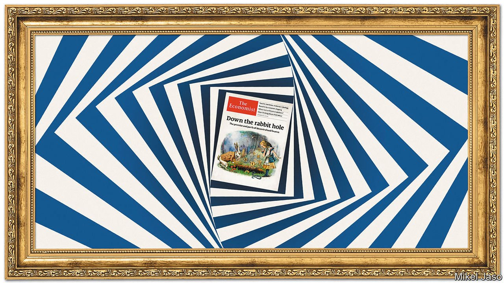
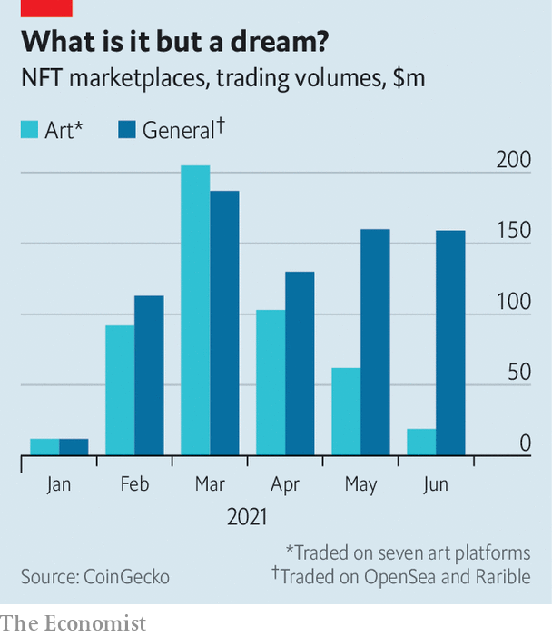

###### Through the looking glass

# The market for non-fungible tokens is evolving 

##### The Economist joins the fray by auctioning an NFT of our cover 

 

> Oct 30th 2021 

JOURNALISM IS ABOUT telling a story, rather than living it. Yet sometimes these two realities collide. When a new technology shows promise, trying it out can help tell the story. In September we wrote that non-fungible tokens (NFTs) and the crypto infrastructure they sit on could in time transform finance and the digital economy. Our cover image that accompanied the article, inspired by “Alice in Wonderland”, shows Alice tentatively peering over the edge of the rabbit hole, into this weird new world.

Now she is part of it. On October 25th The Economist , raising 99.9 ether (around $420,000) for charity. In addition to raising money for a good cause, the sale allowed us to grasp more fully the potential of the technology.


An NFT is a record, typically on the Ethereum blockchain, that represents a piece of digital media: an image, say, or some text, or a video. Invented in 2014, NFTs enjoyed a mini-boom in 2017 as “cryptokitties”, collectable images of digital cats, began selling for thousands of dollars. But the tokens grabbed the headlines in March this year when Christie’s, an auction house, sold an NFT of a work by Beeple, a digital artist, for $69.3m.

Today the total value of NFTs issued on the Ethereum blockchain is $14.3bn, according to DappRadar, a research company, up from around $340m last year. According to a poll conducted in March by Harris, a market-research firm, 11% of American adults say they have purchased an NFT (only a percentage point less than those investing in commodities). Analysts at Jefferies, an investment bank, expect the value of NFTs to double next year, and to approach $80bn by 2025. Furthermore, the tokens’ use is expanding beyond cats and collectables. In time, they could prove useful for all sorts of activities in both the digital and the real worlds.

NFTs are crypto-tokens, like bitcoin or other cryptocurrencies. Bitcoin, however, is fungible: one unit is worth the same as any other, much like a dollar bill or a print copy of the latest issue of The Economist. NFTs, like plane tickets and baseball cards, are not. The tokens store some data, often including the name of the NFT and a link to a digital image. Each token is unique and can be held only in a single online wallet. The image, however, can be viewed, copied or downloaded by anyone.

Curiouser and curiouser

Why would such a set-up exist? NFTs were invented by Anil Dash, an entrepreneur, and Kevin McCoy, an artist, to help convey that an item was a digital original. They offer proof that the holder owns that specific token, even if it does not give them copyright or exclusive use of that work. Even Mr Dash seems a little bemused by their popularity. “If you liked an artwork, would you pay more for it just because someone included its name in a spreadsheet? I probably wouldn’t,” he wrote in April. But, he added, “Putting artworks on the blockchain is like listing them in an auction catalogue. It adds a measure of certainty about the work being considered.” Being able to separate the artist’s original creation from mere copies does confer some value.

NFTs have other potentially useful features. Because they live on an open blockchain system, the history of transactions involving them can be viewed publicly. That makes it possible to code features into the contracts that govern how they are bought and sold. Digital artists can retain a stake in their work, entitling them to a share of the proceeds if the digital original goes on to be sold. This is something that small artists might struggle to enforce through conventional means.

In theory, an NFT could link to text including a legal contract that confers a specific type of property right or ownership. In practice, however, nothing is included. The property rights for art NFTs are instead typically set out by the specific platform used to issue them. Some make clear that the issuer of an NFT must have copyright over the work they are minting. The terms of Foundation, the platform that The Economist used, spell out that the buyer of an NFT has rights that resemble a licence to use an image in limited ways: they can publicly display and copy the NFT for personal use, for instance, but cannot use it for commercial purposes.

If I had a world of my own

Monthly NFT-trading volumes on designated art platforms, including Nifty Gateway and Foundation, reached $205m in March this year, with the sale of Beeple’s opus marking the height of the frenzy. The ardour for art has cooled since. But the wider market for NFTs is evolving. The idea of issuing a unique token that contains information, proves ownership and includes some ownership rights has taken hold for other uses. Secondary trading on OpenSea and Rarible, platforms that offer all sorts of NFTs, has been stable (see chart).

 


Many venture capitalists and developers are attempting to build a new kind of digital economy, in which everything you do online will be run through “decentralised” applications that can be owned and operated by their users. The distribution of all kinds of digital content, like pictures, videos and even articles, could eventually start to take place through something like today’s NFTs.

Something similar is already happening in gaming. Among the most valuable categories of tokens are those used in “Axie Infinity”, a game with 250,000 daily active users. Players collect, breed, battle and trade little creatures, which are digitised as NFTs, and earn other tokens, some of which give them a stake in how the game is developed. Dom Hofmann, a creator of Vine, a video-sharing app that has since shut down, is launching Supdrive, a video-game platform in which the games themselves are sold as NFTs. And some of the biggest types of NFTs are those used to trade virtual plots of land in immersive online worlds known as “metaverses”.

But the tokens could also be useful for activities conducted in the real world. Some universities are experimenting with using them to fund research. The University of California at Berkeley raised $50,000 by selling an NFT based on documents relating to Nobel-prizewinning research on cancer immunotherapy as a collectable item. It is planning another, similar auction. The country of San Marino has approved the use of tokens as digital covid-vaccine passports.

The fact that they signal proof of ownership could make NFTs useful for financial activities. Much as they make virtual-land transfers possible, they could become a way to exchange real-life property deeds, or other sorts of contracts. In June Michael Arrington, the founder of TechCrunch, a media company, sold a flat in Kyiv in this way (the platform listing the property got agreement from Ukraine’s government that the sale of the NFT would be registered as a transfer of a property deed). NFTs would also allow buyers and sellers to tap into a growing number of decentralised-financial applications that are based on blockchains and can make loans without the need for trusted intermediaries.

Like any new technology, NFTs have flaws. Technical limits when they were first created mean that they contain a link to the image, rather than the image itself. That can be a weakness: unscrupulous sellers have broken or changed links after a transaction. Blockchain technologies consume electricity wantonly; we estimate that our experiment created emissions similar to having a seat on a long-haul flight. And the identity of a buyer of an NFT, and the provenance of their funds, cannot always be known. Some solutions are in the works: a decentralised storage system, for instance, tries to fix the problem of broken links; some applications try to touch the blockchain as little as possible, generating fewer emissions. If the promise of the technology is to be realised fully, more innovation will be needed.

Time will tell, then, whether cryptokitties will prove to have been the start of a revolution in how people live their lives online. But our experiment suggests that the potential for a new kind of digital economy seems great enough, at least, to warrant closer examination. ■


