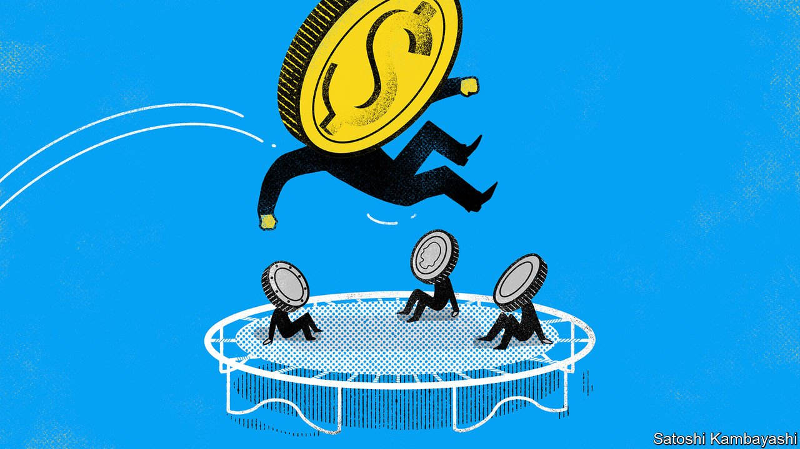

###### Buttonwood

# Why currency volatility could make a comeback 

##### A decade of low inflation and interest rates smothered forex markets. Now consumer prices and rates are going up 

 

> Oct 30th 2021 

FOREIGN-EXCHANGE markets were once a hotbed of lively, speculative activity. But today traders seeking an adrenalin fix must turn to assets like cryptocurrencies instead. Barring a brief surge early in the pandemic—and isolated goings-on in the Turkish lira—currency markets have gone quiet. Macro-trading funds no longer strike fear into central bankers and finance ministries with speculative attacks. The last sudden end to a major currency peg—that of the Swiss franc in 2015—was a result of the central bank taking investors by surprise, rather than the other way round.

Rock-bottom inflation and interest rates over the past decade helped smother swings in exchange rates. Deutsche Bank’s CVIX index, a gauge of forex volatility, has been above its current level more than 90% of the time over the past 20 years. By contrast, the VIX, which measures expected volatility for America’s S&amp;P 500 index of stocks and is often used as a measure of overall market sentiment, has so far spent October at roughly its long-term average. But as consumer prices and interest rates go up, currency volatility could well stage a return, with potentially unwelcome consequences for some investors.


The strangeness of the recovery from the pandemic makes predicting the path of policy especially hard. Yet some divergences seem likely to reassert themselves. Countries are recovering at different speeds, and central banks are displaying varying levels of discomfort with inflation. Policy in America is especially important, given the pivotal role of the dollar: 88% of over-the-counter foreign-exchange trades in 2019 involved the greenback, according to the Bank for International Settlements. The chances that the Federal Reserve turns more rapidly to policy tightening are rising. Break-evens (the gap between yields on inflation-protected Treasury bonds and conventional ones of the same maturity) point to annual inflation of around 3% over the next five years, the highest reading since at least 2003. By contrast, no one is expecting interest-rate rises for decades in Japan, where year-on-year inflation, excluding food and energy, is negative.

Long periods of low volatility are understandably regarded as a good thing by most investors. But they can have less desirable side-effects. Hyman Minsky, an economist, suggested that periods of financial stability and sustained profits can change the behaviour of market participants, by pushing them to adopt riskier strategies that could in turn destabilise markets. The danger is that, as currency markets return to life, the shortcomings of these sorts of strategies are exposed.

The boom in Asian economies in the 1990s, which led to enormous unhedged dollar borrowing by governments and firms, is a case study in how the perception of safety, once overturned, can cause violent market reactions. Faced with steep currency depreciation in 1997-98, that borrowing proved impossible to service, spurring defaults and bail-outs. Today emerging-market governments issue far more of their debt in their own currencies, and when they borrow in foreign currency, do so at longer maturities. Still, weak spots remain. Dollar borrowing by non-banks in the developing world has almost doubled to over $4trn in the past decade, much of it reflecting bond issuance by companies, rather than governments.

Creditors, too, are vulnerable to exchange-rate risk. Working out the extent to which asset-owners hedge their exposures is tricky. But the available figures indicate that falling volatility tends to cause companies to reduce hedging. Large Japanese insurers have tended to hedge more over the past two decades whenever volatility has risen, suggests Fed research published last year. Insurers bought far more currency forwards and swaps during and immediately after the global financial crisis, when volatility peaked, and a declining share relative to their foreign assets thereafter. Unhedged net foreign assets in Australia, too, have risen in the past couple of decades, in part reflecting the rise of non-bank borrowers that are unprotected.

An optimist might point to the market stress of the early days of the pandemic, when volatility surged without causing big currency-market blow-ups. If the system was able to weather acute distress then, why worry now? But placidity was restored in short order last year because central banks were unusually co-ordinated in their easing. Now, by contrast, they are preparing to go their separate ways. Currency markets may no longer be an oasis of calm.


