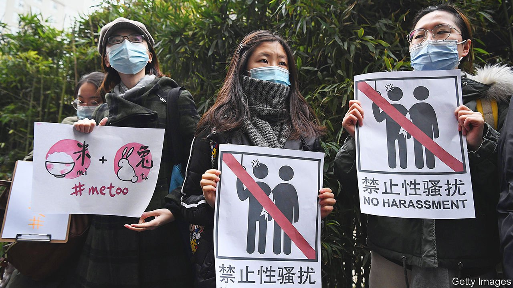

###### Clouds over the sky

# China says it defends women’s rights. So why attack feminists? 

##### If women are not allowed to organise, they will struggle to achieve equality 

 

> Oct 28th 2021 

“WE NEED TO strive for genuine gender equality.” So declared China’s leader, Xi Jinping, at the UN last year. It is a cause the Communist Party has long said it cares deeply about. Mao Zedong once proclaimed that “Women hold up half the sky.” And China’s women have indeed made progress. The World Economic Forum places their country below most of the rich world in terms of equality for women, but well above Japan and India.

However, since Mr Xi took power in 2012 China has fallen from 69th place on that list to 107th. He seems bent on making China more macho. In September his officials banned effeminate men from appearing on television. His Politburo Standing Committee is still all male. He stresses the role of women as wives and mothers. Most important, he has ruthlessly crushed feminist activism. To him, any organised movement is a potential catalyst for anti-party dissent.


. The party has taken steps to remedy a humdrum but non-trivial grievance: that there are not enough public toilets for women. In 2016 it decreed that, when building them, there should be at least three places where women can relieve themselves for every two for men. Mr Xi’s censors quickly expunge references to #MeToo, but since that campaign took off in the West in 2017 China has introduced new rules aimed at curbing sexual harassment and domestic violence.

Even so, the party does not want debate about sexual harassment in the workplace. It might implicate too many important men on the state’s payroll. The very term “sexual harassment” is often censored. The courts are hearing more cases, but they are often brought by the harassers, who accuse their victims of lying. The party gives free rein to online trolls vilifying women who have complained about their abuse.

Mr Xi uses Mao’s “half the sky” quotation, but—unlike Mao—praises Confucian values that emphasise women’s roles as carers. It was a relief to many women when he announced in 2015 that he was relaxing the one-child-per-couple policy. It had been a gross violation of women’s freedom to make their own reproductive choices, and often involved horrors such as forced abortions and sterilisations. But couples are not yet free to choose. Three children is the legal limit for most. Among ethnic-Uyghurs in Xinjiang, government efforts to curb population growth have grown even harsher.

As for women from China’s ethnic-Han majority, the government now frets that they are not having enough babies. The number of children, on average, a woman is expected to have has fallen to an ultra-low 1.3. So it is urging them to have more. But it is not doing much to help them with child care.

And it usually turns a blind eye when employers, worried about women taking maternity leave, avoid hiring or promoting them. In rich countries women have been joining the workforce in large numbers since the 1990s. In China they have been leaving it, notes the Peterson Institute for International Economics.

It is not the government’s business how many children a woman has. So it is fine if Chinese women ignore Mr Xi’s nagging and opt for small families, or not to marry at all. But it would be better still if their choices were unconstrained. That means not only getting rid of all rules on family size, but also preventing employers from discriminating against women who get pregnant, or are thought by managers to be likely to do so.

A society does not have to be democratic to reduce inequality between the sexes. Over the past 20 years China has achieved greater reductions in maternal mortality than most other countries at or below its level of development. It says that nearly as many girls as boys enroll in Chinese schools, and that women have founded more than half the country’s internet startups.

But the patriarchal values that authoritarian leaders foster make progress harder to achieve in areas where grassroots activism is needed. It took widespread participation by women in the #MeToo movement to shock the West out of its complacency about sexual harassment. It has required dogged campaigning, not least by women, to force governments and businesses to pay more attention to pay gaps between women and men.

For as long as civil society and a free press are seen as a threat to party rule, such pressure cannot play its proper part in China. That is a tragedy for Chinese women. ■

