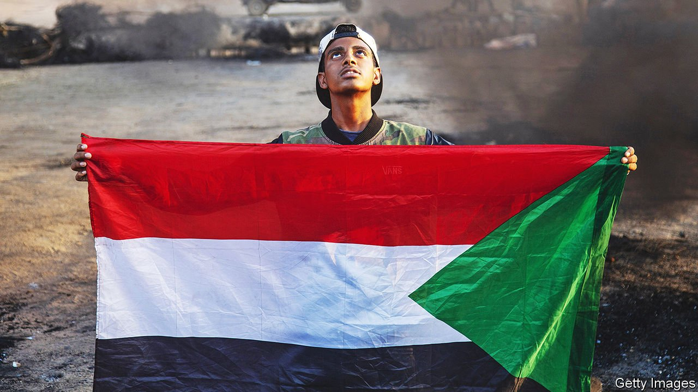

###### With a putsch and a shove

# The army’s takeover in Sudan highlights a worrying trend 

##### Jihadism and great-power competition are behind the rise in coups 

 

> Oct 28th 2021 

SUDAN’S PATH to democracy has always been strewn with landmines. The country became independent in 1956. That year, and again in 1964 and 1986, there were brief attempts at democratic rule. All were scotched by men with guns. In 2019, after 30 years of genocidal military dictatorship under Omar al-Bashir, hope flowered once more. Peaceful protests toppled the tyrant. Many Sudanese longed for the army to retire to barracks.

The army had other ideas. In April 2019 it seized power again. Weeks later, security forces gunned down protesters, killing more than 100 and tossing their bodies into the Nile. Demonstrators kept coming out into the streets, however, braving bullets and beatings. To end the crisis, mediators pressed the protest leaders to let the army stay in charge for almost two years in exchange for a promise that it would hand power to civilians and allow elections in 2022. On October 25th, as the handover approached, . Perhaps they were nervous of what future courts might say about their role in Sudan’s civil wars. Perhaps they just like being in charge. Either way, Sudan is in trouble.


The power-sharing deal, though squalid, was not always doomed to fail. It gave Sudan’s civilian politicians two years to build trust with the army by, say, offering amnesty for all but the most serious war crimes in exchange for full disclosure about them (an approach that worked in South Africa after apartheid). This opportunity was squandered.

Western donors could have smoothed Sudan’s transition with aid more quickly. Instead the economy kept contracting, fuelling a sense of crisis that the army exploited. Days before the coup, Western diplomats warned the generals to back off. That they did not shows how lightly they now take Western threats.

African coups are making a comeback. The past year has seen successful ones in Chad, Guinea and Mali (its second in less than a year), and failed ones in Madagascar and the Central African Republic. It is as bad as the early decades of independence, when Africa endured roughly four coups a year. The “no-coups policy” of the African Union (AU), which seemed more or less to work after it was adopted in 2000, now counts for little.

Two trends are making putsches more likely. One is the spread of jihadism. In 2012, when soldiers seized power in Mali, the AU swiftly suspended it. The Economic Community of West African States (ECOWAS), a regional bloc, imposed sanctions and America halted aid. But then jihadists overran the north of the country. Now the AU and ECOWAS appear to have an unofficial policy of publicly ticking the generals off but leaving them in place rather than risking instability. Unfortunately, unaccountable governments tend to govern badly, feeding the very grievances upon which jihadism thrives. By putting short-term stability before democracy, you often end up enjoying neither.

A second trend is the jockeying for influence in Africa by foreign powers. China has won friends with its policy of “non-interference”. Russia is gaining clout by hiring out mercenaries to guard presidents and to train their armies. If Western countries condemn a coup or a rigged election or threaten sanctions, they know that they will lose influence even as Chinese and Russian ambassadors race to the presidential palace with offers of support, aid and loans.

Balancing values and realpolitik is hard, but two principles can help. The first is to draw red lines and stick to them, making it clear that genocide, war crimes and gross abuses of human rights are intolerable and will be met with sanctions, even if that leads to a break in relations.

The second is to remember that Africans themselves, by a wide margin, want more democracy than they have now. The West should respect that desire. So should the neighbours of countries where putsches occur. If coup leaders are tolerated, there will be more coups. ■

