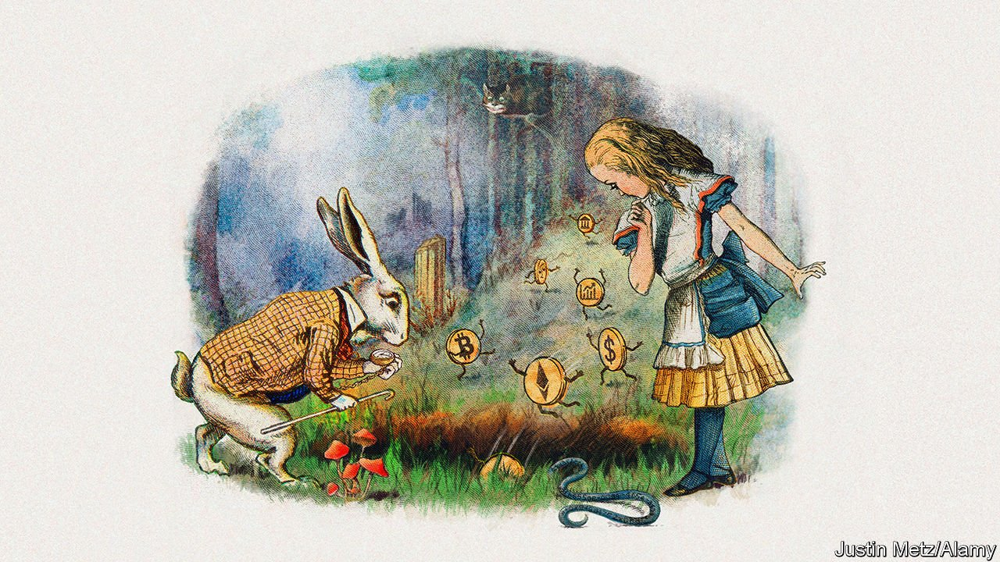
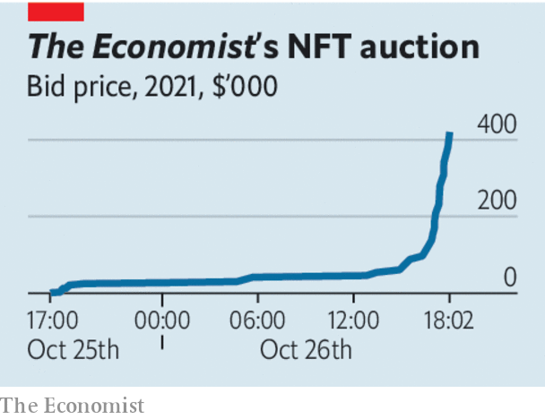

###### Our NFT auction

# The fun in non-fungible 

##### Our auction reveals the promise of decentralised finance—and some big problems 

 

> Oct 30th 2021 

IF NOTHING ELSE, our auction of an NFT was entertaining—and lucrative. Starting on Monday October 25th The Economist invited bids for a  of an image of our recent cover on decentralised finance. NFTs are a digital property deed that lives on a blockchain and can be bought on financial platforms using digital currencies. At one point, a club of would-be bidders formed a decentralised autonomous organisation, called “RabbitHoleDAO”, to try to crowd-source enough funds to buy our token. A scramble of bids forced the winner, who went by the alias @9x9x9, to make an offer of 99.9 ether—around $420,000. The proceeds, net of fees, taxes and transaction costs, will be donated to The Economist Educational Foundation, an independent charity we support.

Plenty of others are having fun, too. Pokémon-style NFTs are being bred by a quarter of a million users of Axie Infinity, a video game. Armies of art fans trade digital collectables. NFTs on the Ethereum blockchain are today worth $14bn, up from $340m in 2020. Jefferies, an investment bank, thinks the total will reach $80bn by 2025.


At this point you may well have a nagging doubt: what exactly do the owners of NFTs get? The best way of thinking about this is that NFTs are a way to unbundle property rights. Having legal title to a conventional asset typically confers a standard set of benefits. With a house, car or company stock, your title brings proof of ownership, the right to exclusive use, the ability to charge for its use by others and the right to receive the proceeds of a sale.

 


In high finance it is common, with the help of pricey lawyers, to slice and dice elements of these rights, as with a derivatives contract. But this kind of flexibility is not cheaply available to consumers and small firms. NFTs have the potential to change that. In our auction we defined the property rights using the default conditions on the platform. So the new owner of our NFT has rights akin to a licence: they can display the image in certain ways, but cannot commercialise it (by, for instance, selling T-shirts with the image on them). On behalf of the charity we support, we also have the ability to take a 10% cut of any future sale of the token. In theory an NFT sale can embody any combination of property rights designed by the seller. There are other advantages. A public, irrevocable record of the transaction exists on a blockchain and works with other digital applications.

Yet for all their conceptual promise, NFTs have three big practical flaws, as our experiment showed. Despite the slick interface of NFT platforms, the process is a nightmare. It includes setting up a digital wallet, funding it to pay any fees associated with creating an NFT, creating the token and finding a way to convert the proceeds into conventional money in a bank account. For most legal and tax advisers this is all virgin territory. The process is expensive: we paid “gas”, a fancy word for fees, and other levies. In order to become mainstream, applications in decentralised finance will have to be as easy to use as an iPhone and cheaper than dealing with conventional financial intermediaries.

The second problem is energy. Our modest experiment created as many emissions as a seat on a long-haul flight. Most platforms are exploring how to lower their energy use. If NFTs are to be the Next Big Thing, they must innovate their way towards a carbon-neutral footprint.

A third concern is contract enforcement. We hope that this will not be an issue for our token, because the asset—a unique digital representation of a cover image already in wide circulation—will be used within decentralised finance, and there is no obvious incentive to misuse it. But for NFTs that refer to assets outside this self-contained world, such as a patent or a building, the property rights conferred by the NFT may conflict with other contracts, and courts may not recognise the digital agreement.

This is starting to change. A flat in Kyiv changed hands this year, when an NFT representing it was sold in a deal recognised by Ukraine’s authorities. But decentralised finance has a long way to go before it is integrated with the legal system. The to-do list is daunting, but if these problems are resolved, NFTs could yet become more than a token gesture. ■

