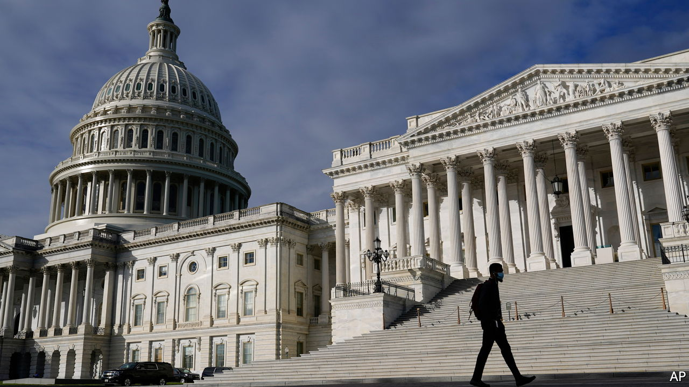

###### Capital pains

# Why Democrats’ tax plans are such a mess 

##### It is not just a fragile majority. It is also a lack of vision and leadership 

 

> Oct 30th 2021 

J0E BIDEN promised to pay for his big social-spending proposals by raising taxes on the rich and nobody else. Now Democrats are rushing to find a big pot of money without raising headline rates of tax at all. They are making a mess of it.

As we wrote this, they were predicting that they would soon reach a compromise on a social-spending bill that would pass in both the House of Representatives and the Senate, where they cannot afford a single dissenting vote in their ranks. Yet they were struggling to reach a deal that could satisfy two centrists: Kyrsten Sinema of Arizona, who has little appetite to raise tax rates, and Joe Manchin of West Virginia, who is willing to do so, but objects to the alternative designed to satisfy Ms Sinema.


The desire for higher tax revenues without higher tax rates has left Democrats scrambling to make deep changes to how some levies work. One is a new minimum tax on the biggest corporations’ accounting profits, which can exceed those declared to the . Another is a levy on firms that buy back their own stock, a longtime bugbear on the left. The most eye-catching idea is a reform to the federal capital-gains tax that is designed to ensnare the ultra-rich. It would tax them annually on the paper gains of their investment portfolios, rather than when assets are sold, as under the current system. It is this proposal that Mr Manchin rejects.

All these ideas are gimmicky and none is good. A tax on the book profits of companies would outsource tax rules to unaccountable accounting bodies, reduce the efficacy of desirable tax deductions for investment and, by interfering with the ability to carry forward losses, play havoc with firms whose profits are volatile. (Will they have to pay the minimum tax in the good years without recompense in the bad ones?)

There is no sound economic reason for penalising share buy-backs. In any case, firms could avoid the tax attached to them by paying dividends instead. The “mark-to-market” capital gains tax is a messy attempt to rapidly extract enormous amounts from a tiny number of the very rich—Elon Musk alone might owe $40bn-55bn. Because this tax would apply only to securities traded on public markets, with different rules for stakes in privately held firms, it would deter entrepreneurs from floating their companies on the stock exchange. That would ultimately be bad for investment and the incentive to innovate, and would get in the way of the widespread ownership of equities.

Democrats’ predicament might seem like a straightforward result of their fragile control of Congress and the idiosyncrasies of two of their senators. But it also results from a lack of vision and leadership. They have failed to bring in straightforward reforms that raise revenue by enlarging the tax base, such as abolishing the egregious exemption that resets accrued capital gains to zero when owners die and pass on their estates.

Taxing capital gains at death, as Mr Biden first proposed, would raise more than $200bn over a decade—not far off the “several hundred billion” Democrats say the tax on investment portfolios would yield. Yet lobbyists defeated the idea, just as they also preserved the carried-interest loophole, which lets investment managers class their fees as lightly taxed capital gains, not income. Democrats continue to toy with the idea of lifting the cap on an exemption from federally taxable income of money used to pay state and local taxes. Doing that would benefit the wealthy, narrow the tax base and subsidise high-tax states.

In promising to pay for a big expansion of the welfare state by taxing only the rich, Mr Biden ignored the example of Europe. Its social spending is funded using broad-based and efficient taxes, most notably value-added tax, a levy on consumption. The president’s plans, which included a big rise in corporate taxes, were by comparison unfriendly to economic growth to begin with. Narrowing the target further—the capital-gains reform would apply only to billionaires and those with more than $100m in annual income sustained over three years—led to a proposal which is even more poorly designed, and which Mr Manchin is right to oppose. All along, Democrats have pretended that raising taxes on businesses would have no negative effect on wages, contrary to the overwhelming consensus among economists.

The failure to agree on a tax plan carries echoes of doomed Republican attempts, under Donald Trump, to “repeal and replace” the Obamacare health-insurance system. That promise was also made without enough thought about the economic and political constraints it was up against.

Perhaps one of the two dissident senators will give ground, letting Mr Biden’s proposals pass. But sooner or later, Democrats will have to confront the fact that permanently expanding the welfare state without damaging the economy means winning an argument for higher taxes, rather than always telling voters that some rich person will pay. ■

For more coverage of Joe Biden’s presidency, visit our dedicated 

