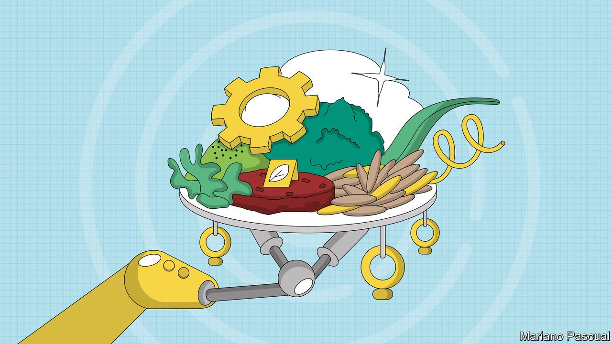
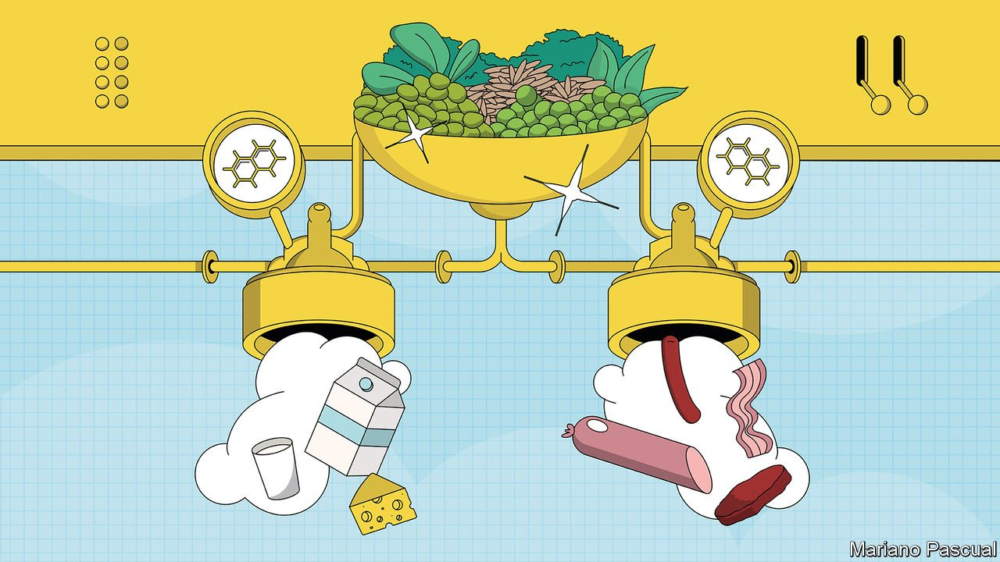
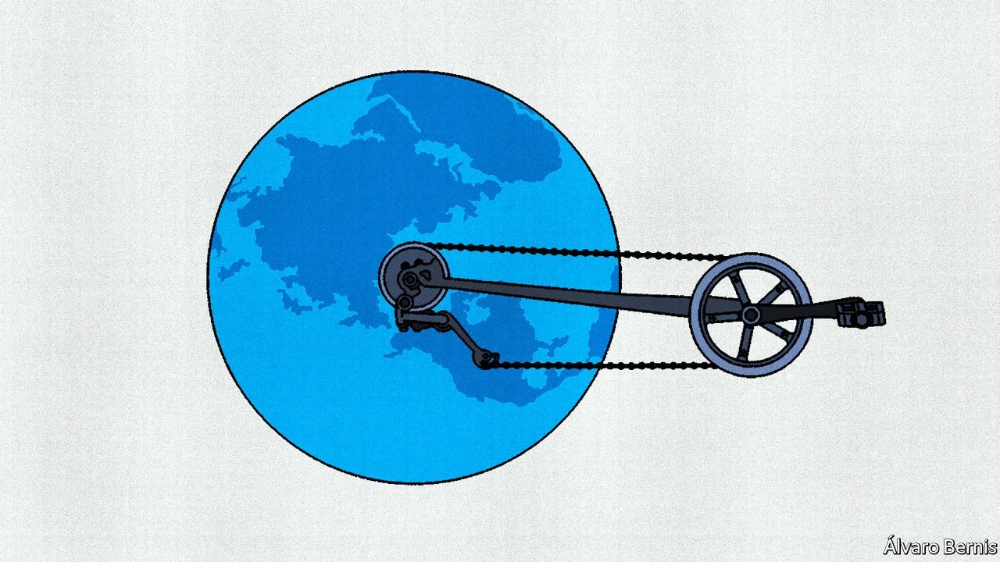

###### On food technologies, Top Glove, malarial bed nets, Poland, liberals, email

# Letters to the editor 

##### A selection of correspondence 

 

> Oct 28th 2021 

Letters are welcome via email to: letters@economist.com

The human cost of green food

The Technology Quarterly on the future of food (October 2nd) showcased technologies that produce cleaner and greener food more humanely, such as lab-grown meat. However, one major group of stakeholders was missing from your analysis: livestock farmers. At the subsistence level and on an industrial scale, livestock farmers around the world generate $1.3trn a year in output and support the livelihoods and food security of 1.3bn people. Out of these, the 500m pastoralists, whose main source of income, culture and entire life revolves around livestock, are particularly vulnerable to these new technologies.


Food’s future is in the hands of regulators and consumers and so is the fate of millions of livestock farmers. Growing meat in a lab may be disastrous for them. Engaging farmers in these new food futures is vital.

HARPINDER SANDHU

Professor of economics

Federation University 

Australia

Ballarat, Australia

There is a widely held concept that plant-based food produces fewer greenhouse-gas emissions and causes less animal suffering than grass-fed beef. This is misguided. Belcampo Farms in California, for example, churns out carbon negative beef, with research to back it up. A growing number of ranchers worldwide operate under similar regenerative principles.

Reducing animal suffering by switching to meat substitutes is also debatable. Plant and crop farmers employ all manner of poisons, traps and deterrents against encroaching wildlife, which has an impact on surrounding ecosystems and watersheds. During harvest, field animals such as rodents, rabbits, fawns and nesting birds reliably meet a gruesome end in harvesting machinery.

DAVID DOSANJH

Vancouver

 


I question whether the morality of raising animals for food is settled. Were it not for the food industry, how many chickens, cows or pigs would there be in the world: thousands, none? Without a food industry, they would not exist. Dying in a slaughterhouse may be less painful than being torn apart by predators or a slow death by hunger or disease, which is how wild animals die.

PEDRO SERRADOR

Toronto

French fries were not the only thing that helped Europe adopt the potato (“Working up an appetite”, October 2nd). Frederick the Great tried to order Prussians to cultivate potatoes but to no avail; people said they were so bad that not even dogs would eat them. Cleverly, he changed tack and declared the potato to be a royal vegetable, grown only in plots guarded by soldiers. Soon enough peasants started stealing the potatoes and growing them. A useful lesson in marketing for those trying to change eating habits in the West and persuade people to eat insects.

RICHARD MILBURN

Environmental Security

Research Group

King's College London

 


Top Glove

With regard to the “The urge to protect” in your special report on trade (October 9th), Top Glove would like to update The Economist about its ongoing efforts and successes in improving its environmental, social and good governance practices, including the resolution of the Withhold Release Order issued by the United States Customs and Border Protection agency.

The CBP issued Top Glove with one WRO on July 15th 2020. Subsequently, as part of the CBP process, the order was replaced with a Finding on March 29th 2021. However, after the CBP had thoroughly reviewed the evidence that Top Glove had addressed all indicators of forced labour at its Malaysian facilities, the CBP modified the Finding on September 10th, and immediately allowed the importation of the company’s disposable gloves made at its factories in Malaysia to America.

NURJEHAN MOHAMED

Senior consultant

MNAIR

Petaling Jaya, Malaysia

Malarial bed nets work

Alex Nicholls rightly warns against focusing on outputs rather than on outcomes in philanthropic programmes (Letters, October 16th). But his example, that antimalarial bed-net schemes “failed”, is incorrect. Contrary to some reporting, few bed nets get used for fishing. A four-country study of over 25,000 bed nets found less than 1% were being misused. A comprehensive analysis by Cochrane, an independent network of researchers, of 23 medical trials encompassing nearly 300,000 people showed that bed nets reduced deaths by a third. A study at Oxford concluded that they averted around 663m cases of malaria in Africa between 2000 and 2015. These important outcomes, by charities and others, should be applauded.

CAROLINE FIENNES

Director

Giving Evidence

London

PROFESSOR PAUL GARNER

Liverpool School of Tropical Medicine

Poland and the EU

Charlemagne’s toxic rhetoric on Poland was based on the false assumption that a Polish court ruled that the “country’s constitution trumped fundamental parts of EU law”, such as “ever closer union” (October 16th). The Polish Constitutional Tribunal did not terminate the controlled provisions of the treaty; they are not derogated from the Polish legal system. The judgment uses the formula “in so far”, which means that only certain interpretations of the treaty provisions are incompatible with the Polish constitution.

The judgment of the Constitutional Tribunal does not question the idea of the principle of the primacy of EU law, within the limits of conferral (Article 5 of the treaty), nor does it result in its blanket entitlement to question it by other authorities. The court is well versed and competent in reviewing EU law. It adjudged Poland’s accession treaty in 2005 and the Lisbon treaty in 2010. Similar institutions exist in other member states.

Poland will remain in the EU as a dedicated promoter of the open single market, free trade, industrial policy, enlargement policy, the Eastern Partnership, border control and an adequate budgetary response to a post-covid Europe. Turn your attention to other European capitals if you are looking for a gap between pro-EU declarations and deeds.

KONRAD SZYMANSKI

Minister for European Union affairs

Warsaw

Liberals can turn conservative

Your graphic detail algorithm on interstate political migration in America (October 16th) ignores the distinct possibility that latte-loving liberals will become gas-guzzling gun lovers when faced with frontier reality in Alaska, Montana and other red states.

DAVID MARTINMiami

 


Responding to email

Bartleby’s column on how to write a great out-of-office reply (October 9th) brought to mind my favourite out-of-office message: “You’re receiving this automated response because I am out of the office on vacation. Had I been in the office, you likely would have received no response at all.”

RAHUL BAFNA

New York

