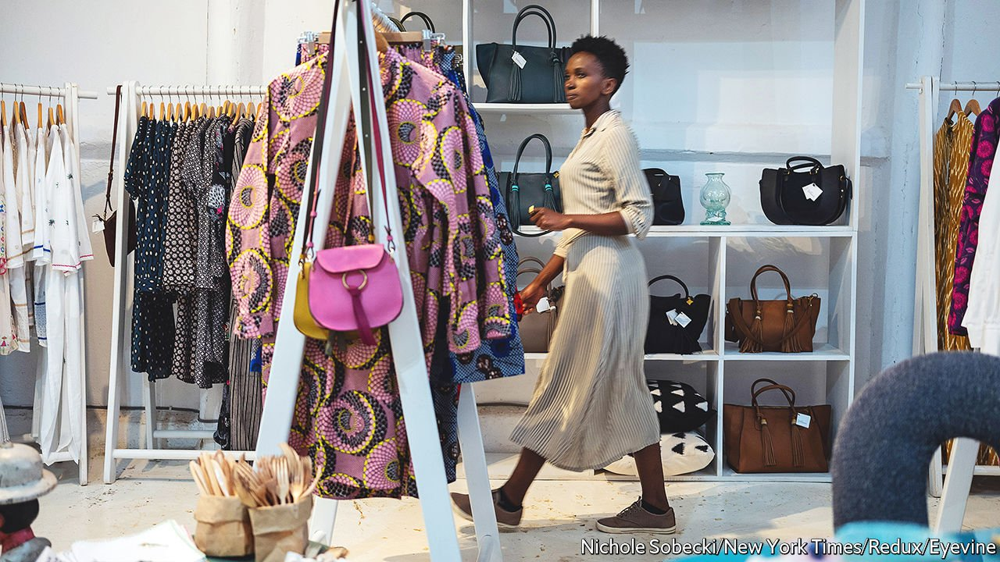

###### Expatonomics

# How UN staff are reshaping African cities 

##### Expensive lunch menus, high-end car washes and imported nibbles are some of the signs 

 

> Oct 30th 2021 

A SPECIAL ECONOMY emerges around any big UN office in the developing world. Other international bodies cluster around it. Expatriates move into the safe, pleasant neighbourhood where it is located. Local suppliers vie for contracts to sell fresh produce, stationery and other staples to all these organisations. Unskilled workers get jobs as cleaners, gardeners and security guards. And small businesses, such as posh cafés and dry cleaners, thrive serving the expats and well-paid local staff.

The reason there is so much economic activity around UN hubs is simple: the UN has a lot of staff with a lot of money to spend. The UN Secretariat has a $3.2bn budget this year, with additional pots for peacekeeping and other agencies. A fair bit of that goes into salaries. So-called “professional staff”, who move around the globe, earn a base salary ranging from $46,000 a year for a fledgling policy wonk to $205,000 for an undersecretary-general (usually the head of a UN body such as the World Food Programme).


That would be more than enough to live on comfortably in any African capital. But there are additional allowances for expats with a family in tow. And jobs in cities like Nairobi and Addis Ababa come with extra pay because they count as “hardship” postings. (This is debatable. Street crime may be common in Nairobi, but the weather, bars, sports clubs and barbecued beef are extremely pleasant.)

An influx of well-paid workers provides an economic boost for any city. When the UN was established in 1945, American cities competed to host its headquarters. Since then places such as Copenhagen and Geneva have wooed UN agencies with shiny new buildings and tax incentives. Calculations from the mayor’s office in New York City, which hosts the UN’s headquarters, suggest that it adds almost $3.7bn to the city’s annual output. The UN, its agencies and affiliates are together its 22nd-biggest employer, with 10,900 staff.

The benefits of hosting the UN are much greater in places that are not already brimming with Wall Street bankers, fashion glitterati and other big spenders. Member states have chosen Nairobi, Dakar and Addis Ababa as hubs in Africa. There are only a handful of cities on the continent that are safe and well-connected enough to host legions of foreign workers and their families. But it is crucial, says Stéphane Dujarric, the spokesperson for the secretary-general, to have teams on the ground. “If you’re working on development policy, doing it from New York or doing it from Nairobi and Dakar gives you a different perspective,” he says.

The economic impact is apparent in Gigiri, a leafy corner of Nairobi where the organisation’s African headquarters are based. Street signs hint at how important the 5,000 UN staff who work there are to the local economy: United Nations Crescent leads to United Nations Avenue. The neighbourhood is filled with fancy restaurants, cafés and hotels that are unaffordable to most Kenyans. At Village Auto Bazaar, a car wash and service centre, Joshua Muhanji reckons that about 70% of his business comes from UN workers.

Yet there are costs to being a UN hub, too. New York spends about $54m on things like security for staff and public schools for their children. It forgoes almost $100m in tax thanks to exemptions for UN buildings and its diplomats. “The city makes quite an investment in hosting the UN, but it’s worth it,” says Penny Abeywardena, New York City's commissioner for international affairs.

There are other downsides in emerging markets. Cities can become dependent on UN spending. Businesses in Gigiri struggled during covid 19-lockdowns, as offices emptied out and expat staff fled. In Dakar, there are plans to relocate various UN offices from the seaside district of Les Almadies to a new city 30km outside the capital. That worries businesses in Les Almadies, from high-end coffee shops to informal car washes and the American Food Store.

A large UN presence can also distort the local job market. The organisation’s Flemming Principle dictates that the pay of local hires, who are employed on different terms and paid in the national currency, should be “among the best in the locality, without being the absolute best”. The UN conducts regular surveys on what private companies, governments and non-profit organisations pay in any given location. And it uses that information to set its alphabet-soup salary scales. In Nairobi, for example, a driver might make the equivalent of $9,000-14,000 a year, while a more skilled assistant could make $32,000-50,000. That is far less than expat staff. But in a country with an annual GDP per person of just $1,800, it is a princely sum. Joe Muturi, the head of Slum Dwellers International, a network of NGOs,puts it bluntly: “everyone wants to work for the UN.”

Martyn Davies, the managing director for emerging markets and Africa at Deloitte, a consulting firm, says that big international organisations reinforce a two-tier economy. UN employees mix in fancy bars and restaurants that most locals can’t afford, and price middle-class families out of pleasant neighbourhoods. “It’s monetary apartheid,” says Mr Davies.

That sort of inequality could spark resentment, but many locals are pragmatic. At Alkimia, a restaurant in Les Almadies serving $88 steaks and $45 seafood platters, Dimitri Vasnier, the chef, sees the irony in anti-poverty and environmental advisers arriving in four-wheel drives and leaving untouched plates piled high at buffets. But UN staff in the area are an important clientele for the restaurant. “There is so much waste,” he says. “But that is what gets the economy ticking.” ■

