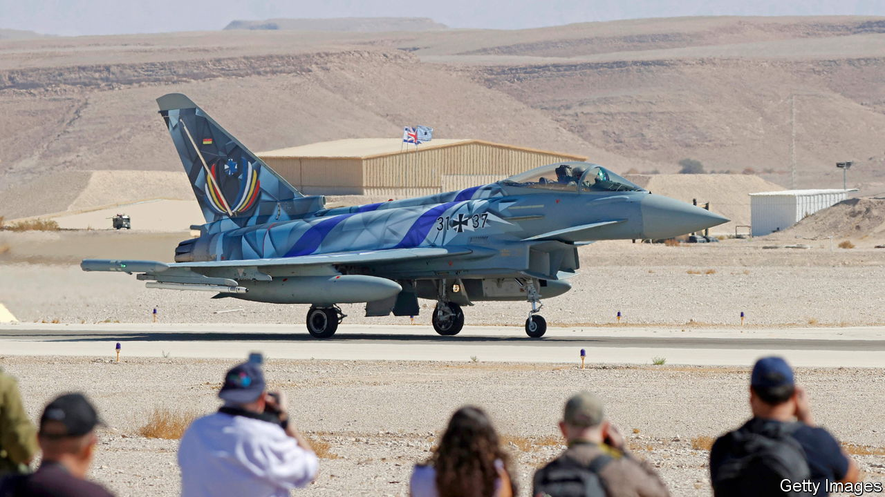
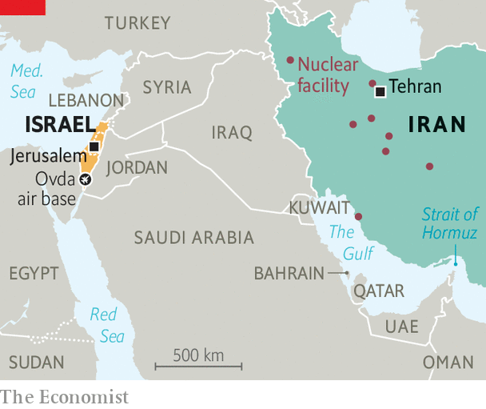

###### Diplomacy by other means

# Israel again rattles its sabre at Iran 

##### A military response is readied as hope for a nuclear deal fades 

 

> Oct 26th 2021 

TWO BY TWO they roared into the sky over the Israeli desert—American F-16s, British Typhoons, French Rafales and more—to confront an unseen enemy called “Dragonland”. The foes of war games are fictitious; Israeli officers were at pains to say the exercise was “generic”.Yet Dragonland’s force, with its drones and air-defence missiles, seemed a lot like Iran’s. Such exercises “are needed to face Iran”, noted one general.

The “Blue Flag” exercises at the Ovda air base in the Negev desert are a form of military diplomacy, and a signal that Israel, the host, has friends. Israel is becoming the hinge of two emerging military groupings: an eastern Mediterranean one to fend off Turkey, and a Middle Eastern one to deter Iran. The number of Blue Flag participants has grown—seven countries, including India, exercised with Israel this year. The United Arab Emirates’ air-force chief watched as an honoured guest.


Whether any of these friends would help Israel in a war with Iran is unclear. But the proposition may be tested sooner than some expect. Sabre-rattling is growing louder as Iran’s nuclear programme gathers pace and . America has warned that it would look at “other options” and this month it tested a new bunker-buster bomb. The Israeli air force has begun rehearsing attack plans; the government is allocating more money to the armed forces to confront Iran. In Manama, Bahrain’s capital, on October 1st the Israeli and Bahraini foreign ministers posed for pictures in front of an American warship. Iran, for its part, has staged air-defence exercises and warned Israel of a “shocking response” to any attack.

Israel has entered what some call the “dilemma zone”—weighing up the danger of Iran going nuclear against the prospects for diplomacy, the complexity of mounting a military operation, Iran’s likely retaliation, and the response of America and regional partners. Israel will not say what its “red lines” are, but Western diplomats think it may take a decision to act by the end of the year.

Israel has been here before, notably in 2009-12, when it threatened to bomb Iran but stayed its hand. Now, though, Iran is even closer to having the wherewithal to make atom bombs. That is in part because in 2018 Donald Trump abandoned a nuclear deal, known as the Joint Comprehensive Plan of Action (JCPOA), that limited Iran’s nuclear programme and opened it up to enhanced inspections in return for the partial lifting of international sanctions. Iran says it wants nuclear technology only for civilian purposes, yet its uranium enrichment has advanced to the point that its “breakout time”—the time it would need to make a bomb’s-worth of fissile material—has shrunk from a year to about a month. (Making a warhead to fit on a missile might take another 18-24 months.)

Iran seems uninterested in America’s call for a return to “mutual compliance” with the JCPOA. The UN’s International Atomic Energy Agency says its monitoring of Iran’s activities is no longer “intact” because the regime is refusing to let it replace damaged cameras.

 


Israel has twice bombed its enemies’ nuclear facilities—striking an Iraqi nuclear reactor in 1981 and a Syrian one in 2007. But these were single air raids. Taking out Iran’s nuclear facilities would be far more difficult because they are dispersed and some are buried underground (see map). Iran has also acquired Russian-made S-300 air-defence missiles. An attack plan is “not something you can prepare in just a month”, says an Israeli general.

Israel’s operational challenges range from identifying the location of Iranian facilities to their level of fortification and anti-aircraft defences. Israel would be operating some 1,500km (932 miles) away from its bases, requiring air-to-air refuelling for many aircraft over potentially hostile territory. Some analysts believe it is all beyond Israel’s capabilities. Israeli military planners claim otherwise, saying they can do enough damage to set back Iran’s nuclear programme by some years.

Israel’s task would be easier if its new Gulf allies were willing to help by, say, allowing overflights or providing bases. But the more they get involved, the likelier they are to become targets of retaliation. Iran has threatened to close the Strait of Hormuz, through which much of the Gulf’s oil passes, if attacked. Iran’s conventional military capacity may be limited, but it has built up a force of ballistic and other missiles, and resorted to asymmetric tactics, such as sabotaging ships near its waters.

It also sponsors proxy militias—in Iraq, Syria, Yemen and Lebanon—that give it military reach across the region. Hizbullah in Lebanon has thousands of rockets that can be rained down on Israel’s cities, as well as guided missiles and drones that can strike accurately. Israel, military officials note, has just a handful of power stations and desalination plants, and a single international airport. Hitting these would cause “strategic damage”. Many Gulf states are even more vulnerable.

Much will depend on President Joe Biden, who says he will not allow Iran to go nuclear on his watch. Military action by America would be more powerful than an Israeli raid, not least because it has larger bunker-busting weapons. Even if it just gives Israel the green light to act alone, America might not be able to stay out of the fighting. If Iran responds by widening the conflict, as many expect, America would be called upon to keep the sea lanes open, defend allies and even protect itself. Its forces in Iraq and Syria are exposed to attack. Having withdrawn from Afghanistan, saying he wanted to end the “forever wars” in the Muslim world, Mr Biden will be loth to get sucked into another one.

Israel’s best hope is that its threat of action, combined with Western diplomatic and economic pressure, will persuade Iran to agree to a diplomatic deal. “Iran can be deterred,” insists one Israeli official, “It does not want to be North Korea.” The danger is that the mullahs conclude that only nukes will keep their regime safe. ■

