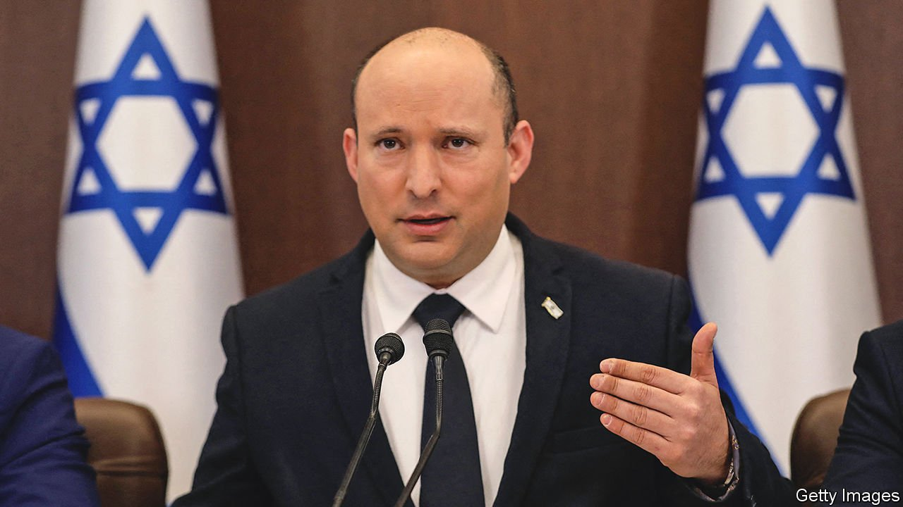

###### Bibi’s long bye-bye

# Netanyahu’s shadow starts to recede in Israel 

##### An unlikely coalition is surpassing expectations. But a crucial vote looms 

 

> Oct 30th 2021 

THE PARALLEL-UNIVERSE politics that played out in Jerusalem this month were unusual, even for a holy city full of surprises. In the real Jerusalem on October 10th, Naftali Bennett, Israel’s prime minister (pictured), was glad-handing Germany’s outgoing chancellor, Angela Merkel, by welcoming her to a special session of his cabinet. In the otherworldly Jerusalem, Mr Bennett’s predecessor, Binyamin Netanyahu, was holding court with Jared Kushner and Ivanka Trump, the son-in-law and daughter of America’s ex-president, Donald Trump, and Mike Pompeo, his last secretary of state. It was as if the video had been wound back to 2020, before voters evicted them all from power.

In office Mr Netanyahu and Mr Trump embraced each other. Out of power, they still cast shadows over the politics of their countries. Mr Trump rails against the supposedly “stolen” American election of 2020. Mr Netanyahu accepts the result of the Israeli vote this year, but regards Mr Bennett as illegitimate. The faithful still address Mr Netanyahu as “prime minister”.


His Likud party remains the largest in parliament, whereas Mr Bennett presides over a crazy-quilt coalition of eight parties, stretching from left to right and including an Arab Islamist faction, Ra’am. But, for all its oddness, the coalition has proven more solid than many expected when it took power in June, and has changed the tone of Israeli politics. “I tell Americans it’s like post-Trump. It’s decompression,” says Merav Michaeli, the Labour Party leader and transport minister. “The craziness has gone. That in itself makes a huge difference. People are breathing again.”

If Mr Netanyahu casts himself as the proto-Trump, then the new coalition may offer an antidote to his polarising populism. That it represents a wide spectrum of Israeli society may offer a new model of consensus politics.

But first it must survive. The coalition will soon face its sternest test, over the budget. Israel has not had one in three years. With a two-seat majority, the government is vulnerable to the whims of any of its members. If the budget is not adopted by November 14th an election will be called. So far there has been surprisingly little brinkmanship, though. It helps that Mr Bennett has money to distribute: the economy is growing and ultra-Orthodox parties are not in the coalition to demand big subsidies for religious institutions.

With a budget in hand, the coalition will be hard to unseat before the next budget deadline in 2023. Removing it would require 61 votes for a new prime minister or an election, but Mr Netanyahu can muster only 53. The balance is held by Arab parties that are unlikely to side with him. Under the coalition deal, Mr Bennett is supposed to make way in two years’ time for Yair Lapid, leader of the centre-left Yesh Atid party and the architect of the government.

Mr Bennett has turned from right-wing gadfly to centrist problem-solver. He has gambled, seemingly successfully, on booster jabs to avoid another lockdown to contain the pandemic. On October 27th the government adopted a law to break the monopoly of the ultra-Orthodox rabbinate on issuing kosher certificates. Above all, it is seeking to improve the lot of Arab citizens after communal violence in May. It has passed legislation allowing thousands of illegally built homes (mainly of Bedouin families) to be connected to the electricity grid. The budget allocates more money for Arab neighbourhoods. Abroad, the government is working to patch up relations with European countries and America’s Democratic Party that were frayed under Mr Netanyahu. It has opened embassies in the United Arab Emirates and Bahrain.

Nevertheless, Mr Netanyahu remains the country’s most capable politician. He has dominated public life for much of the past quarter-century, not only as the country’s longest-serving prime minister but also as a formidable opposition leader.

Mr Bennett’s coalition survives through an act of amnesia: its parties set aside the most divisive issue, the question of Palestinians living under occupation. This has proven easier done than said. Years of bloodshed and disenchantment have created a consensus. The left concedes that there is little support for the creation of a Palestinian state; the right acknowledges that annexing the whole West Bank is beyond reach. So Palestinians are left in a patchwork of autonomous zones.

This pact might break. Another Gaza war could compel Ra’am to withdraw. The Biden administration’s attempt to re-open an American consulate in Jerusalem to serve Palestinians may prompt the defection of right-wingers. , which Israel is threatening, is fraught with risks.

On the day he was ousted in June, Mr Netanyahu confidently promised that “we will be back soon.” But lately he seemed to concede that the government could last its full term, telling loyalists that Likud could be back in power “in two weeks or another three and a half years”.

Can Mr Netanyahu wait that long? At the age of 72, being leader of the opposition holds little attraction. Well-paid speeches and directorships beckon. But as a member of the Knesset (Israel’s parliament) he is forbidden from making money other than his parliamentary salary. He faces the hefty legal cost of defending himself from several charges of fraud and bribery, which he denies. Yet giving up his seat would remove his aura as a prime-minister-in-waiting, which may affect the dynamics of his trial. Already challengers are emerging within Likud.

By staying on, Mr Netanyahu provides the glue that holds the government together. “We’re not happy with a lot of the policies,” says one coalition member. “But as long as Netanyahu is on the scene, we’ll stick together. No one wants to be blamed for allowing him back.” ■

