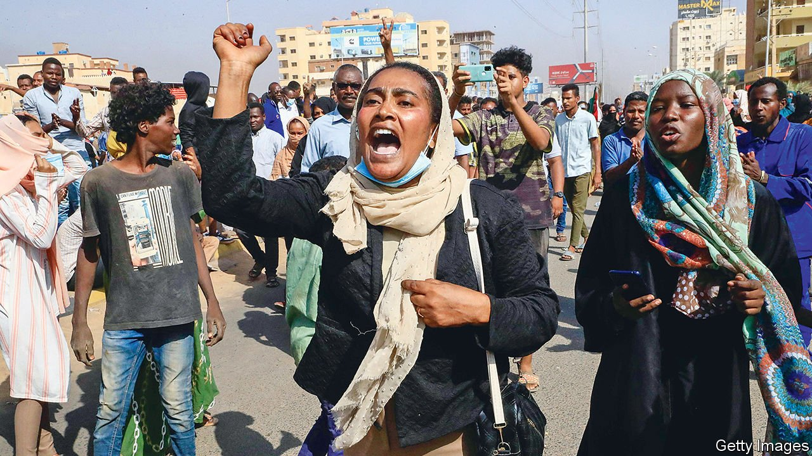
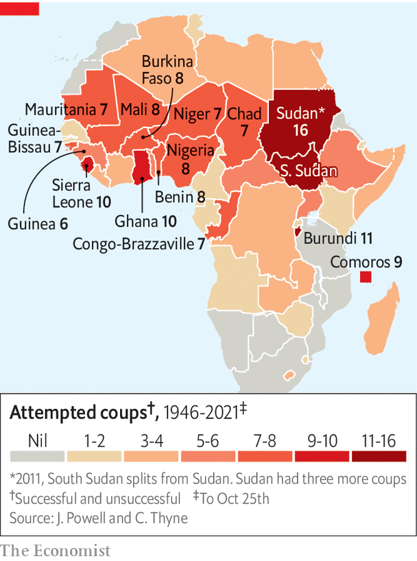

###### The men with guns strike back

# Sudan’s democratic transition is upended by a second coup in two years 

##### The generals acted just months before they were due to hand power to civilians 

 

> Oct 25th 2021 

THE SCRIPT was all too familiar. First, Sudan awoke to find that Abdalla Hamdok, the prime minister appointed by protest leaders two years ago, had been arrested by the army. Then the internet was switched off. Bridges into the capital, Khartoum, were closed, as was its airport. “What is happening now in Sudan is a military coup,” said Nasredeen Abdulbari, the justice minister. Soon protesters were on the streets, burning tyres and chanting slogans, such as “retreat is impossible.”

The scenes recall the heady days of Sudan’s revolution in 2019, when peaceful mass protests toppled Omar al-Bashir, a ruthless Islamist despot who had ruled Sudan for three decades. Then alas, the army seized power in a coup. To quiet further mass protests, the generals made a  with the protest leaders. Lieutenant-General Abdel-Fattah al-Burhan became Sudan’s de facto president and chairman of the sovereign council, a military and civilian body charged with overseeing Mr Hamdok’s mostly civilian cabinet. Mr Burhan was originally supposed to hand over to a civilian this year ahead of elections that were due to take place in 2022. Instead he has mounted a second coup, which may spell the end of yet another brief Sudanese attempt at democracy.


History has repeated itself often since independence in 1956. Previous democratic revolutions in 1964 and 1985 were also snuffed out by military takeovers. For months it had been obvious that divisions within the interim government were likely to spill over into violence or lay the ground for a coup. In an  in July, the vice-chairman of the sovereign council, Muhammad Hamdan Dagalo (known as Hemedti), warned of a takeover by people tied to the old regime. This was almost certainly disingenuous. It was always more likely that Mr Dagalo would join forces with Mr Burhan to oust the civilians. Mr Dagalo does not have much form as a democrat. He is a desert warlord who heads a notorious paramilitary unit called the Rapid Support Forces (RSF), which grew out of the Janjaweed, an Arab militia responsible for genocide in the country’s Darfur region.

 


The opening salvo was fired last month, when the army said it had foiled a coup attempted by Islamists loyal to Mr Bashir. Many suspect that it was in fact a ploy by the generals themselves to tighten their grip on the government. Mr Dagalo blamed civilian leaders, for their bickering and mismanagement of public services. On October 11th Mr Burhan called for the cabinet to be dissolved and warned against efforts to exclude the army from the transition. Days later protesters were bused in by the army to stage a rally calling for a military takeover. Many Sudanese suspect this was to make the coming coup seem popular.

Mr Burhan and Mr Dagalo have been preparing in other ways, too. An agreement signed last year with rebels from Darfur and southern Sudan brought more men with guns into the power-sharing government, apparently as their allies. The two have also been amassing economic power. Firms that once belonged to Mr Bashir’s family have been swept up by the armed forces. Profits from military-owned companies, which were once channelled to the ruling party, now flow directly to the army’s own coffers. Mr Dagalo’s RSF has been expanding its business interests, too. Few doubted that Mr Hamdok’s efforts to rein them in, and to launch investigations into the army’s role in massacres under the previous regime, could spell trouble.

The timing of the coup has nonetheless raised eyebrows. In the week leading up to it, thousands demonstrated in Khartoum against the armed forces in the largest protest since 2019. The coup came less than two days after the visit of Jeffrey Feltman, America’s special envoy to the Horn of Africa, during which he urged the generals not to stage one. Since Mr Bashir’s downfall, the generals as well as civilian politicians have been anxious to repair ties with the West after decades of sanctions. Speaking to The Economist in July Mr Burhan  that Sudan’s “international isolation…is now over”. His government has  and persuaded America to remove Sudan from its list of state sponsors of terrorism. Yet much of that progress may be undone by this coup.

America, Sudan’s biggest bilateral donor, has already halted some $700m in aid. The World Bank, which in March said Sudan could access up to $2bn in grants, has also paused disbursements. Diplomatically the regime looks isolated, too. The African Union (AU) has suspended Sudan and the Arab League has called for a restoration of the transitional government.

That the generals were so brazen as to risk antagonising Sudan’s biggest donor suggests they were confident of having the staunch backing of allies such as Saudi Arabia, the United Arab Emirates and Egypt. “Without regional cover Burhan would not do this,” says Magdi el-Gizouli of the Rift Valley Institute, a think-tank based in London and Nairobi.

In grabbing power Mr Burhan has made an already combustible region even more so. The AU has its hands full with war-torn Ethiopia next door, where 400,000 people face famine. A border dispute between Ethiopia and  has been aggravated by the internal tensions of both countries. Both sides have moved troops to the area and skirmishes have broken out. It may not take much to spark a full-blown war.

Meanwhile much of Sudan itself is ready to ignite. Some 430,000 people have been uprooted this year by various internal conflicts, such as fighting between farmers and cattle herders. In Khartoum itself, protests against the coup have already been met with force, with at least seven people killed and more than 140 injured. Then there is the risk that Sudan’s potpourri of militias and security forces might turn their guns on one another. Mr Burhan and Mr Dagalo may be working together on this coup, as they did on the previous one, but there is little love, or trust, between them. The Sudanese spring, until recently a source of hope in a troubled region, is turning into a winter. ■

