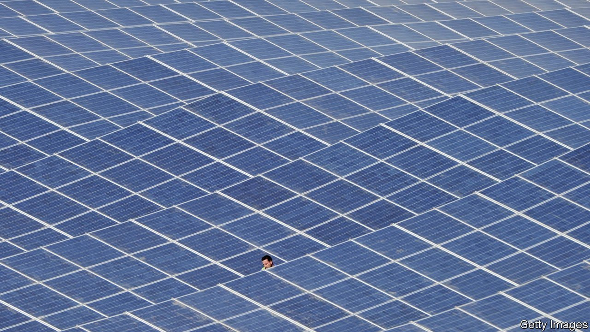
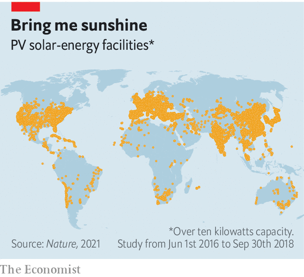

###### Solar-cell census

# An accurate tally of the world’s solar-power stations 

##### The method should work for other energy infrastructure, too 

 

> Oct 27th 2021 

REBUILDING AN ENTIRE planet’s energy system is a big job. Just ask the delegates at the COP-26 climate conference scheduled to kick off in Britain on October 31st. The most basic problem is knowing what, exactly, you are trying to rebuild. Academic-research groups, think-tanks, charities and other concerned organisations try to keep track of the world’s wind turbines, solar-power plants, fossil-fuelled power stations, cement factories and so on. To this end, they rely heavily on data from national governments and big companies, but these are often incomplete. The most comprehensive database covering American solar-power installations, for instance, is thought to miss around a fifth of the photovoltaic panels actually installed on the ground.

In a paper just published in Nature, a team of researchers led by Lucas Kruitwagen, a climate scientist and AI researcher at Oxford University, demonstrate another way to keep tabs on the green-energy revolution. Dr Kruitwagen and his colleagues have put together an inventory of almost 69,000 big solar-power stations (defined as those with a rated capacity of 10kW of electricity or more) all over the world—more than four times as many as were previously listed in public databases. This new inventory includes their locations, the date they entered service and a rough estimate of their generating capacity.


Conceptually, the team’s method is simple. Instead of relying on top-down reports, they worked from the bottom up, looking at the entire planet from space and counting how many solar panels they could see. This is not the first time people have hunted from orbit for solar-power stations. But previous analyses have been limited to a few countries. As far as Dr Kruitwagen knows, his is the first attempt to survey the entire planet for a particular type of infrastructure. Earth is a big place, of course, which means practice is a great deal harder than theory. His approach has been made possible by two big technological trends.

 


One is a growing abundance of cheap, easily available satellite imagery. In the 20th century, reconnaissance satellites were the jealously guarded property of a handful of governments. These days, a cottage industry of Earth-observation firms and agencies sells images on the open market. Dr Kruitwagen’s pictures came from two sets of satellites, Sentinel-2 and SPOT, run by the European Space Agency and Airbus respectively. These peer down on the world, recording visible light and also the infrared and ultraviolet parts of the spectrum. The images Dr Kruitwagen used amounted to around 550 terabytes of data, spanning the period between 2016 and 2018. That is enough to fill more than a hundred desktop hard drives.

Sifting through this many pictures by eye would have been impractical. That is where the second technological trend comes in. Dr Kruitwagen and his colleagues trained a machine-learning system to spot the solar panels for them.

Computer vision is a hot field. But the specifics of orbital reconnaissance meant that off-the-shelf software was not suitable for the task the researchers had in mind. Machine-learning systems are taught what to do by examining a “training set”, which contains examples of what is being searched for. For common tasks such as facial recognition, pre-built training sets are often available. But Dr Kruitwagen’s team had to build their own.

For this, they turned to OpenStreetMap, an open-source rival to Google Maps in which volunteers had already tagged large numbers of solar plants. But there was little consistency. “Some people had just drawn rough outlines around an entire field,” Dr Kruitwagen says. “Others had gone in and traced the outline of each row of panels separately.” Fixing that involved a great deal of manual labour.

Once the training data had been cleaned up, the learning algorithms had to be tweaked as well. From space, even big solar installations look small. Each pixel in the Sentinel images represented a ten-by-ten-metre square. Even for the higher-resolution SPOT satellites, the squares’ sides are one and a half metres long. Existing classifiers, trained for things like facial recognition or self-driving cars, are used to spotting objects that loom large in their field of vision. Hunting for smaller ones meant tinkering with the software to boost its ability to detect tiny features. False positives—things like tennis courts and agricultural greenhouses that resemble solar panels from space—had to be removed.

Panel games

Though extraordinary, Dr Kruitwagen’s results are already out of date. The data-gathering phase of the project ended in 2018, meaning that the thousands of new plants built since then are not included. But the project, he says, proves that the method works. He intends to make his results, including the labour-intensive training set, available for others to use. One logical extension of his project, he says, would be to expand the analysis to include solar panels installed on domestic rooftops. Such “behind-the-meter” installations are particularly tricky to track in other ways.

More generally, Dr Kruitwagen hopes that his eye-in-the-sky approach—which, despite the planetary scale of the project, cost only around $15,000 in cloud-computing time—could presage more accurate estimates of other bits of climate-related infrastructure, such as fossil-fuel power stations, cement plants and terminals for ships carrying liquefied natural gas. The eventual result could be the assembly of a publicly available, computer-generated inventory of every significant bit of energy infrastructure on Earth. Quite apart from such a model's commercial and academic value, he says, an informed public would be one better able to hold politicians’ feet to the fire. ■

For more coverage of climate change, register for , our fortnightly newsletter, or visit our 

