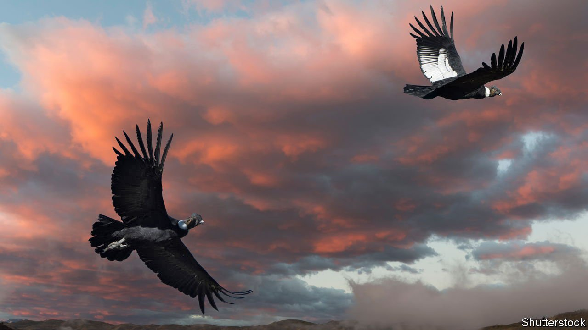

###### Avian parthenogenesis

# No sex please, we’re condors 

##### An endangered bird may sometimes reproduce without males 

 

> Oct 30th 2021 

FEW ANIMALS have come closer to extinction, and yet survived, than the Californian condor. Thousands died as a result of flying into electrical cables or being poisoned by lead shot from discarded game-animal carcasses. By 1982, there were only 22 left. These relicts were rounded up and brought into a captive-breeding programme that proved an astonishing success. Thanks to the efforts of a team of conservationists co-ordinated by the San Diego Zoo Wildlife Alliance there are now 329 condors flying freely in western North America, and 175 more in the care of various zoos.

As the precision of those numbers suggests, these birds are among the most closely monitored in the world. It therefore came as a shock to Oliver Ryder, a geneticist at the alliance, when he discovered that two of the females he was scrutinising had laid eggs unfertilised by males, which then went on to hatch.


As Dr Ryder and his colleagues report this week in the Journal of Heredity, both females had had ample opportunities to mate, since each was housed with a male with which she had successfully reproduced in the past. One of them, indeed, had raised a whopping 23 chicks before laying the fertile unfertilised egg in question. She and her mate then went on to raise two more.

Parthenogenesis, as this form of male-free reproduction is known, is common in invertebrates and not unheard of in vertebrates. Some snakes indulge in it. So do Komodo dragons. But it has rarely been recorded in birds, and when seen (as it has been in domestic turkeys) it has always been in circumstances when no males were around and it was therefore the only reproductive option available.

In nature, it will hardly ever be the case that there are no males around. On the other hand, it is hard to say whether parthenogenesis is happening in wild birds, because that would require intense genetic screening of nestlings of a sort that is rarely conducted in ornithological research projects.

In this instance, neither chick prospered. One, which was released into the wild near Big Sur state park in California, failed to thrive there and probably died of starvation at the age of two—not an uncommon fate for reintroductees, unfortunately. The other, held in captivity as part of a breeding programme, nevertheless failed to breed, and died of complications from a foot injury when it was nearly eight years old.

At the moment, therefore, it is hard to know whether Dr Ryder has stumbled on an intriguing and previously unperceived mode of avian reproduction, or an aberration of little wider significance. But if condors, and possibly other bird species, are routinely reproducing by parthenogenesis, then some rewriting of the textbooks will definitely be in order.

