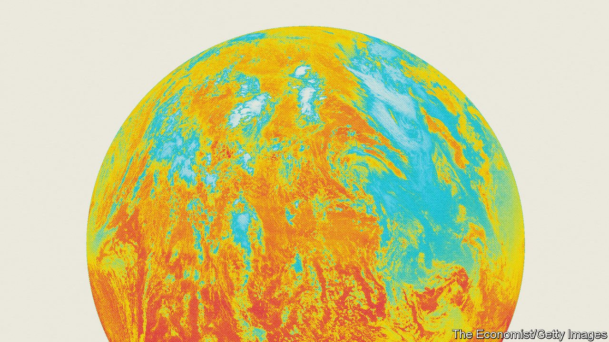
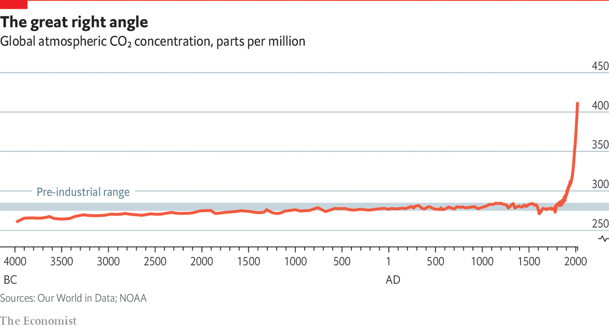

###### Stabilising the climate

# The agenda for the COP 26 summit 

##### There has never been a collective human endeavour more ambitious than stabilising the climate. In this special report our journalists assess what it will take to meet the historic goals agreed on in Paris six years ago 

 

> Oct 27th 2021 

SOME 1,500 years before the birth of Christ, when the chariots of Ahmose I, the first pharaoh of the 18th dynasty, had brought all of Egypt back under the rule of Thebes, the level of carbon dioxide in Earth’s atmosphere was about 277 parts per million (ppm). When the Gautama Buddha attained enlightenment under the Bodhi Tree a millennium later, and when Socrates drained his cup of hemlock a century after that, the level of CO had hardly changed at all. It was barely different when the Tang dynasty in China and the first Muslim caliphate arose in the 7th century AD, or when the Aztec empire fell to the conquistadors nine centuries later on the other side of the world. For most of history the composition of Earth’s atmosphere has been as unchanging a backdrop to the human drama as the arrangement of its continents, or the face of its Moon.

In the middle of the 19th century that changed. Very quickly by historical standards, and instantaneously by geological ones, the CO level began to rise. Having stayed between 275ppm and 285ppm for millennia, by the 1910s it had reached 300ppm. By 2020 it was 412ppm (see chart). In a century or so a crucial aspect of Earth’s workings had undergone a change 100 times greater than had previously been seen in a millennium.

 


An equally sudden shift in the background arrangement of the continents would have been a lot more noticeable. But it might not have been much more consequential. Although the way in which the atmosphere’s carbon-dioxide level affects the planet’s biology, chemistry, and physics does not in itself shuffle the tectonic plates, it changes the world in which they sit.


More carbon dioxide means more plant growth. In the 30 years from 1980 to 2009 satellite observations revealed that between a quarter and a half of the plant-covered surface of Earth—an area between those of Africa and of Asia and Europe combined—grew noticeably greener. Plants were flourishing on the CO-enriched air, adding tens of billions of tonnes to the planet’s biomass. The oceans, for their part, have grown more acidic after absorbing some of the atmosphere’s sudden CO surplus. It is as though ten rivers of pure battery acid the size of the Thames have emptied themselves into the seas.

And then there is the physics. Carbon dioxide absorbs infrared radiation. It is by emitting infrared radiation that the surface of Earth cools itself down. More CO in the atmosphere makes this process harder, so it means a warmer Earth. The increase in CO since the mid-19th century has, in concert with industrial and agricultural production and the release of other greenhouse gases such as methane, nitrous oxide and industrial gases like CFCs and HCFCs, increased the planet’s average surface temperature by between 1.1°C and 1.2°C.

This has already had an adverse effect on crop yields which outstrips any of the benefits from a higher level of CO. It is increasing the frequency, intensity and duration of droughts and heat waves. It has made large tracts of permafrost impermanent, gobbled up mountain glaciers and reduced the area of multiyear ice on the Arctic Ocean by 90%.It is destabilising the great ice sheets of Greenland and western Antarctica and making it easier for midsized hurricanes to intensify into the most powerful of storms. It is also making it harder for nutrients at depth to get to the living things that depend on them close to the surface and reducing oxygen levels. Sea levels are rising by a centimetre every three years or so.

If this were a continental rearrangement, it would be a global tectonic spasm which moved all the continents and their hapless inhabitants away from the poles and towards the equator while, at the same time, pushing once-cool mountain heights down towards sweltering plains and once-stable coastlines beneath the waves. And it would be picking up speed.

There is no doubt that the change in the CO level was brought about by humankind—mainly through the burning of fossil fuels, but also through conversion of forests and other natural ecosystems to farmland. As long as those activities continue in their current form, the CO level will continue to rise, and the world will move further and more damagingly away from its historical state.

In 1992, when the CO level had reached 356ppm and evidence of anthropogenic warming was, if not overwhelming, definitely discernible, the leaders of the world agreed to do something about the potentially catastrophic course they had more or less unwittingly embarked on. In the UN Framework Convention on Climate Change (UNFCCC) agreed upon at a summit in Rio de Janeiro that year, they committed themselves to the “stabilisation of greenhouse-gas concentrations in the atmosphere at a level that would prevent dangerous anthropogenic interference with the climate system”. This was to be done in a “time-frame sufficient to allow ecosystems to adapt naturally to climate change, to ensure that food production is not threatened and to enable economic development to proceed in a sustainable manner”.

This was, by far, the most ambitious international agreement of all time. There is no way of stabilising the climate without stopping the increase in the levels of long-lived greenhouse gases in the atmosphere. Although it did not say so in so many words—many might not have signed up if it had—the UNFCCC had, in effect, committed its signatories to ending the fossil-fuel age.

A new era

Fossil fuels have been crucial to the development of the economy for two centuries. They played an intimate part in the most important transformation in the human condition since the development of agriculture, a transformation that saw a huge growth both in the world’s population and in people’s wealth. But their use also gave the CO level, previously part of the background against which the human drama played out, a potentially show-stealing, or even show-ending, role. It had to be brought under control. It had to be stabilised.

While these remarkable aspirations floated free of specific targets, the sheer magnitude of the task could be ignored, and ignored it largely was. In 2015 in Paris, the same group of countries tethered their aspirations to a set of specific goals, thereby revealing the brutal size of the undertaking. “Preventing dangerous anthropogenic change”, said the Paris agreement, meant in practice, “holding the increase in the global average temperature to well below 2°C above pre-industrial levels and pursuing efforts to limit the temperature increase to 1.5°C above pre-industrial levels”. As to the time frame, the peak in greenhouse-gas emissions should come about “as soon as possible”, there should be “rapid reductions thereafter”, and “a balance between anthropogenic emissions by sources and removals by sinks of greenhouse gases” (net-zero emissions) should be achieved by “the second half of this century”—ie, in considerably less than a human lifespan.

As the parties to the UNFCCC converge on Glasgow for the COP 26 summit, this special report looks at what those commitments mean. It is not a guide to the specifics of carbon-cutting policies and technologies, nor to the particular ways in which national commitments made in Glasgow will fall short of the ambition needed. It is a survey of the scale of action required, the battleground on which it will be fought and the fundamental novelty of undertaking to stabilise the climate.

The moment when the COlevel, so flat for so long, began to rise was the inadvertent beginning of a new era in which the industrial economy and the forces of nature became conjoined. The moment when the now perilously steep curve rounds the corner to a new plateau, or even a steady decline, will be as consequential. But the agreements in Rio and Paris say that this time it will not be inadvertent. The curve-flattening climate stabilisation will be the result of deliberate interventions in both the economy and nature on a global scale. And it will be maintained, if it is maintained, by human institutions with the astonishing, and possibly hubristic, mandate of long-term atmospheric management.■

Full contents of this special report

The agenda for the COP 26 summit: Stabilising the climate* 


