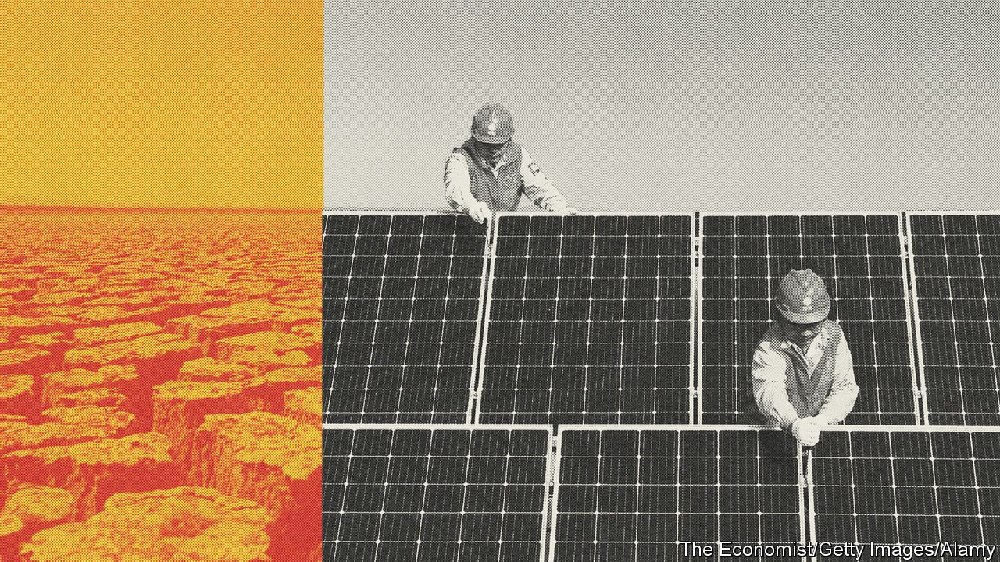
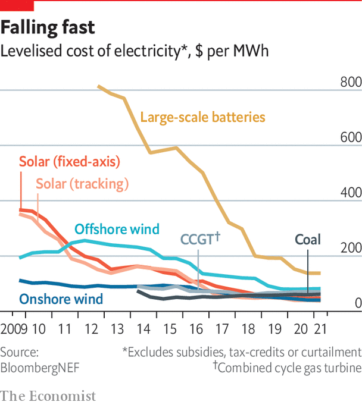

###### The state of play

# What the Paris agreement of 2015 meant 

##### Replacing fossil fuels is becoming easier. But temperatures are still likely to rise too far 

 

> Oct 27th 2021 

THAT IT TOOK almost a quarter of a century of diplomatic wrangling, setbacks and innovation for the world to put Paris’s numbers and procedures to Rio’s remarkable ambition makes it unsurprising that, as yet, little has been done to meet its goals. In 1992, according to figures from Our World in Data, 78% of the world’s primary energy—the stuff used to produce electricity, drive movement and provide heat both for industrial purposes and to warm buildings—came from fossil fuels. By 2019 the total amount of primary energy used had risen by 60%. And the proportion provided by fossil fuels was now 79%.

Over the same period the share of primary energy provided as electricity by modern renewables—wind turbines and solar panels—rose from nothing to 3%. The share provided by nuclear power, which is also generated without fossil fuels, fell from 5.4% to 4%. Hydroelectricity was more or less stable at 6%.


Luckily, not all trends are linear. The highly subsidised growth in renewables that began to take off in the early 2000s has not yet made a big dent in global energy consumption, but it has vastly reduced the cost of wind turbines and solar panels. In many markets renewable-electricity projects can now match or undercut the price of fossil-fuel infrastructure—at least if their developers borrow at the same rates as fossil-fuel developers. In 2020 the share of the world’s energy generated by solar panels grew by 21%, which points to a doubling every four years. Wind, which now supplies twice as much energy as solar, is growing more slowly, by 12% a year. But that is still a six-year doubling. The 3% penetration achieved in the past two decades might prove the basis for 30% or more over the next two.

The process can be speeded up further by the simple expedient of making fossil fuels more expensive. Carbon pricing has not, so far, had the traction that economists would wish for it. Most fossil-fuel users do not pay a carbon tax; nor are they subject to a cap-and-trade system of CO emission permits. But in one of the world’s largest economies, the European Union, electricity generators and an increasing number of other businesses face real costs for burning fossil fuels. Over the first half of this year, emitting a tonne of CO under the EU’s permit scheme cost, on average, €44 ($53).

 


The more the world’s generators face similarly significant carbon prices, the more completely renewables will triumph over existing fossil-fuel plants and the more attractive low-emission approaches to heavy industrial processes will become. And the cleaner the grid becomes the more helpful it will be to electrify consumer activities which used to depend on the burning of fossil fuels, such as the driving of cars and the heating of homes.

Carbon dioxide is not the only greenhouse gas. Human activities also emit methane (from the natural-gas industry and rubbish heaps, but also from livestock), nitrous oxide (mostly from agriculture) and chlorine-bearing industrial gases. That these boost the rise in temperature is a problem, but is to some extent more tractable. Big reductions in agricultural emissions of methane and nitrous-oxide emissions will take time (though marginal improvements would come quickly if beef consumption fell). But other approaches to methane reduction, including plugging holes in the natural-gas infrastructure, might happen faster. Slashing methane emissions in half could, other things being equal, knock 0.2-0.3°C off the world’s temperature.

Brimstone, too

Other “short-lived climate forcers”, as they are known, are more problematic. Sulphur-dioxide emissions, which are mostly associated with burning coal and heavy oils, produce small airborne particles of sulphate which reflect sunlight back into space, offsetting greenhouse warming. According to the Intergovernmental Panel on Climate Change (IPCC) these particles cool Earth roughly as much as methane warms it. As the use of coal declines, so will the levels of sulphate, exacerbating global warming.

Cheap renewables and the willingness to pay for their installation; the electrification of ever more aspects of daily life; the clear efficacy of carbon pricing; a new seriousness about short-lived climate forcers: they all make action on climate change look easier today than it did 12 years ago, when the meant-to-be-momentous Copenhagen climate summit ended in disarray and disagreement, and also a good bit easier than it did six years ago in Paris. The new round of “nationally determined contributions” (NDCs) that countries are volunteering under the rules of the Paris agreement reflect that progress.

Yet the increased ambition in the NDCs should not be mistaken for anything like victory; at best it shows that the world is just about staying in the game. As the collapse in Copenhagen made clear, the UNFCCC, despite being a treaty that was signed by almost all the countries in the world, cannot be used to force those countries to take action. The Paris agreement worked around this impotence with a sort of cognitive dissonance. Together, the member countries set demanding temperature targets; individually, they committed themselves to voluntary NDCs that offered far too little by way of emission reductions for those targets to be met.

So although the NDCs being offered at Glasgow—the Paris agreement calls for a new set every five years—are more ambitious, they always had to be. To come even close to achieving the temperature goals requires a lot more progress, much of it in areas where alternatives are less well developed than renewables were at the time of Paris, and a lot of it already assumed in this round of NDCs. There is still a lot of fundamental work to be done on how to decarbonise things which cannot be electrified. Nor is turning the easy deployment of cheap renewables into stable, reliable electricity grids a problem that is anything like fully solved.

Even if progress does continue, it is not going to produce emission reductions that are deep enough to meet the target of keeping overall warming as low as 1.5°C. The inclusion of efforts towards meeting that goal in the Paris agreement was a central demand for climate-vulnerable countries. For some low-lying island states, it was an existential issue: “one point five to stay alive,” as the chant had it. More generally it was seen as a way of ratcheting up the ambition of the whole UNFCCC process. Its supporters were willing to give ground on other things in order to see it adopted. It would be going too far to dismiss the limit’s inclusion in the text of the agreement as “the tribute vice pays to virtue”, the pithy definition of hypocrisy by La Rochefoucauld, a 17th century aphorist. But it was easier to accept the less than stellar NDCs on offer from many large countries in the context of the increased long-term ambition of the 1.5°C limit.

The biggest problem with this is that, even in Paris, it was clear that the 1.5°C limit could not be met by emission reductions alone. They would have to be supplemented by something else: the withdrawal of CO from the atmosphere by means of “negative emissions”. In a few years CO removal went from a largely sidelined topic to a central one. But substance has not kept up with increased salience; mechanisms which can provide lots of reliable CO removal remain, at best, embryonic.

At the same time, the amount of work that negative emissions may be required to do is getting ever greater. Analysis in the World Energy Outlook published by the International Energy Agency (IEA) in the run-up to Glasgow finds that the pledges so far made in the NDCs are too small to provide a good chance of staying under 2°C, let alone 1.5°C. And this is despite some ambitious pledges with significant negative emissions built in: a net-zero America by 2050, a net-zero China by 2060.

Stabilising the climate will always be challenging; but the lower the residual emissions, the better the odds of meeting the challenge. Unfortunately, decarbonisation at a rate anywhere close to that required by Paris still looks highly unlikely to happen. To see why, this report turns next to the region where most emissions now come from, and where the largest share of cuts in future will be needed: Asia.■

Full contents of this special report


What the Paris agreement of 2015 meant: The state of play* 


