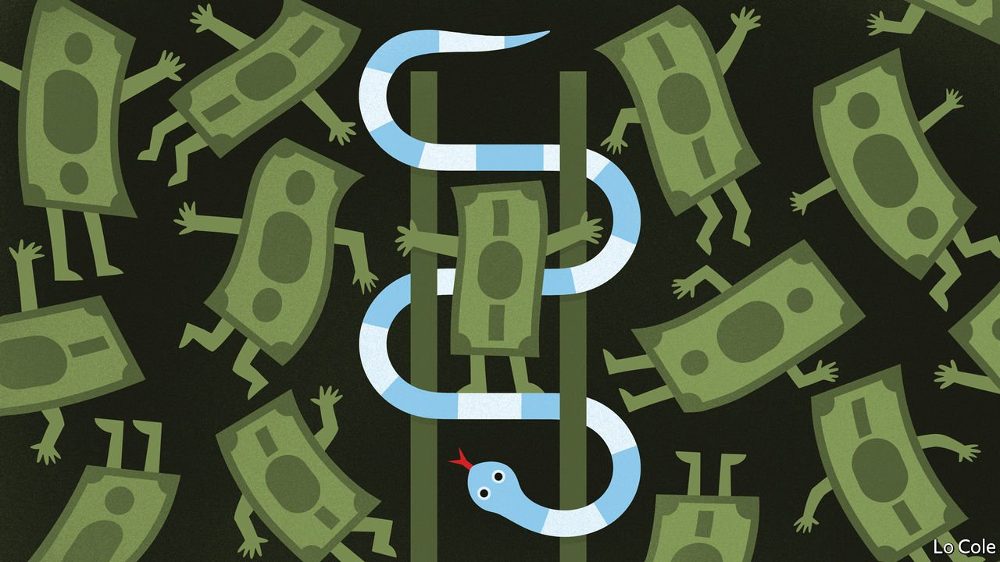

###### Bello

# Argentina’s government has fixed the price of 1,432 products 

##### But Peronism’s penchant for controls is holding the country back 

 

> Oct 30th 2021 

THE DEFINITION of insanity, Albert Einstein is alleged to have said, is to do the same thing over and over again and expect a different result. Argentina’s Peronist government seems to find this simple rule as baffling as others find the general theory of relativity. On October 19th Roberto Feletti, the new secretary for internal trade, issued a decree fixing until January the prices of 1,432 products, ranging from cheese spread to shaving cream. Its 881-page appendix sets out to the last fraction of a peso the maximum price for each product in each of the country’s 24 provinces. The reason? Prices rose by an unexpectedly high 3.5% in September, or 53% over 12 months. And the October figure is due to be published just three days before a crucial mid-term legislative election.

In September the ruling coalition was shocked to lose primaries that serve as a dry run for the election. The lesson drawn by Cristina Fernández de Kirchner, the powerful vice-president who held the top job from 2007 to 2015, was that the government had intervened too little in the economy. Mr Feletti’s controls will allow the ruling coalition to blame price rises on grasping businesses.


“There’s no economic logic, it’s all communicational and political,” says Federico Sturzenegger, a former president of the central bank. It is the government itself that is the reason why Argentina has the highest inflation of any of the world’s bigger economies (barring Venezuela, whose government is even more addicted to controls). It had already capped utility tariffs and interest rates after it came into office in December 2019. But its failure to reach an agreement with the IMF denies it international sources of credit. So it is financing this year’s fiscal deficit of around 4% of GDP mainly by printing money. “That money chases other goods,” driving inflation up, points out Mr Sturzenegger.

The country has been here before. Peronism’s penchant for protectionism, subsidies and holding down the exchange rate means that Argentina suffers chronic fiscal deficits and shortages of hard currency. In late 2013, as the commodity boom waned and dollars ran short again, Ms Fernández’s government tightened its prior controls on prices, foreign exchange and capital movements. Recession and higher inflation duly followed, and the Peronists lost the presidential election in 2015 to Mauricio Macri of the centre-right.

So why repeat a failed recipe? The Kirchneristas’ reading is that they only lost narrowly in 2015. They represent interests that benefit from protection (established industrialists), or are assuaged by subsidies (the poor). Controls assure a kind of stability, preventing hyperinflation.

This artificial stability comes at a cost: the economy has seen almost no growth since 2008. Wages have risen by less than inflation in eight of the past ten years. Argentines were getting steadily poorer even before the pandemic. Those who can afford to send their money abroad; in the recent Pandora papers leak Argentina ranks third in terms of the number of beneficiaries of offshore companies, behind Russia and Britain.

Can the government keep control until the next presidential election in 2023? As inflation has edged up, the price of the dollar in the (tolerated) black market has widened to double the official rate. Alberto Fernández, the proxy president installed by Ms Fernández, has been diminished by his mishandling of the pandemic (he lost credibility after breaking his own draconian lockdown to host a birthday party for his partner). Losing next month’s election would be a further blow.

Luis Secco, an economist, notes that past hyper-inflationary episodes came when the government was weak after losing a mid-term election. But there may still be scope for muddling through, especially if the government reaches an agreement with the IMF. Even if it doesn’t, and it finances fully next year’s expected deficit of 4% of GDP by printing money, inflation need not go much higher than this year.

The big question is whether Argentines have tired at last of the Kirchneristas’ failed policies. Mr Macri lifted controls, spurring short-term growth, but he was too slow to reform the state, prompting a run on the peso and a belated slashing of the deficit. “The people can’t take more austerity,” Máximo Kirchner, the vice-president’s politician son, said this month. His policies offer slower but inexorable impoverishment without any hope of growth. Argentines may come to realise that.

