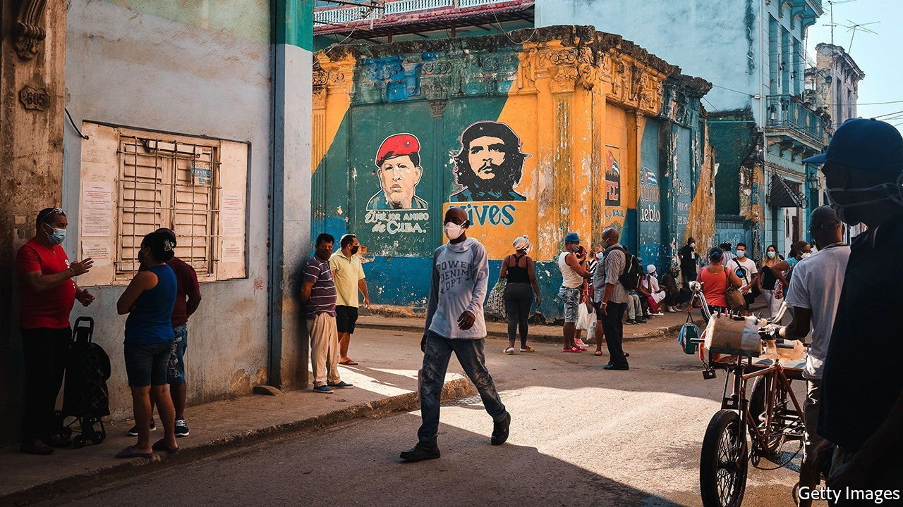

###### Red, white and blue tape

# Cuba’s communist regime is trying to control crypto 

##### Digital currencies are a lifeline for ordinary Cubans 

 

> Oct 30th 2021 

SAILY DE AMARILLO is an entrepreneur in a system that discourages diversity. In Havana she runs a boutique hotel, a café and a co-working space. She also teaches people about social media on Slyk, a website that has taken off in Cuba. Slyk gives her an online presence without having to build a website. Even more important, she can be paid for her work in cryptocurrency.

Parts of Latin America and the Caribbean are experimenting with alternatives to cash. In September Nayib Bukele, the president of El Salvador, introduced a law which makes bitcoin, a cryptocurrency, legal tender. Mr Bukele, who is increasingly authoritarian, pushed through the law despite the fact few Salvadoreans actually want to use crypto. Nicolás Maduro, Venezuela’s autocrat, may have been hoping to catch some of the same headlines when he announced the country’s new “digital bolivar” in August. Digital in name only, the new banknotes lop six zeros off a currency ravaged by years of hyperinflation. Locals, tired of carrying bundles of cash, use mobile payments and debit cards instead.


Cuba is part of this trend—but, as ever with the communist island, with a twist of its own. Interest in crypto had been bubbling for a while, but took off properly late last year, when President Donald Trump imposed sanctions on organisations affiliated with the Cuban armed forces. That included the banks which process much-needed remittances from family members abroad. Almost overnight, firms such as Western Union could no longer operate. This cut off a lifeline in a country in which payment firms such as Visa, Mastercard, Paypal and Stripe were already off-limits.

Accustomed to finding creative workarounds in desperate situations, Cubans abroad began offering to sell cryptocurrency, such as bitcoin, to people on the island with mobile phones and the technological know-how. The buyers would then deliver the purchase price in pesos to the seller’s family or friends.

Initially many of these transactions happened informally over social-messaging apps. As crypto became more common, people turned to specialist platforms, such as BitRemesas, founded in September 2020 by Erich García, a Cuban YouTube influencer who makes videos about the internet. BitRemesas matches crypto sellers outside the country with buyers on the island through auctions.

Now the Cuban government wants to muscle in. At the end of August, the central bank announced that it would recognise and regulate the use of crypto. As is so often true in Cuba, details of the new rules remain cryptic. But the government’s desire to clamp down on a new technology comes at a worrying time. In July countrywide protests were met with police repression and house arrests. Activists had hoped to stage a peaceful march on November 15th, but the government has refused them permission to do so. Rather than deal with their discontent, it claims that they are agents for the United States.

Many of those who protested in July were calling for reforms to an unfair financial system that requires Cubans who are lucky enough to have dollars to exchange them at a lousy rate for other currencies, or for pre-paid cards to buy food and basic goods in state-run shops. Crypto might offer a lifeline to some. But it will take more than the world’s most decentralised currency to change one of the world’s most centrally-planned economies.■

