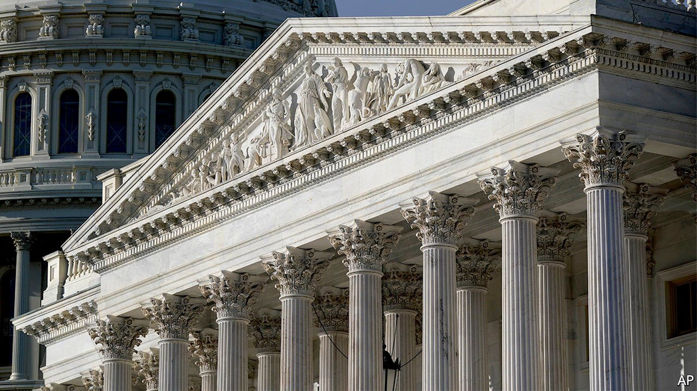
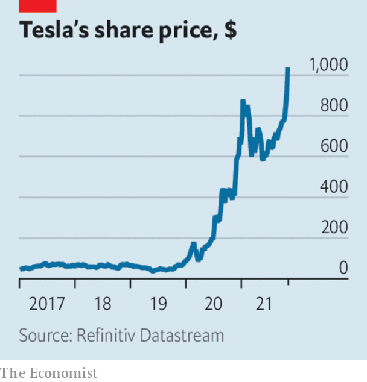

###### The world this week

# Business 

#####  

 

> Oct 30th 2021 

Democrats in the American Senate tried to pin down proposed  that will pay for a $1.5trn spending bill on welfare and the climate, legislation that is much reduced in scope from what its backers originally envisaged. But their plans were thrown into confusion when moderates pushed back against both radical ideas on taxing the super-wealthy and a levy on the profits of America’s biggest companies based on their financial accounting for shareholders, and not what they declare to the taxman.

A blizzard of policies was announced in the (or leaked to the press several days before). The national living wage is to rise to £9.50 ($13) an hour, a 6.6% increase. And with fuel prices surging, a planned tax increase on petrol was scrapped. That didn’t go down well with greens, just days ahead of the British-hosted COP26 summit.


Masters of the metaverse

Facebook formalised its expansion into the “metaverse”, a collection of online worlds where users’ avatars buy clothes, attend concerts and socialise. The company announced more investment in its Reality Labs division, which from now on will report separately from the rest of the business. Part of the reason for Facebook’s refocus is growing competition from TikTok and other apps for attention from younger customers, many of whom think the platform, which will turn 18 next year, is boring. It also faces claims that it cannot control hate speech.

The other highlight in Facebook’s quarterly earnings was the impact on its growth prospects of Apple’s new privacy policy, which allows iPhone users to say whether they want to be tracked for . Mark Zuckerberg said the policy was having a negative effect on Facebook. Snap, a photo and messaging platform, also blamed the change for weaker-than-expected revenues; its share price shed more than a quarter of its value.

Meanwhile Alphabet, the parent company of Google, said that the change in Apple’s policy was having only a modest impact on its advertising business, most of which comes via its search engine. Sales from ads across its divisions, which include YouTube, surged in the third quarter by 43%, year on year, to $53bn.

 


Tesla became the first carmaker to pass a stockmarket value of $1trn, after Hertz placed an order for 100,000 of its vehicles as part of its drive to electrify its rental fleet. Tesla joins Alphabet, Amazon, Apple and Microsoft in the club of American companies valued at over $1trn. Elon Musk’s net fortune alone is now worth more than ExxonMobil’s market value.

The bullish quarterly earnings season in  pushed the S&amp;P 500 to a new record. The index is up by a fifth since the start of the year.

Oil prices climbed, after Goldman Sachs estimated that global demand will soon reach pre-pandemic levels, just as the world faces an energy crunch in natural gas. Brent crude rose above $86 a barrel, up by a fifth since the start of September. Saudi Arabia, meanwhile, pledged to cut its carbon emissions to net zero by 2060. The promise was met with some scepticism; the target excluded the kingdom’s fossil-fuel exports.

The Spanish government softened its proposed windfall tax on the profits of utility companies by allowing for exemptions. It announced the policy in September amid soaring electricity bills for consumers, prompting a backlash from utilities, which said investment would suffer.

Beyond Meat’s share price struggled to recover from the hammering it took after the company warned that sales would be lower than expected because several factors have reduced demand. The maker of plant-based products had a hugely successful IPO in 2019, but has faced stiff competition in the market for fake meat since then.

Eurostar could face competition running passenger trains through the Channel Tunnel that links Britain and France. Renfe, Spain’s state-owned railway company, reportedly thinks it can offer a viable alternative service and has gained the support of the tunnel’s operator.

DraftKings, an American fantasy-sports and betting operator, abruptly abandoned its $22bn takeover approach for Entain, a British gambling firm and owner of the Ladbrokes brand. American gambling companies are looking to expand their global reach, but both sides reportedly couldn’t agree on the terms of a deal.

Retail regeneration

Augmenting its expansion from suburban warehouses to city-centre locations, IKEA is buying the building in London’s Oxford Street that used to house Topshop before it went bankrupt. That’s good news for the city’s busiest shopping thoroughfare, which lost some big high-street names during the pandemic.

