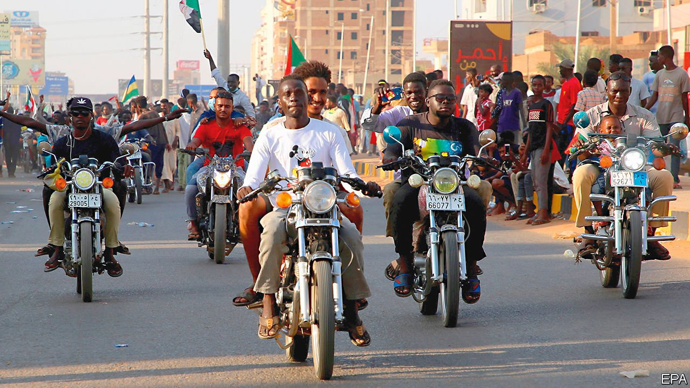
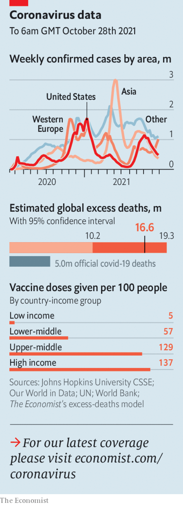

###### The world this week

# Politics 

#####  

 

> Oct 30th 2021 

. Abdel-Fattah al-Burhan, a former general and the country’s de facto president, seized control just months before he was supposed to step down. He also had the civilian prime minister arrested. Mr Burhan said he had acted to prevent a civil war. Thousands of protesters said no, it was a blatant power grab. Soldiers opened fire on them. At least seven people were killed and 140 wounded. Donors such as America suspended aid, but Mr Burhan hopes for backing from undemocratic foreign powers.

BioNTech, the company that developed the covid-19 vaccine marketed by Pfizer, said it would build factories in Senegal and Rwanda next year. It hopes to produce more doses for Africa, which has 17.5% of the world’s population but has so far received only 2.5% of covid jabs.


President Abdel-Fattah al-Sisi of Egypt lifted a four-year state of emergency. In theory, it will now be less easy for his government to quash protests, arrest dissidents without warrants and limit various freedoms. Critics wondered how much less easy it will really be. America has threatened to withhold aid from Egypt unless it improves its human-rights record.

Israel moved ahead with a proposal to build 3,000 new homes for Jewish settlers in the occupied West Bank. The Biden administration has condemned the plan. It may also increase tension in Israel’s governing coalition, which includes doveish parties that oppose settlements.

 over the Negev desert. Aircraft from America, Britain, France, India and other countries joined the drill. The head of the United Arab Emirates’ air force also watched. The exercise pitted Israel and its allies against the fictional “Dragonland”, which has military capabilities remarkably similar to Iran’s.

A different sort of tweeting

A cyber-attack in Iran disrupted the sale of subsidised fuel, resulting in long queues at petrol stations. A group calling itself “Predatory Sparrow” claimed responsibility, but the authorities blamed an unnamed “state actor”. The hackers also took control of digital billboards, making them ask: “Khamenei, where is our fuel?” Ayatollah Ali Khamenei is Iran’s supreme leader.

The UN said that more than half of  would go hungry this winter without help, and that the proportion who subsist on less than $1.90 a day would rise from roughly half before the Taliban seized power in August to a shocking 97% by mid-2022. It said Afghanistan was about to become the world’s worst humanitarian crisis. Residents of Kabul are selling possessions in the streets to buy food.

Members of  convened virtually. Myanmar was excluded, since its military mounted a coup in February and has been slaughtering protesters since then. It was the first time the group has sanctioned a member state this way. Joe Biden promised to help South-East Asian countries stand up to Chinese aggression. It was the first time in four years that an American president had taken part in an ASEAN meeting.

Hong Kong’s legislature passed a law banning films that the government thinks might threaten China’s national security. Violators may face three years in prison.

China postponed the annual marathon in Beijing because of concerns about the spread of covid-19. It had been due to take place on October 31st. No new date has been set.

The chairman of America’s joint chiefs of staff, General Mark Milley, confirmed that China had tested a hypersonic weapon. He called it a “significant technological event” and “very concerning”.

A committee advising America’s Food and Drug Administration recommended that the Pfizer vaccine for covid-19 be given to children aged five to 11. If approved, the shots will be one-third the strength of the jab given to adults.

Not everyone is happy with having to take the vaccine.  imposed by the mayor on public-sector employees either to take the jab or to go on unpaid leave. Thousands of workers, mostly firefighters, marched across the Brooklyn Bridge to protest outside City Hall. Police in Chicago are also up in arms.

, ordered ten ambassadors, including those of America, France and Germany, to be declared personae non gratae, a prelude to expulsion. The envoys’ sin was to have called for the release of a philanthropist, Osman Kavala, who has been locked up for the past four years on trumped-up charges. The Turkish lira fell to its lowest-ever level against the dollar. America’s embassy said it didn’t meddle in Turkey’s domestic affairs, and Mr Erdogan backed down.

Roll over, Moldova

Gazprom, Russia’s state-owned gas company, told Moldova that it would cut the price of its fuel to the cash-strapped former Soviet republic, if it was prepared to alter its tariff-free trade agreement with the EU. Vladimir Putin insists it is nonsense to say that Russia plays politics with its energy exports.

 


Colombia said it would extradite Dairo Antonio Úsuga, aka Otoniel, to the United States, after he was captured in a big security operation. Mr Úsuga is said to be the country’s most powerful druglord. His Gulf Clan in northern Colombia is suspected of killing rivals to gain control of cocaine-smuggling routes into Central America.

Pope Francis agreed to visit Canada to take part in the country’s “process of reconciliation with indigenous peoples”. Hundreds of unmarked graves were found earlier this year at sites of former residential schools for indigenous children, most of which were run by the Roman Catholic church. Justin Trudeau, Canada’s prime minister, vowed to improve relations with indigenous Canadians. He is still taking flak for skipping the first national day for reconciliation on September 30th to go surfing.

