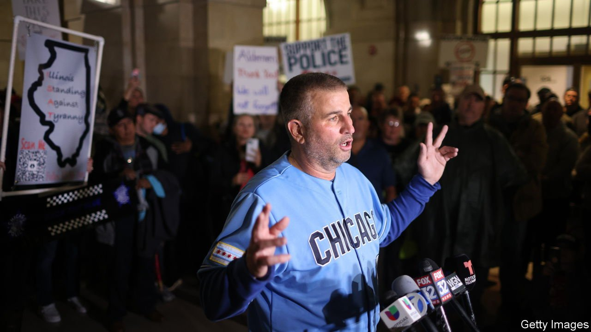

###### Police v vaccine mandates

# Cops hate vaccine mandates, and the city leaders imposing them 

##### Hands up, no shots 

 

> Oct 30th 2021 

JOHN CATANZARA, president of Chicago’s police union, says he is no anti-vaxxer. He got his jabs some time ago. Yet the fiery union leader, who likes to post long monologues on YouTube to rally his troops, insists that his vaccination status is none of the city of Chicago’s business. On October 15th, under a mandate announced in August by Lori Lightfoot, the mayor, all city workers were meant to fill in an online form with their vaccination status. Those who are not vaccinated have to submit to twice-weekly testing for covid-19, at their own expense. If they do not supply their status, they will be put on unpaid leave. Mr Catanzara calls this “tyranny”.

In August, in an interview with the Chicago Sun-Times, he described it as being the sort of thing Nazi Germany would have imposed, comparing getting a vaccine to being told to shower in Auschwitz. He apologised for those remarks, but he has kept up the basic thrust, saying on October 25th that Chicago is “literally a dictatorship”, for forcing city workers to get vaccinated. Worried that he has, in effect, been encouraging the police to strike—which would be illegal—a judge ordered him to shut up. He only barely complied. By the deadline 4,500 officers, almost a third of Chicago’s police force, had not provided their vaccination status. A few dozen have been put on unpaid leave. Yet their refusal to co-operate is about more than just vaccines. It reflects police anger more broadly with liberal city governments.


In New York on October 25th, the largest police union also sued to oppose a vaccine mandate there, which comes into effect on November 1st. In Los Angeles Alex Villanueva, the county sheriff, said on October 7th that he will refuse to enforce a vaccine mandate imposed by Los Angeles County. Portland, Oregon, and Seattle are also facing police revolts. By contrast Florida’s Republican governor, Ron DeSantis, a vocal supporter of vaccine holdouts, this week promised a $5,000 sign-up bonus to those who move to his state rather than accept their jabs. “If you’re not being treated well, we will treat you better here,” he said.

Mr Catanzara, like many police officers, insists his objections are about collective-bargaining agreements, not vaccines themselves. The police are not alone. In New York hundreds of municipal workers marched across Brooklyn Bridge on October 25th to protest against the mandate there. In Illinois a few teachers have resigned rather than get jabbed. But the police seem especially irked. This may reflect officers’ politics. Last year the national Fraternal Order of Police endorsed Donald Trump. City leaders, by contrast, tend to be on the left of the Democratic Party. Ms Lightfoot has been an enthusiastic proponent of Chicago’s consent decree, through which the federal government monitors its police force. Bill de Blasio, the mayor of New York, has curbed stop-and-search and is unpopular in the NYPD.

So far, vaccine mandates have largely survived legal challenges. Politics is a bigger risk. On October 25th, at an emergency meeting, Mr Catanzara demanded that Chicago’s aldermen, or councillors, put their hands up to vote for a resolution to take the power to impose these rules away from the mayor. To those that didn’t, he threatened: “We are coming for every one of your damned seats.” In Los Angeles Mr Villanueva has suggested that cops will quit rather than be forced to get jabbed.

Such threats may not come to much. But murder rates are rising again in many American cities, and police officers are in demand. Ms Lightfoot has already watered down her original proposal (initially, getting tested was not an option). It is a risky business, upsetting the boys in blue. ■

Dig deeper

All our stories relating to the pandemic can be found on our . You can also find trackers showing ,  and the virus’s spread across .

