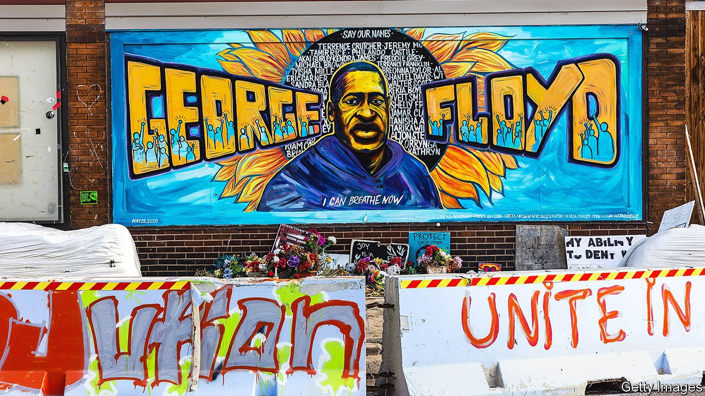

###### Police reform

# George Floyd’s city votes on the future of its police department 

##### Crunch time for the defunding debate 

 

> Oct 30th 2021 

YOU CANNOT avoid his face anywhere you go. More than a year after the murder of George Floyd, and a few months after the conviction of Derek Chauvin, the police officer who knelt on his neck, the memory of Floyd remains almost hauntingly imposed upon Minneapolis. The street where he was killed is demarcated by two enormous constructions of black fists raised in the air; the site of his death is a makeshift memorial with fresh flowers in spite of the stiff October chill; murals of him and of protests envelop the city.

Despite the upheaval that his death and its ensuing protests caused in the city and the country, precious little about policing in America seems to have changed. Cities that hastily cut police budgets are now reversing course in the face of resurgent violence. After months of negotiation, a vaunted bipartisan police-reform deal in Congress has collapsed.


On November 2nd, however, voters in Minneapolis will have the chance to do something drastic. As well as passing judgment on Jacob Frey, the incumbent mayor seeking re-election, they are also voting on whether to replace the Minneapolis Police Department with a new Department of Public Safety that “employs a comprehensive public-health approach”, and to eliminate a mandatory minimum of police officers established in the city’s charter.

In a city where there were as many as nine Biden voters for every Trump supporter in the last presidential election, such a referendum would pass easily if Democrats were united. They are not. Mr Frey is running against the measure. The state’s governor and senators, all Democrats, are opposed to the idea of repealing and replacing the police department. But Keith Ellison, the state attorney-general who won a murder trial against Mr Chauvin, is for it. “If we don’t make changes to the circumstances that brought us to George Floyd and the aftermath, we’re going to get more of it…And I want to do something different,” he says.

Rhetoric and reality

The critical division is over whether or not the plan is a pretext to “defund the police”. Opponents insist it is sloganeering masquerading as policy. “I have never supported defunding or abolishing the police,” wrote Mr Frey when defending his stance. Shortly after Floyd’s murder, a majority of the city council appeared at a rally at Powderhorn Park on a stage in front of which “DEFUND POLICE” appeared in gigantic block letters.

Advocates for reform have adjusted their language. As with the civil-rights movement, “those farthest on the left are what pushed the movement…we shifted the narrative from reform to defund,” says Sheila Nezhad, a community organiser running for mayor who is posing a stiff challenge to Mr Frey. Having contributed to a report on policing that argued that “abolition is the only way forward”, Ms Nezhad now avoids such rhetoric on the campaign trail, preferring words like “reinvest”. Kate Knuth, another candidate for mayor who supports the reform, says: “My vision of a department of public safety absolutely includes police,” funded at the same levels as today.

Reform campaigners in Minneapolis favour a less provocative slogan, “Expand public safety”, for their yard signs. The established minimum size of the force—17 officers per 10,000 residents—is not particularly high for a large city, though it is unusual in being so explicit. The argument for abolishing it is that it is an impediment to reform. “It’s not revolutionary or radical, it is literally a common-sense step to keeping people safe, and quite frankly benefits police officers”, who are overstretched, argues JaNaé Bates, a church minister and leading campaigner. Law-enforcement officers would remain, she says, but some funding would be reallocated towards other means of emergency response, such as mental-health professionals.

Advocates hope that the proposed rebranding and the rerouting of funding towards unarmed social services will restore trust among minority communities, without risking a backlash among white residents. Such an approach is necessary to win. Public opinion in favour of “defunding” police departments was never high. The increase in violent crime has made it even less so.

In June 2020, 41% of Democrats told survey-takers for the Pew Research Centre that they wished to reduce local police budgets. By September 2021 that had shrunk to 25%. Among the general public, support declined from 25% to 15%. Official data recorded a 30% jump in homicides nationwide between 2019 and 2020, the largest single-year rise on record. The preliminary evidence for 2021 suggests that the rate may continue to grow. Minneapolis is on pace to have 88 murders this year—the most in the city in the past 25 years.

The energy for police reform is often inversely related to crime. That puts reformers in a difficult position. In August 2020 the city council in Austin, Texas, voted to trim its annual policing budget by one-third. Its most recent budget reversed that entirely. There is now a referendum in that city to institute a minimum staffing requirement for policing—exactly the kind that Minneapolis is currently trying to undo. Other Democrat-led cities, like Atlanta and New York, have had to reverse earlier pronouncements on reduced police funding in the face of increased crime. If Minneapolis votes differently, it would buck an emerging trend.■

