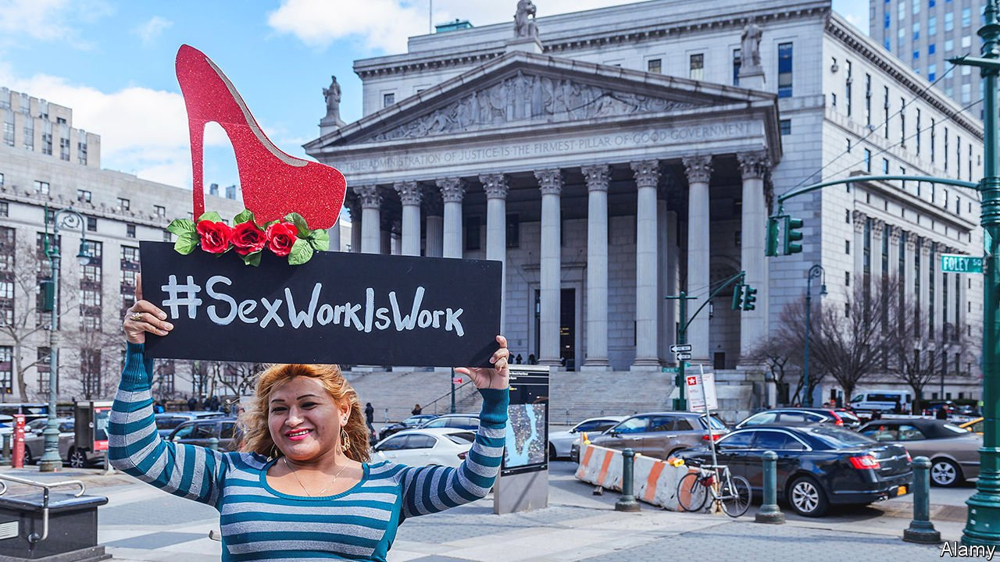

###### Prostitution in America

# How to bring sex work out of the shadows 

##### The debate over different approaches to decriminalisation 

 

> Oct 30th 2021 

LIFE FOR women who sell sex in Manhattan may be a little easier these days. In April the district attorney’s office said it would stop prosecuting those who offered or agreed to engage in a sex act for payment. Buyers of sex, though, can still be charged with “patronising a prostitute in the third degree”.

The language sounds archaic because the law is. Whereas many rich countries have decriminalised the buying or selling of sex (or both), prostitution remains illegal across America, apart from in a few counties in Nevada. But the change in Manhattan—and similar moves in other New York boroughs and Baltimore—is part of a growing movement to reform the criminal-justice system’s treatment of such transactions. A handful of states have introduced bills that would partially or fully legalise them.


This reflects a growing belief that prosecuting prostitutes is cruel and counterproductive. Criminal records can make it hard to find housing and alternative employment. The mere threat of them can prevent some from seeking health care.

What is the best way to reform? There are two broad approaches: allowing the selling of sex but retaining penalties for buying it, in the hope this will lower demand (this is known as the Nordic model, after a law passed in Sweden in 1999); and decriminalising both sides of the transaction, in the hope that it will result in better working conditions.

In America, where polarisation on many social issues is growing, divisions between the proponents of these different approaches can be stark. This is especially apparent in New York, where two bills have been introduced in the state legislature. In September Kathy Hochul, the governor, said she was considering decriminalisation. She did not say whether she favoured the Stop Violence in the Sex Trades Act, a full decriminalisation bill, or the Sex Trade Survivors Justice and Equality Act, which would punish only buyers.

Proponents of full decriminalisation argue that bringing sex work into the light makes it easier for prostitutes to get access to health services and report violence to the police. They often cite the example of New Zealand, which fully decriminalised in 2003. Four years later a study found that most prostitutes still did not report violence, but a majority said police attitudes towards them had improved. Barbara Brents, a sociology professor at the University of Nevada, says that although the state’s tightly regulated brothels take a big slice of sex workers’ earnings, some women choose to work in them because they feel safer. (Even so, most prostitutes in Nevada work outside the legal brothels.)

Cecilia Gentili, a former sex worker and trans woman who helped found Decrim NY, which was involved in drawing up the Stop Violence bill, says she never considered telling police when she was forced to sell sex, for fear of being arrested. Sex work, she believes, should be regarded much like any other employment. Laws aimed at reducing demand are “patronising”, she says, promoting the idea that “women are not able to make decisions”.

Whether such activists speak for most sex workers is impossible to know, because there have been no large-scale surveys of sex workers in America. Yet strong anecdotal evidence suggests selling sex is different from other forms of manual labour in important ways. Drug addiction and homelessness often lead people into sex work and keep them in it. Many prostitutes have sold sex since they were minors; other forms of employment are not connected with abuse in this way.

Nor are they typically connected with trafficking. Some people in organisations that work with prostitutes say the spectre of sex trafficking—defined by the federal government as a commercial sex act “induced by force, fraud, or coercion” or in which the seller is under 18—is a distraction from other problems. Reliable data are hard to come by, so no one really knows how prevalent trafficking is. But it is almost certainly underreported.

Proponents of full decriminalisation say it would make it easier to prosecute traffickers. But champions of the Nordic model say breaking the law acts as a deterrent to some would-be buyers, so full decriminalisation boosts demand, creating opportunities for exploitation on the supply side. Since most women with alternatives choose not to sell sex, less fortunate ones fill the gap. Some will be trafficked.

The New Zealand study found that the number of sex workers there had not increased after decriminalisation. But an analysis of data from 150 countries in 2013 found that legalising prostitution led to its expansion and increased trafficking. Alexi Meyers, a former assistant district attorney in Brooklyn, says prosecutions against sex-work “promoters” can lead to the prosecution of traffickers; full decriminalisation could prevent that happening.

Nordic or nothing?

In states that are mulling decriminalisation, decisions are likely to come down to practical factors such as this. Another consideration is how changes in one state will play out in a country where sex work mostly remains illegal (and in conservative states any reform is a distant prospect). If New York became the first to fully decriminalise, it could well attract sex tourists in large numbers.

In June, when Maine’s governor vetoed a bill decriminalising sex work, she expressed concerns about becoming the first state to do so (she also worried, she said, that it would push up demand). Though the rejected legislation was for the Nordic-style approach, this may emerge as the most palatable and practical way for America to begin to reform its sex-work laws. ■

