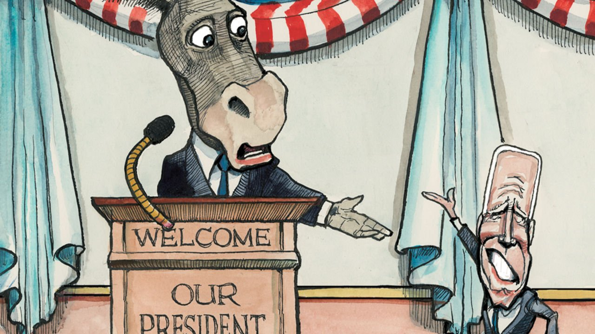

###### Lexington

# No one loves Joe Biden 

##### Americans elected the president to get rid of his predecessor. They’re not sure what else he can do 

 

> Oct 30th 2021 

ARLINGTON, HOME of Robert E. Lee and a cemetery dug vengefully on his front lawn, is barely in Virginia these days. The city’s tony apartments and IT firms have long made it feel like an extension of Washington. That, in turn, made it relatively safe for Joe Biden, one cold and blowy evening this week, to flit across the Potomac and dip his toes into Virginia’s gubernatorial race.

It would have been awkward had he not, given how many Democratic big-hitters have flooded the state as the contest between Terry McAuliffe and Glenn Youngkin has tightened. But no one expected the increasingly troubled president to move many votes. Even the irrepressible Mr McAuliffe, a force field of positivity and Mr Biden’s friend for 40 years, admits that he is unpopular in the commonwealth. This was implicit in the arrangements made for the presidential visit. Only a tiny corner of a large Arlington park had been fenced off and floodlit for it—to create the safest possible space in the most reliably Democratic city of a state that Mr Biden won last year by ten points.


Only a modest Democratic crowd duly showed up. And its members seemed ambivalent about the president. Asked for their opinion of him, some said they were “indifferent”, others claimed to have “no view”. Several of those quizzed by Lexington said they knew nobody who was enthusiastic about him. “That’s not really what he’s about,” said one woman, jiggling a “Terry for Virginia” sign. Just one person, an India-born woman huddled in the gloom, richly praised the administration. She worked for a hospital lobby and loved its increased health-care spending.

As Mr Biden’s approval ratings have dived in recent months, solid arguments have been offered in his defence. Most presidents lose support in their first year, as the thermostatic nature of public opinion asserts itself. And indeed his descent from 56% approval after his inauguration to the low 40s today is similar to the slides Barack Obama and Donald Trump suffered. Mr Biden has also faced daunting headwinds, in the resurgence of covid-19, the economic havoc it has wreaked and the fact that half of Americans have not heard a good word said about him, so polarised have the media become. History is against him in Virginia, too. As one of the first states to vote after a general election, it often bloodies the nose of whichever party occupies the White House. Yet such rationalisations cannot lessen the gravity of his predicament.

Mr Obama fell from such a high level after his first election that he remained in positive territory. Mr Trump was never popular outside his base—yet the more unpopular he got, the more its members loved him. Taking the fight to the liberal mainstream was his shtick. Neither ameliorating factor applies to Mr Biden. He won by a much narrower margin than Mr Obama’s, which in itself called the Biden shtick (his promise to unite the country against Trumpism) into question. And that tension has increased as his numbers have worsened.

In Arlington Mr Biden again focused, in his shouty way, on his predecessor. “Remember this: I ran against Donald Trump and Terry is running against an acolyte of Donald Trump!” The limits of that message were exposed in the general election, not only by Mr Trump’s robust losing performance, but also by how little damage other Republican candidates suffered by association. And the former president is even less of a bogie today. Most voters—especially independents, among whom Mr Biden’s slide has been steepest—appear to have put him from their minds. Moreover, it becomes increasingly hard to present yourself as a uniter, not a divider, when more than half the country thinks you’re doing badly.

If Mr Biden cannot reverse that impression, the outcome for his party will be grim. Mid-terms are a referendum on the president, not his predecessor. His dire ratings are therefore setting Democrats up for a hiding. History suggests they are consistent with their losing control of both chambers. It also shows how hard it will be for Mr Biden to claw his way back.

Among his recent predecessors, only Bill Clinton has staged a major public-opinion comeback in peacetime, and he had the advantages of an excellent economy and quicksilver political skills. Mr Biden has neither. He is above all tied to covid-19, the sort of fundamental that is far more determinative of political success or failure than most coverage suggests. Political performance tends to be less of a factor; but there too Mr Biden is in trouble.

By recent standards, his administration has performed creditably. It is led by serious people, unlike its predecessor. And he appears on track, despite Democrats’ slim congressional majority, to sign more major legislation in his first year than Mr Obama. The debacle in Afghanistan, which hit Mr Biden’s ratings hard, was a blot, yet one that received blanket coverage in part because of how uncharacteristic of the administration it was. Such incompetence, which was expected of the Trump administration, is atypical of Mr Biden’s—save in one respect, its ability to sell its aims and accomplishments, at which he and his party are abject.

Hardly any non-lobbyist in the Arlington crowd could name a significant thing the administration had done. Most knew congressional Democrats were haggling over the cost of a spending package, but struggled to recall almost any of the climate and social policies it contained. And this was in arguably the most educated, switched-on, centre-left place in the country. The chances of independent voters in Milwaukee or El Paso having half a clue as to what Mr Biden is attempting would appear to be close to zero.

In his labyrinth

Mr Trump was always selling his record, even when it didn’t exist. By contrast Mr Biden and his party are not making a case for what they are actually doing. Mr Clinton’s guru, James Carville, suggests they dislike salesmanship. Or perhaps Mr Biden is no good at it. Either way, he is falling short. If elections are about the future, as Mr Clinton liked to say, they cannot only be about Mr Trump. ■

For more coverage of Joe Biden’s presidency, visit our dedicated 

