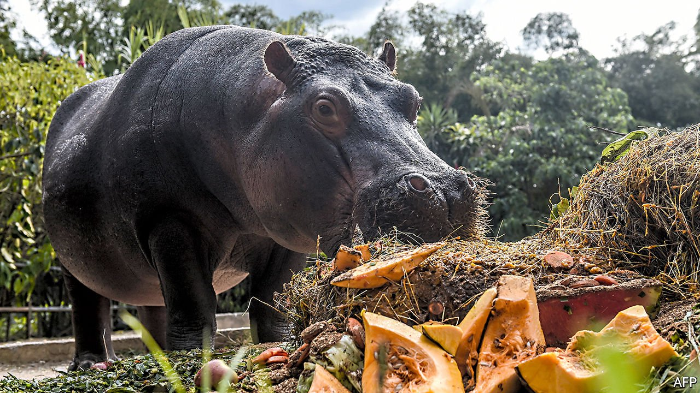

###### Animal rights

# Pablo Escobar’s hippos lead a charge for animal rights 

##### They can wallow on a while longer 

 

> Oct 30th 2021 

CORPORATIONS HAVE enjoyed legal personhood since the 19th century. Now, it seems, they have company. A dispute over the fate of hippos in Colombia has given rise to a federal court ruling in Ohio that, for the first time in American law, recognises animals as people.

This should come as welcome news to the 100-plus hippos of Colombia’s Magdalena river. They are the offspring of four hippos smuggled into the country by Pablo Escobar, a drug lord. After Escobar died in a shoot-out with police in 1993, other specimens from his exotic menagerie—ostriches, zebras, flamingos—found new homes in zoos. But the hippos took up residence in the mud of the Magdalena and got to reproducing.


The surfeit of hippos has coated lakes with algae and could displace otters, manatees and endangered turtles. Hippos have begun wandering into villages, too—a potential peril for human persons. Last year the government considered a cull, prompting a Colombian lawyer to take up the cause. The hippos, his lawsuit says, enjoy protection under Colombian law and must not be killed.

Judge Karen Litkovitz, the federal judge in Ohio, does not get to decide the hippos’ fate. But on October 15th she agreed with the Animal Legal Defence Fund that the hippos are “interested persons” under a law permitting foreign litigants to gather evidence in America that may buttress their claims. Experts in non-surgical sterilisation will be deposed for their insights on PZP, a contraceptive that could spare the hippos while dampening their growth.

America is not the first country to regard animals as legal persons. An Indian court cited the constitution in banning a bullfighting festival in 2014. A judge in Argentina ruled that Sandra, an orangutan, was a non-human person eligible for better environs than her concrete enclosure in a Buenos Aires zoo; she now luxuriates in a sanctuary in Florida. In 2020 a court in Islamabad, faced with cases involving stray dogs, an elephant and a bear, recognised the “right of each animal…to live in an environment that meets the latter’s behavioural, social and physiological needs”.

Judge Litkovitz’s decision is not couched in such sweeping terms. It remains to be seen whether other American courts take her cue in cases such as that of Happy, an elephant at the Bronx Zoo who has shown signs of self-awareness and misery. In 2022 New York’s highest court will consider whether the writ of habeas corpus—protection from unjust imprisonment—applies to Happy.

