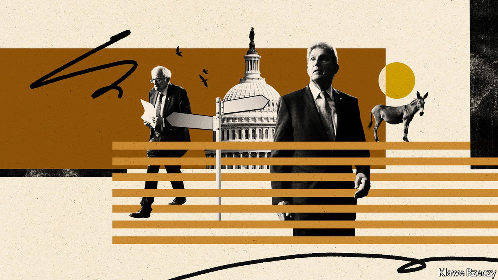

###### America’s entrenched political divide

# The Democrats’ disadvantage 

##### The party faces long-term hurdles that will be hard to overcome 

 

> Oct 27th 2021 

FOR WEEKS, Democrats in Congress have been trying to pull off a delicate legislative two-step with President Joe Biden’s agenda. House progressives refuse to vote for an infrastructure bill, which passed the Senate with bipartisan support, until the Senate passes a social-spending bill. That measure has to be slender enough—negotiations have whittled it down to around half of its initial $3.5trn size—to satisfy moderate Democrats, but not so meagre that it loses progressives’ support. And Mr Biden would love it done before he arrives at the COP26 climate conference in Glasgow on November 1st. His legacy hangs in the balance, and the tactics surrounding this legislative pas de deux are intensifying an argument over the party’s direction.

Democrats won unified control of the federal government in 2020, defeating an incumbent president for the first time since Bill Clinton beat George H.W. Bush in 1992. Joe Biden ran on an agenda that was farther left than either Hillary Clinton’s or Barack Obama’s. Now the debate over that agenda is highlighting a rift in party strategy. Conservative Democrats such as Joe Manchin, a senator from West Virginia, contend the party must not throw fiscal caution to the winds. But progressives such as Bernie Sanders, a senator from Vermont, argue that the party must be bold, proving it can honour its promises.


Even if the rival factions compromise and pass Mr Biden’s legislation, Democrats will still probably lose their congressional majority next year. Mid-term elections since 1934 have typically produced a backlash against parties occupying the White House; they have lost an average of 28 seats in the House and four in the Senate in those contests. The Democrats’ current advantage will vanish if they lose four seats in the House and one in the Senate.

 


Longer-term trends also paint a dire picture for the Democrats, especially in the Senate. For half a century they have been losing support among rural voters and gaining in the cities. This has packed their voters into metropolises in coastal strongholds, such as California and New York, as well as smaller cities in states where Republicans outnumber them, such as Florida, North Carolina and Texas. Less-populated conservative states like Idaho and Wyoming remain reliably Republican. Because each state has the same number of senators, the chamber gives Republican voters a disproportionate number of seats.

According to calculations by Daily Kos, a liberal website, Republicans have not won the cumulative popular vote for the Senate since the three election cycles leading up to 1998 (the chamber is divided into thirds, with one-third elected every two years). Yet they have won the majority of its seats in seven of those 12 cycles.

How can Democrats combat these trends? One group of strategists sees the answer in population growth among some of America’s most left-leaning voters—young people and Hispanics. But that theory fell apart in the last election, when non-college-educated Hispanics swung hard towards Mr Trump and turnout among young voters, though up, remained below the overall average.

Many Democrats have instead come round to the views of David Shor, a data analyst who worked for Mr Obama. Mr Shor’s proposed strategy is to decrease “education polarisation”—the gap between the votes Democrats get from college-educated Americans and those they get from people with no college education—to the level of 2012. That was the most recent year in which whites without college degrees gave Democrats 40% of their votes or more, according to Catalist, a political-data firm. Last year just 37% voted for Mr Biden. Since only 36% of Americans over the age of 25 have a college degree, relying on them to fill the gap is not viable. Whites without degrees make up the largest share of the population in rural states.

Mr Shor’s solution is “popularism”: the idea that Democrats need to emphasise their most popular policies, such as economic redistribution and lower health-care costs, and avoid topics such as immigration and defunding the police that alienate working-class white voters. Though “don’t do unpopular stuff” sounds a glaringly obvious strategy, the debate over the theory has taken hold of the party.

How Democrats should carry out Mr Shor’s plan is unclear. Education polarisation is not a new trend. A study of survey data stretching back to 1948 by Amory Gethin, Clara Martínez-Toledano and Thomas Piketty, all economists, illustrated parallel trends in many Western democracies. The authors write that it will be hard to reverse unless Democrats become the champions of conservative positions on “sociocultural” issues, such as law and order, the environment and immigration.

Persuading someone to change their vote grows harder as political identities deepen.In 2020 the link between a voter’s partisan identity and self-described ideology was the strongest on record. According to an analysis of survey data by Charles Franklin, a political scientist and pollster in Wisconsin, a person’s stated ideology explained roughly 57% of their partisanship in 2020, up from 49% in 2016 and 20% three decades ago. This rise in social sorting helps to explain the decrease from 10% to under 5% in the share of Americans who regularly switch parties, according to The Economist’s analysis of survey data from the American National Election Studies, a poll conducted in election years since 1952.

Much of Mr Trump’s success in 2016 stemmed from his understanding that policy preferences are fickle: identity-loyalty and group conflict are more powerful levers to earn a person’s vote. Democrats cling to the theory that their popular policy agenda will eventually secure them a permanent majority. But before support for a wealth tax, say, can win over non-college whites, they will first need to feel that Democratic candidates understand them and share their cultural outlook.

There Democrats face a further hurdle: their increasingly nationalised brand. According to Jonathan Rodden, a political scientist, one reason left-leaning parties worldwide have been doing poorly with rural working-class whites is that their candidates struggle to differentiate themselves from the party’s ultra-progressive elected officials from the big cities. This imposes the otherworldliness of very left-leaning Democratic politicians elsewhere onto the party’s candidates in the heartland. Recent losses for conservative Democrats in Montana and North Dakota show how vulnerable they are to this.

When the Republicans were in a similar position in the 1960s, locked out of power by the union of progressive northern Democrats and conservative southern ones, they mustered a realignment. They used the backlash against the civil-rights and feminist movements to woo conservative non-college whites. But entrenched identities now make such a feat harder. It appears nearly impossible for Democrats to win back a substantial share—say, 5%—of the blue-collar northern whites they once relied on for power, especially in the Senate. They are likely to be disadvantaged by America’s geography-based electoral system for many years to come. ■

For more coverage of Joe Biden’s presidency, visit our dedicated 

