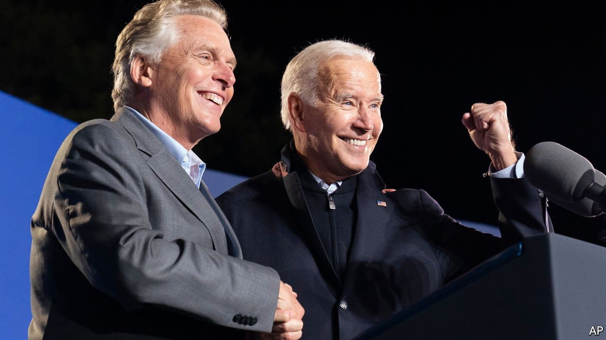
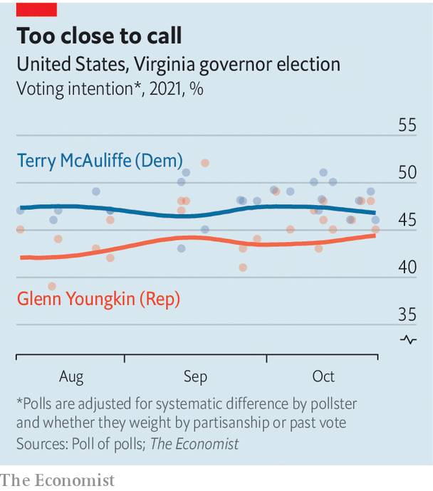

###### Predicting America’s elections

# The message from our model for Virginia’s gubernatorial race 

##### Bad news for Democrats 

 

> Oct 30th 2021 

THE RESULT of Virginia’s race for governor on November 2nd will “set the tone” for next year’s mid-term elections. So said Terry McAuliffe, the former Democratic governor of the state, as he launched a get-out-the-vote campaign last Friday. If so, the party is in trouble. President Joe Biden won the state by ten percentage points last year, but Mr McAuliffe is now polling just two points ahead of his Republican opponent, Glenn Youngkin, according to a statistical model built by The Economist. That gap is small enough for Mr Youngkin to close at the last minute.

 


Our model aggregates publicly released polls and attempts several modest corrections to the underlying data. First, we remove any uniform biases from each polling firm. These may arise from methods of collecting or processing data—or, in rarer cases, from the ideological bent of the polling house. We then subtract any systematic differences between pollsters who try to ensure they have representative shares of Democrats, Republicans and independents and those who do no such weighting. This helps control for the tendency for non-party-weighted data to bounce around more than party-weighted polls; in some cases it also removes an extra layer of bias. Lastly, we use the model to fit a trend line through all the adjusted points. This method yielded a closer prediction for the recent recall election in California than most other public averages of polling data.


If the election were held today, our model suggests Mr McAuliffe would defeat Mr Youngkin by about two percentage points. That should not comfort the Democrats. Our model also finds plenty of uncertainty in the polling data: it gives the former governor only a roughly two-in-three (67%) chance of winning the race. Even a modest polling error could blow the aggregate off course. In 2017, when the state’s current Democratic governor, Ralph Northam, won the office, the polling average in Virginia underestimated his margin by six percentage points.

Win or lose, the tone the election sets for the mid-terms is likely to be bad for the Democrats. The party in the White House usually loses both the subsequent election for Virginia’s governor and seats in the national House and Senate elections the year after. And a close relationship exists between the swing against the incumbent party in those gubernatorial contests and in the House vote nationally. With Mr Biden’s  underwater and a trend against the Democrats in congressional generic-ballot polling, even a five- or six-point margin for Mr McAuliffe on November 2nd would portend defeat in the mid-terms.

