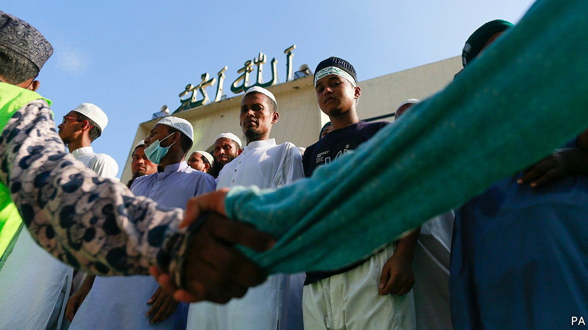

###### Spilling over

# Bangladesh’s religious minorities are under attack 

##### The prime minister blames India’s Muslim-bashing for Hindu-bashing in her own country 

 

> Nov 6th 2021 

ONE DAY in October Dilip Das had a bath, donned a new shirt presented to him by his son and prepared a garland of flowers before setting off for his local temple in Cumilla, a city of 300,000 in eastern Bangladesh. It was Durga Puja, the most important festival in the Bengali Hindu calendar. By the end of the day the 62-year-old Mr Das was dead, bludgeoned by a Muslim mob. “What was his sin?” asks Rupa Das, his wife. “He was just a simple man, a washerman,” who had lived happily alongside his Muslim neighbours.

Mr Das was a victim of widespread unrest that day in Bangladesh, which is 90% Muslim. A copy of the Koran had been found in one of the temporary temples erected for the festival in Cumilla. A video showing a police officer carrying the Islamic holy book, with a voice-over claiming it had been rescued from under the feet of a Hindu idol, quickly went viral on Facebook and WhatsApp, unleashing a wave of attacks on Hindus and other religious minorities, too. Outside the main mosque in Dhaka, the capital, a crowd of 10,000 chanted, “Hang the culprits”. Across much of the country Muslim rioters beat Hindus and pillaged their property. Hundreds were wounded and at least three died, along with four Muslim protesters who were gunned down by police.


Islam is the state religion in Bangladesh. Confusingly, the constitution also says the state is secular. (Past struggles over this topic ended in a self-contradictory muddle.) The ruling Awami League party is secular, but rising Islamic conservatism has made religious minorities feel insecure, says Mubashar Hasan of Western Sydney University. The Awami League, too, has courted puritanical voters and flirted with Islamist groups in its 12 years in power. And it has often failed to prosecute those responsible for attacks, says Rana Dasgupta of the Bangladesh Hindu-Buddhist-Christian Unity Parishad, an advocacy group. Members of the party’s student wing were implicated in the recent riots.

Yet in responding to the violence Sheikh Hasina Wajed, the prime minister, suggested it was India’s treatment of Muslims that was causing anger towards Hindus in Bangladesh. On October 14th she issued a warning to Narendra Modi, her Indian counterpart, and his supporters: “They have to be aware that such incidents should not take place there which would have an impact on Bangladesh.”

Sheikh Hasina is not being entirely disingenuous. Bangladesh is indeed affected by regional currents, says Dr Hasan, especially those in India. In 2019 Mr Modi’s Hindu-nationalist government rolled out new rules granting an easier path to citizenship for refugees from neighbouring countries—unless they are Muslim. It has also targeted Muslims in states bordering Bangladesh, whom politicians from the ruling Bharatiya Janata Party have labelled “infiltrators” and “migrant termites”. In recent weeks hundreds have been displaced in eviction drives. Huge protests greeted Mr Modi when he visited Dhaka in March. Anti-India feelings often slide into anti-Hindu hostility, says Dr Hasan.

Events in India have triggered violence in Bangladesh before. The country’s Hindus were targeted in 1992 after religious fanatics demolished a mosque in India. This time, however, the bloodshed in Bangladesh triggered fresh violence in India. A few days after the unrest abated in Cumilla, mobs ransacked mosques and Muslims’ homes in Tripura, an Indian state just a few miles from the city. India’s National Human Rights Commission has asked local police to respond to allegations that “the state machinery acted like a bystander”.

In Bangladesh, in contrast, the government has arrested 583 people since Mr Das was slain, and Sheikh Hasina has vowed to defend religious freedom. Mr Modi, notes Meenakshi Ganguly of Human Rights Watch, an NGO, is mute on the mistreatment of Muslims in India. Majoritarianism elsewhere in the region sets a low bar, though. In the end, she says, states must protect their own religious minorities. ■

