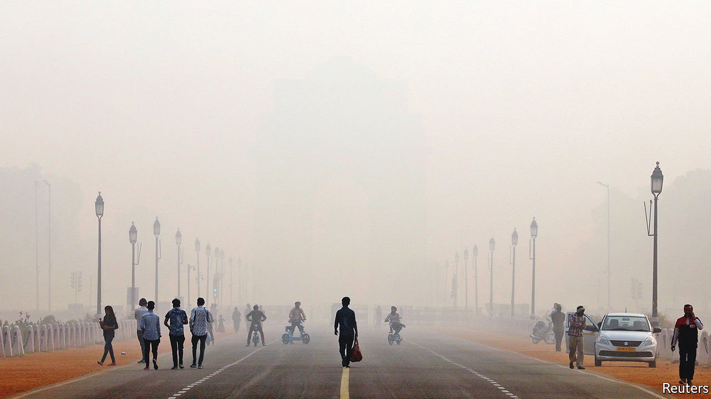
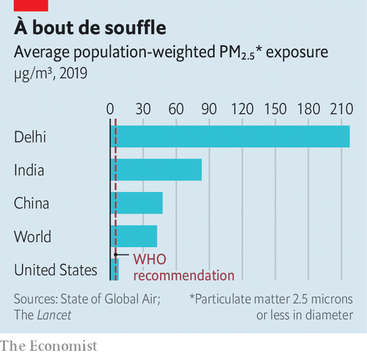
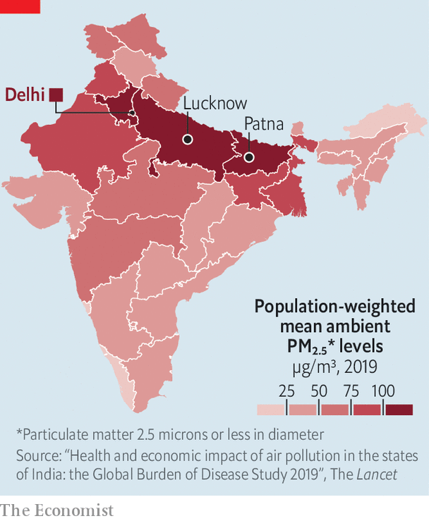

###### Pollution season

# India’s toxic air is its most immediate environmental problem 

##### Even as the country pledges climate action, its people are dying from breathing 

 

> Nov 6th 2021 

ADDRESSING WORLD leaders at the COP26 jamboree in Glasgow this week, Narendra Modi, India’s prime minister, listed five commitments to tackle climate change, including a promise to achieve carbon neutrality by 2070 and several shorter-term goals. Mr Modi also took the opportunity to point out that while poor countries bear a mere fraction of the blame for creating the world’s climate mess, some, such as India, have done better at keeping environmental commitments than many rich countries.

He is right. With 18% of the world’s people, India is reckoned to have caused just 3% of accumulated CO emissions. Yet even as Indian leaders repeatedly—and sometimes justifiably—take the moral high ground on climate change’s long-term challenges, their people continue to suffer and die from its immediate, home-grown causes.


Dr Arvind Kumar should know. When he started working as a chest surgeon in Delhi 30 years ago, nine-tenths of lung cancer patients were smokers and nearly all were men over 50. Now half of them do not smoke, 40% are women and their mean age is a decade younger. He regularly sees children with blackened lungs. “The urgent issue we need to face is not CO,” says Dr Kumar. “It is about our own health and the health of the next generation.”

 


The trouble is not just in Delhi. In winter the Himalayas trap the combined exhaust of the 600m people who populate the sprawling Indo-Gangetic Plain. From diesel pumps for irrigation to cremation pyres and from coal-fired power plants to gas-guzzling SUVs, the smoke combines in a toxic stew that can hang for weeks in the season’s typically windless conditions. Big provincial cities such as Lucknow and Patna are just as sooty as Delhi. So are many rural areas.

Across this whole region, reckon researchers from the University of Chicago in a recent study, air pollution is likely to reduce life expectancy by an average of more than nine years. Research published late last year in the Lancet, a medical journal, estimates that in 2019 alone some 1.67m Indians died from the effects of pollution, accounting for one in six of the country’s deaths. The authors put the cost to India of lost productivity at some $36.8bn, in addition to $11.9bn spent on treating illnesses caused by pollution, equal to a total of 1.8% of GDP. They emphasise that these are conservative estimates.

Evidence continues to accumulate of wider-ranging effects. Clinical tests of 928 teenagers in Delhi found that 29.4% had asthma, three times typical levels worldwide. Unexpectedly, 40% were found to be overweight, a number so striking that the researchers think it may be caused by metabolic responses to pollution rather than overeating. Another study found a link between the height of Indian toddlers and pollution levels. Airborne toxins have also been linked to congenital defects.

 


The government has not ignored air pollution. Strongly backed by Mr Modi, a push to replace solid fuels with gas for cooking has saved hundreds of thousands, mostly women, from deadly indoor air pollution. India has ramped up solar- and wind-power capacity. The government has tightened vehicle-emissions rules. In 2019 it launched a National Clean Air Programme, aiming to cut pollution in 122 cities by up to 30% within five years.

Yet the same government has also stinted on many other measures. It has proved particularly soft on coal, a domestically abundant hydrocarbon that still accounts for some 70% of power generation—and 10% of airborne particulate pollution. Under Mr Modi the state-owned Coal India, already the world’s biggest producer of the stuff, has been tasked with boosting output by 40%. In Glasgow Mr Modi pledged that by 2030 India will install a whopping 500GW of renewable capacity to meet half its power needs. But if the other half comes from thermal sources, that would still mean doubling their current output.

India’s government has also failed to do some simple things to check daily pollution. A study by a think-tank in Delhi found that India could simply shut down 20-30 of its most polluting coal-fired power plants without seriously disrupting supply, since they also happen to be abysmally inefficient. Mr Modi could also oblige other plants to install the scrubbing equipment required by a law of 2015, instead of repeatedly letting them off the hook. Perhaps most usefully, he could reshape India’s bureaucracy to place pollution at the forefront of concerns rather than seeing it as an irritant.

As more Indians suffer, pollution is gaining traction as a political issue. Dr Kumar, the surgeon, has enlisted doctors across India to press local authorities. Bhavreen Kandhari, a mother worried by her own daughters’ health, helped form a pollution action group called Warrior Moms. Among the first successes of such citizens’ lobbies, at least eight states have slapped partial or total bans on firecrackers, a noisy but deadly way of ringing in Diwali, the Hindu festival of lights that marks the start of north India’s pollution season, and which fell this year on November 4th.

The weight of public opinion is one thing. The rustle of cash may prove more persuasive. Gautam Adani and Mukesh Ambani, India’s richest tycoons, both built colossal fortunes from hydrocarbons. Far nimbler than India’s government, they are pivoting to green energy. Mr Adani, king of Indian coal until last year, has gone on such a binge that his green-energy arm is now India’s biggest renewable-power supplier. International investors are getting into the act, too. So far in 2021 $9.67bn has been poured into Indian green bonds. That is nearly as much as in the previous five years combined.■

