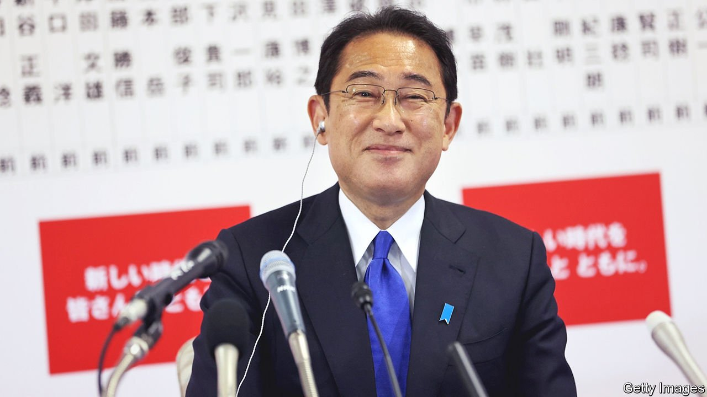

###### Wishy-washy

# Japan’s new prime minister still has to explain what he stands for 

##### Kishida Fumio handily led his party to re-election, but his agenda remains vague 

 

> Nov 4th 2021 

WHEN KISHIDA FUMIO became the head of Japan’s ruling Liberal Democratic Party (LDP) at the end of September, one of the first things he did was to lower expectations for the party’s future. Public frustration with the government’s handling of covid-19 had helped force the resignation of his predecessor, Suga Yoshihide. Some polls suggested that the party’s dominance in the lower house was under threat in coming elections. Voters seemed lukewarm on Mr Kishida, giving his new cabinet lower approval ratings than incoming prime ministers typically enjoy. Mr Kishida defined “victory” for his party as maintaining a simple majority of 233 seats along with its coalition partner, Komeito, down from 305 before the election.

He was perhaps overcautious. When results were tallied from the election on October 31st, the LDP had lost only 15 seats, leaving it with 261, single-handedly clearing the threshold for both a simple majority and also an “absolute stable majority”, which means that the party can chair and control all parliamentary standing committees. That is a relief for Mr Kishida. And it is a devastating defeat for Japan’s opposition, which had hoped to capitalise on public discontent. Instead, the biggest opposition party, the Constitutional Democratic Party of Japan (CDP), lost 13 seats. On November 2nd Edano Yukio, its leader, announced his resignation.


The opposition’s humiliation is in part the result of potent memories of its messy rule from 2009 to 2012. And it is in part because of bad strategy. The CDP co-ordinated with the Japan Communist Party to put forward unified opposition candidates in many districts, which alienated its own supporters. It also repelled independents, who are around 40% of the electorate and who turned out in relatively low numbers this year. Overall turnout was low, too, at just 56%. That is only a hair higher than the 54% in the previous lower-house election in 2017, which was itself barely more than the post-war record low of 53% in 2014.

Nonetheless, the results are no ringing endorsement of the status quo. Anti-establishment sentiment flowed instead to an upstart libertarian populist outfit based in Osaka, the Japan Innovation Party, which more than tripled its seats, from 11 to 41. It has limited appeal beyond its home region, and it is rare for regional parties to go national in Japan.

But the upstarts’ strong showing suggests that voters may abandon the LDP when presented with an alternative seen as competent. In a recent global study the Pew Research Centre, an American pollster, identified Japan as one of six countries where more than half the population wants “major changes or complete reform to the political, economic and health-care systems”. (The others on the list were America, France, Greece, Italy and Spain.)

Mr Kishida does promise big-sounding changes. He ran his campaign calling for a “new model of capitalism”, contrasting himself with Abe Shinzo, a former prime minister whose “Abenomics” agenda had mixed results. But no one, from Japanese business leaders to those on Mr Kishida’s “new capitalism” council, seems to have much idea what he means by it. Whatever the changes turn out to be, they are unlikely to be radical.

Vagueness pervades Mr Kishida’s other big agenda items, too. He celebrated his victory by making his debut on the world stage, joining other world leaders at the COP26 summit in Glasgow. Though he promised an additional $10bn in funding to support measures for decarbonisation elsewhere in Asia, he offered little detail on how Japan plans to reach its own pledge to become carbon-neutral by 2050.

On defence, the LDP promised in its campaign manifesto to raise spending, possibly even doubling it to 2% of GDP, but Mr Kishida has yet to say what he would spend that money on. Nor has he convinced the public and the powerful finance ministry of the need to do so. Little surprise, then, that those in Tokyo happiest about Mr Kishida’s victory are bureaucrats, who see a pliable figure unlikely to upset the status quo. Until the opposition gets its act together, the LDP will not have trouble staying in power. But Mr Kishida still has to prove himself as a leader.■

