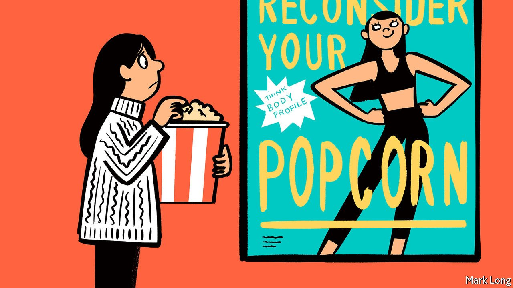

###### Hot shots

# Why young South Koreans are posing in their underwear 

##### To show off the time (and money) they have spent with personal trainers 

 

> Nov 6th 2021 

LEE JI-HOON’S younger clients have lately been making unusual requests. “People in their 20s and early 30s showed up and asked me to draw up these excessive training plans and dieting rules,” says Mr Lee, who works as a personal trainer at a fancy gym in Gangnam, a posh part of Seoul, South Korea’s capital. The clients, most of whom are women, all have the same aim: they want to look hot for their “body profiles”.

An Instagram search in Korean for the hashtag “body profile” turns up more than 2.5m results. Most of them are glossy full-body portraits of men and women in their underwear, posted on personal accounts (though a few belong to celebrities). Some subjects are draped over chairs, recline on beds or emerge from pools and rivers. Others pose with champagne and canapés, or with foliage.


The point, like so much on Instagram, is to impress. Joo Sohyun, a 27-year-old in Seoul, says she booked a body-profile photo session because she was bored with doing nothing except work. “I wanted that identity of someone who keeps fit,” she says. Taking the profile shots was a way of proving to the world that she had worked hard to achieve a valuable goal. The whole thing, including the training programme and photo session, set her back more than 1.5m won ($1,300). Others splurge even more. Mr Lee’s packages start at 2.5m won; bespoke ones can be 7m won.

Yoo Hyun-jae, who studies youth culture at Sogang University in Seoul, thinks the trend reflects an obsession with looks and social status. The attention young people pay to their online image mirrors everyday life, where looking your best in public is considered polite and commenting on others’ appearance and offering suggestions for improvements remain common.

As in other countries, advertising exploits the associated anxiety. A company hawking diet products plasters cinemas all over the country with posters urging patrons to “reconsider your popcorn”. Serious-looking plastic surgeons admonish commuters in ads on Seoul’s subway: “Think you’re pretty? Think again.” Celebrity culture also plays a role, says Mr Yoo. The first people to publish body profiles were the pop stars from whom many youngsters take their cues.

Some commentators worry that the trend harms young people’s mental health and fosters poor eating habits. Even Mr Lee is concerned. “I was so proud when they showed me the pictures, but some of them came back a few weeks later looking worse than they did before they started working out,” he says. Mr Yoo is less fretful: “Those body-image problems are not caused by the fact that people are now taking pictures of themselves while exercising.” Hand-wringing will in any case do little to dissuade the likes of Ms Joo. “Houses are too expensive and jobs are hard to come by. This is one of the easiest and healthiest ways for young people to feel a sense of achievement,” she says.

