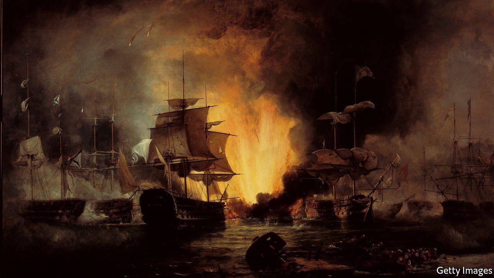

###### Nationalism and revolution

# A new book shows how the Greek revolution shaped Europe 

##### It inspired a wave of nationalism—and holds lessons for foreign intervention today 

 

> Nov 6th 2021 

The Greek Revolution: 1821 and the Making of Modern Europe. By Mark Mazower. Penguin Press; 608 pages; $35. Allen Lane; £30

WHEN A COALITION of footloose merchants, sea captains, hard-pressed peasants, landlords, bandits, clerics and intellectuals raised the flag against the Ottomans in the spring of 1821, the great powers of Europe knew exactly what they thought. This impertinent move to establish a state called Greece spelled trouble and should be discouraged.


After six years of grinding warfare, economic ruin and atrocities, the calculus shifted. Europe’s masters felt they had more to fear from an Ottoman victory, with all the punitive killings and deportations that would follow. In October 1827 the British, French and Russian navies—notionally bent on enforcing a truce—sank the Ottoman and Egyptian fleet in Navarino Bay. That did not instantly create a functioning Greek state, but it was a matter of time.

In turn that set a precedent for the emergence of other small, proud European states, wrested from the grip of the Russian, Austro-Hungarian and Ottoman empires—a process lasting until the final collapse of those empires during or soon after the first world war. As the subtitle of Mark Mazower’s new book maintains, events in Greece 200 years ago helped shape modern Europe. His elegant and rigorous account also holds lessons for modern geopolitics: about the galvanising effects of violence, the role of foreign intervention and the design flaws in dreams.

What changed the international view of the Greek struggle? To some extent, the emergence of a new phenomenon called public opinion. As Mr Mazower recalls, the Ottoman response to the uprising fanned philhellenic sentiment across Europe and America. Russia was appalled by the hanging of the Orthodox Patriarch in Constantinople; liberal Europeans and Americans were shocked by the slaughter of tens of thousands of Greeks on the island of Chios. Western idealists (including Lord Byron) flocked to fight for Hellenic freedom.

A powerful view of the drive for Greek independence is cynical about all this. And some Western philhellenes were indeed horrified when, after arriving in this supposedly enchanted land, they found that in appearance and manners the insurgent Hellenes were not so dissimilar from the Ottomans. One volunteer, Thomas Gordon, was dismayed by seeing a massacre of Muslims and Jews in the Peloponnesian stronghold of Tripolitsa.

Mr Mazower acknowledges the sins of some Greek warlords, but his emphasis is different. Somewhere amid the bloodlust, flight and ethnic cleansing, he says, a change in consciousness came about. “A new collective understanding of the Greek nation emerged out of the wartime refugee experience,” not least as those involved “came from all over the Greek world”.

He writes sympathetically of the swashbuckling commander Georgios Karaiskakis, who, after some impressive victories, was slain in battle in 1827. As the author describes him, Karaiskakis came from a world of near-anarchy and opportunism in northern Greece but grasped that panhellenic interests must prevail over personal squabbles (a leap some bigwigs failed to make). If such laudatory views were expressed in a Greek textbook, they might be dismissed as patriotic hype. But coming from Mr Mazower, an eminent historian of the Balkans, they command respect.

And they capture an important truth, which applies to many nationalist uprisings. Yesterday’s unrealistic goal can become today’s imperative, given the rapid shifts of sentiment that bloodshed and suffering engender. Common agony can be an effective glue, as many would-be repressors of rebellion, including the British in post-1916 Ireland, realised too late.

I dream, you fantasise

Bulgarians, Poles, Romanians, Hungarians and Balts subsequently claimed and gained their independence. A rich variety of local circumstances coloured these nationalist movements, but several were inspired by the Greek example. All such projects are based in part on romantic fantasy, of which the Utopian dreams harboured by Greece’s leaders and their foreign supporters were a peculiarly compelling specimen: they strove to recreate one of history’s most glorious epochs, that of classical Hellas.

For Greece’s external well-wishers and some Athenian patriots, that meant resurrecting Periclean Athens; others in the Greek ruling class dreamed of forging a neo-Byzantine empire based in Constantinople. Some entertained both visions at once. These dreams underpin some brilliant modern Greek poetry but they are a poor guide for practical statecraft.

Well into independence, Greece was a strange mixture of modern and premodern statehood. It incorporated an ambitious polyglot elite, enjoying fortunes made in Alexandria or Odessa, and a rural reality in which violent strongmen defied central power. Yet the Greek state did eventually become a more or less coherent polity, albeit with failings—such as a tendency to overspend and overreach—that can be traced to the delusions of grandeur which plagued the enterprise from the start.

That bears out Mr Mazower’s portrayal of the insurgency as a truly transformative revolution. Many readers will see parallels with modern times more broadly. After all, in the past 30 years there has been a resurgence—and then a crash—of gung-ho liberal internationalism, which often echoed the pro-Greek sentiments voiced in Western capitals in the 1820s.

Both then and more recently there was a burst of confidence in the possibility of instigating reform and modernisation in remote, rugged lands through a mix of local fighting spirit and strategic intervention from afar. Think of the NATO bombardment that helped detach Kosovo from Yugoslavia in 1999, or the excitement felt in November 2001 when rough-hewn Tajik warriors and precision-guided missiles combined to overthrow the Taliban with seemingly miraculous ease. Or recall the certainty felt in 2011, among politicians in London and Paris, that high-tech support for tenacious Libyan rebels would establish a stable new order in Tripoli.

At the same time, the exasperation of starry-eyed philhellenes (even Byron) over the foibles of their Greek allies may seem familiar to any Western bureaucrat who struggled to prop up the NATO-protected order in Afghanistan. The miserable collapse of that order seemed to vindicate the sceptics who insist that nation-building in wild places is impossible, and an ill-advised use of military force.

Mr Mazower’s argument is a counterweight to that pessimism, albeit a nuanced one. In the story he tells, native pluck and endurance really can combine with strategic intervention to create new political and social realities. The proviso is that the intervention must go with the grain of local powerbrokers and the traditions they personify. That vital rider may explain why, in its own terms, NATO succeeded in Kosovo and failed in Afghanistan. ■

