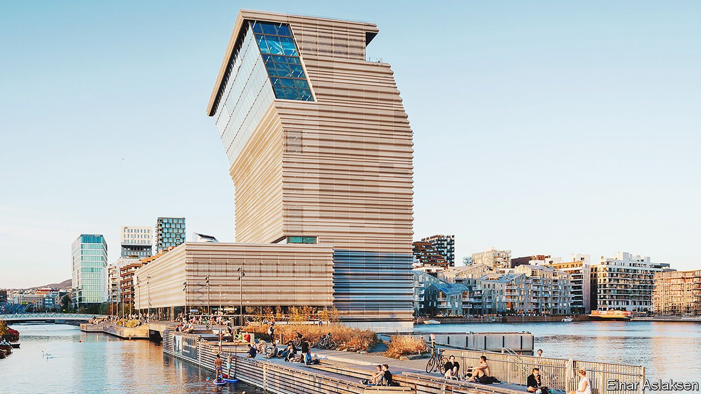

###### Everyone can hear “The Scream”

# A palatial museum of Edvard Munch’s art opens in Oslo 

##### MUNCH is one of the biggest museums anywhere devoted to a single artist 

 

> Nov 6th 2021 

“THIS GREAT and lonely artist”, wrote J.P. Hodin of Edvard Munch, “has been appreciated…only by a handful of initiated people in the West. He has remained practically unknown to the Americans as well as to the English and French.” A distinguished art historian, Hodin made his appraisal in 1950, six years after Munch’s death, when the Museum of Modern Art in New York staged a retrospective of his work. In the seven decades since, Munch has become a rock star of world art.

“The Scream”, in whicha human figure clasps its skull against a swirling sunset, is as recognisable as Van Gogh’s sunflowers or Monet’s water lilies. Its mystique was boosted in 1994 when thieves stole Munch’s original version of the painting (he made several) from Norway’s National Gallery. In 2004 masked gunmen made off with another version in broad daylight from the poorly secured (and relatively small) Munch Museum. Both were recovered, though the picture swiped in the second theft was damaged.


The drama in 2004 contributed to a decision to build a new museum for the country’s most famous painter. Four years later officials in Oslo announced plans to house the city’s trove of 42,000 Munch-related objects, including paintings, sculptures, prints and photos. The inauguration was scheduled for 2014—when Norway celebrated the 200th anniversary of the signing of its constitution—but wrangling over costs and architecture, as well as the covid-19 pandemic, delayed it until last month. A street party followed the ribbon-cutting by King Harald and Queen Sonja.

“Forget everything you know about museums,” says Stein Olav Henrichsen, MUNCH’s director. “This is totally different.”(It has even dropped the word “museum” from its name.) The 13-storey building on the Oslo Fjord is one of the biggest institutions in the world devoted to a single artist, with a theatre, library, cinema, rooftop restaurant and space for temporary exhibitions. It towers over the city’s opera house, a public library and residential buildings, all part of a recent urban-renewal project.

The unusual design is controversial. Some Norwegians have criticised the airport-like feel of the monochromatic interior, apparently meant to accommodate throngs of Munch devotees. Others are wowed by the undulating aluminium cladding on the exterior, which gleams in sunlight during the day and emits light through perforations at night, setting the tower aflame. Juan Herreros, the museum’s Spanish architect, says he wanted to make art the building’s protagonist. No whimsy was to obscure the work on show.

As you might expect, “The Scream” is the centrepiece. Only on arrival will visitors learn which of three rotating versions will be on display. They are part of “Edvard Munch Infinite”, a permanent exhibition of some of his best-known paintings, such as “Madonna” (sometimes called “Woman Making Love”), also stolen in the heist of 2004. “Edvard Munch Monumental” presents some of the large paintings he made for the University of Oslo. “The Researchers”, a 36-foot (11-metre) bathing scene, reflects the interest he developed in vitalism after a nervous collapse. A school of thought popular in Germany, where Munch lived in the 1890s, vitalism emphasised hygiene, physical education and the life-enhancing force of the sun.

Munch’s childhood was traumatic. His mother and favourite sister died of tuberculosis. Another sister was diagnosed with schizophrenia; his father suffered from depression. The artist himself struggled with mental illness. A lifelong bachelor, who saw out his days on an estate outside Oslo, his greatest attachment was to his work. When he died, aged 80, he gave thousands of items and his personal papers to his home town. It is at last doing justice to his munificence and his genius. ■

