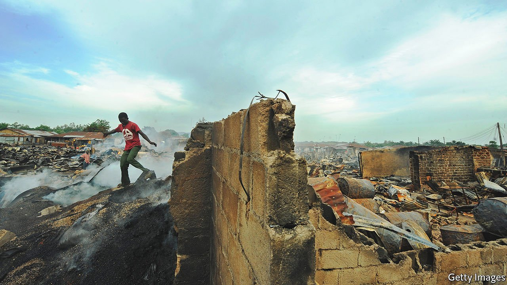

###### Nigerian literature

# After 50 years, Wole Soyinka has returned to fiction 

##### The Nobel laureate’s new novel offers a bleak diagnosis of his country 

 

> Nov 6th 2021 

Chronicles from the Land of the Happiest People on Earth. By Wole Soyinka. Pantheon; 464 pages; $28. Bloomsbury Circus; £20

WRITERS, LIKE most people, tend to slow down with age. Not Wole Soyinka, Africa’s first Nobel laureate in literature. After focusing for nearly 50 years on plays, poetry and activism, at 87 he has returned to fiction, which he last published in 1972. As the narrator says of the mysterious enterprise at the heart of his new book, this is not some “mumbo-jumbo, cockatoo-feather, dried-leather-thong, cowrie-and-tortoiseshell operation”. Eccentric as the tale may seem, it is a tense, well-plotted novel comprised of several stories that come together in the final pages.


Four old friends go way back. As boys they made a secret pact, swearing to support one another come what may. They called themselves the “Gong o’Four”. “Four for one, one for four, gung-ho!” they repeated when they met. Farodion was the first to lose touch, but he was always a bit of an outsider. Badetona was similar in character, marked out by his passion for figures. Gregarious Duyole, they all agreed, had the most fertile mind, a font of ideas that were “shared, not hoarded”. His bond with Kighare Menka, who became a renowned surgeon, was always special.

Dr Menka narrates. He works in northern Nigeria, operating on the victims of bombings by Boko Haram; the people in his chronicles are hardly happy. When he finds that a trade in human body parts is being run out of his own hospital, his professional demeanour cracks. He embarks on a search that will transform his life—and those of the rest of the Gong o’Four.

Famed as a playwright, Mr Soyinka likes playing with words, and his prose is full of puns and witticisms. Above all, though, he enjoys dramatic set pieces, in which Nigerian society abounds; he brings funerals and fundamentalist prayer meetings to life in all their lurid splendour. But his purpose is not merely to ridicule his fellow Nigerians. During a scene in which a suspected robber is set upon by a market crowd and almost decapitated, Duyole turns to the narrator. “Something is broken,” he tells the doctor. “Beyond race. Outside colour or history. Something has cracked.”

On one level, this is a sophisticated thriller. On another, it is an excoriating moral satire about the vanity and corruption of Nigeria’s political class, with its business cronies and kleptocratic preachers. In Mr Soyinka’s telling, the country is not so much a failed state as a sick one. Infected with greed, vanity and self-delusion, its body politic appears, in his novel, to be beyond cure. ■

