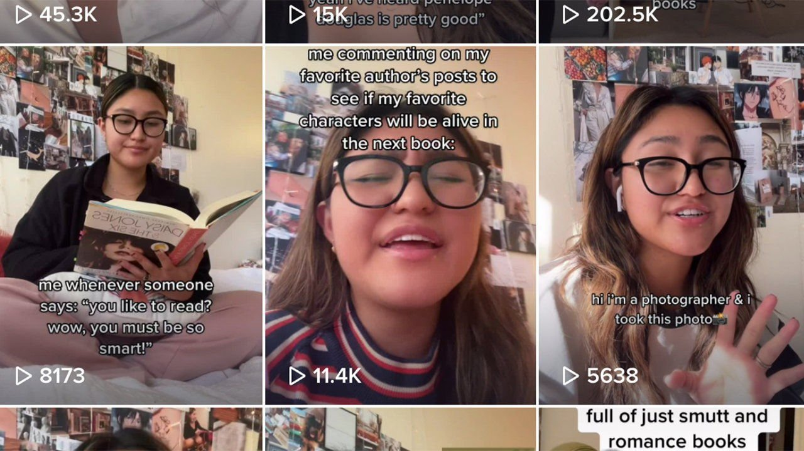

###### Books and social media

# BookTok has passion—and enormous marketing power 

##### Old-fashioned critics might not approve. But why should BookTok’s stars care? 

 

> Nov 6th 2021 

A YOUNG WOMAN holds up a book and smiles. “This is day one of me reading ‘The Song of Achilles’,” she says. The video jumps forward. “And this”, she moans, her face stained with tears, “is me finishing it.” Another clip, entitled “Books that will make you SOB”, offers written notes on how assorted stories got readers to cry, such as “I can’t think about it without bawling” and “ended up crying sm [so much] i had to change my shirt”. This is BookTok, as the literary wing of the app TikTok is known. Imagine the emotional pitch of a Victorian melodrama, add music, and you have the general idea.

BookTok is passionate. It is also profitable—at least for publishers. Bloomsbury, a publishing house based in Britain, recently reported record sales and a 220% rise in profits, which Nigel Newton, its boss, put down partly to the “absolute phenomenon” of BookTok. On Amazon, BookTok is so influential that it has leapt into the titles of books themselves. The novel “It Ends With Us”, for instance, is now listed as “It Ends With Us: TikTok made me buy it!” Evidently TikTok did a good job: the romance is riding high in the top 100 in both Britain and America.


The medium is not quite as gushy as it might seem. Much of the overdone emotion is ironic, and some of the videos are very funny—particularly those with the hashtag #writtenbymen, which poke fun at the male gaze. Nonetheless, many would make mainstream book reviewers tut. But why should the young women who are BookTok’s stars care what fogeyish literary types think of them? Until fairly recently, their perspective was marginalised in both fiction and criticism. White men dominated both—even though most novel-readers are female.

BookTok has helped upend that hierarchy. Selene Velez (pictured), a 19-year-old American student, is behind @moongirlreads_ (an account with 185,000 followers). She focuses on authors who aren’t typically “taken as seriously” as others. “I’m a woman of colour,” she says. “I try to promote authors of colour.”

At the same time, BookTok pushes back against publishing amnesia. Books are imagined to confer immortality on authors—to be a “monument more lasting than bronze”, as the Roman poet Horace wrote—but the lifespan of most is startlingly short. Dig out a list of bestsellers from 20 years ago: not only are today’s readers unlikely to buy them, most won’t have heard of them. Many of the books will have joined the legions of what W.H. Auden called the “undeservedly forgotten”.

BookTok is resurrecting backlists. One reason publishers noticed it, says Philip Gwyn Jones of Picador, a British imprint, was that, under its influence, old titles were creeping back into the bestseller charts. It offers such books “a second lease on life”, and he applauds it. “Eventually, a great book finds its readers,” Mr Gwyn Jones says. “You just have to hope that, unlike Kafka, [authors] don’t have to die before that happens.” Start trending on BookTok, and they won’t. ■

