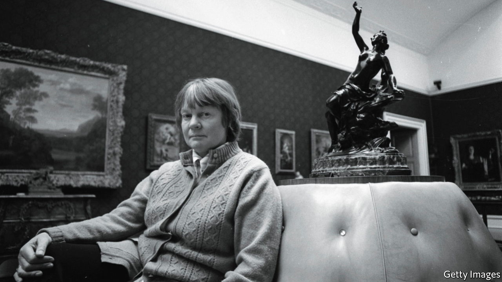

###### The moral of the story

# The four women who shook up philosophy 

##### A new book traces their pathbreaking friendships and careers 

 

> Nov 6th 2021 

The Women Are Up to Something. By Benjamin Lipscomb. Oxford University Press; 326 pages; $27.95 and £20

“THERE HAS never been a woman who could do philosophy as she can.” So said Philippa Foot of her friend, Elizabeth Anscombe, in a recommendation to the head of an Oxford college in 1957. Letters of reference can exaggerate. If Anscombe had a precursor, would anyone have known? Before the 20th century, it was nearly impossible for a philosophically gifted woman to gain recognition, unless she was royal or at least a duchess. How that situation began to change, at least in Britain, is part of the story told in this fine group biography of four women, who became friends at Oxford during the second word war.


Its other two subjects are Iris Murdoch and Mary Midgley, who, like Anscombe, had been well-educated, middle-class girls. As Benjamin Lipscomb, an American philosopher, explains, Foot was much posher. Her grandfather, Grover Cleveland, was twice America’s president. Her earlier education was overseen by nannies and consisted mainly of riding and parties.

Murdoch (pictured), the most famous of the quartet, is best-known for her novels. But she was also a philosophy don at Oxford for 15 years, having decided to become one after hearing Jean-Paul Sartre lecture. Anscombe was the most eccentric. Monocled, cigar-smoking and renowned for removing her trousers when a restaurant informed her that women could not wear them, she was mistaken for a cleaning lady when she arrived to take up the Cambridge chair of philosophy once occupied by her friend, Ludwig Wittgenstein.

Much of Midgley’s philosophical work was not written for academics. Her first book appeared when she was almost 60 and was followed by 15 more, many taking aim at what she saw as oversimplifications by biologists, psychologists and other scientists. She had a spat with Richard Dawkins over whether it is helpful to call genes “selfish”. Midgley paused her career for over a decade to care for three children. Anscombe, a devout Catholic, brought up seven without blinking; the secret was to realise that “dirt doesn’t matter”.

What did matter to all four women was ethics. They were dissatisfied with the state of moral philosophy, especially as practised at Oxford. It was both too dry, because it focused on the language of morals rather than on ethical dilemmas, and mostly wrong, because it did not even get the linguistic questions right. Foot chipped away at the idea that descriptive and evaluative language could be neatly separated: calling an action “rude”, for example, both describes it and rebukes it. Against the orthodoxy of the time, she thus maintained that there was no yawning chasm between facts and values.

Anscombe argued along similar lines in a seminal paper published in 1958: Hume, Kant, Bentham, Mill and others all came in for a drubbing. Moral philosophers, she insisted, needed to rethink many of their beliefs about human nature and psychology. Two years earlier, she had made headlines in the wider world by objecting to the award of an Oxford degree to Harry Truman. In her eyes, the bombings of Hiroshima and Nagasaki made him a mass-murderer. The dons of one college were told to go and vote Anscombe down, because “the women are up to something”.

The four women in Mr Lipscomb’s lively tale did not only philosophise about morals (and, in Anscombe’s case, much besides). They campaigned to improve the world, according to their lights. Anscombe was twice arrested at abortion clinics; Murdoch was refused an American visa because of her past membership of the Communist Party. Foot was devoted to the anti-poverty charity, Oxfam; Midgley was active in the animal-welfare, environmental and disarmament movements.

It may have been the war that made them. Midgley reckoned she had found her voice as a philosopher only because there were so few men at Oxford when she studied there. They were mostly away, fighting. The only time when most Oxford philosophy students have been women was when this quartet were undergraduates. ■

