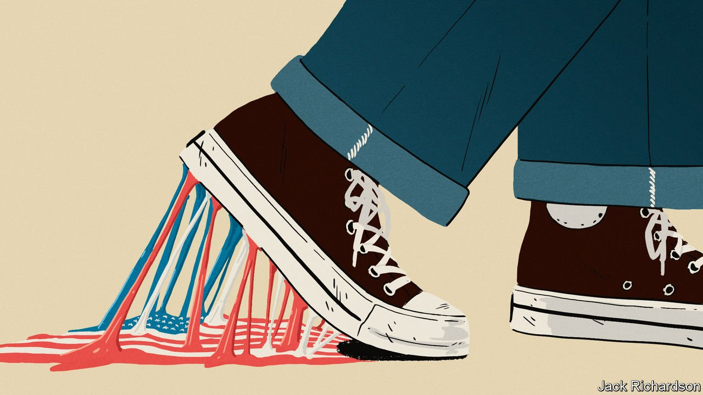
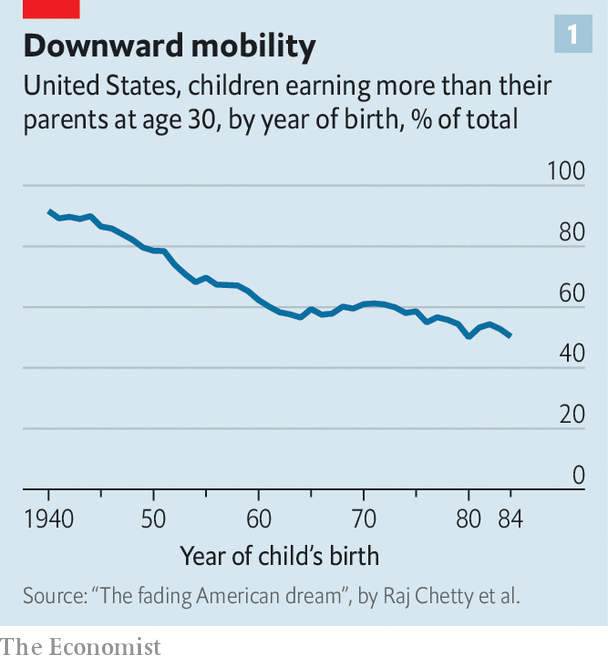
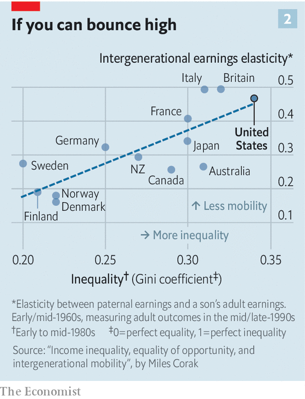
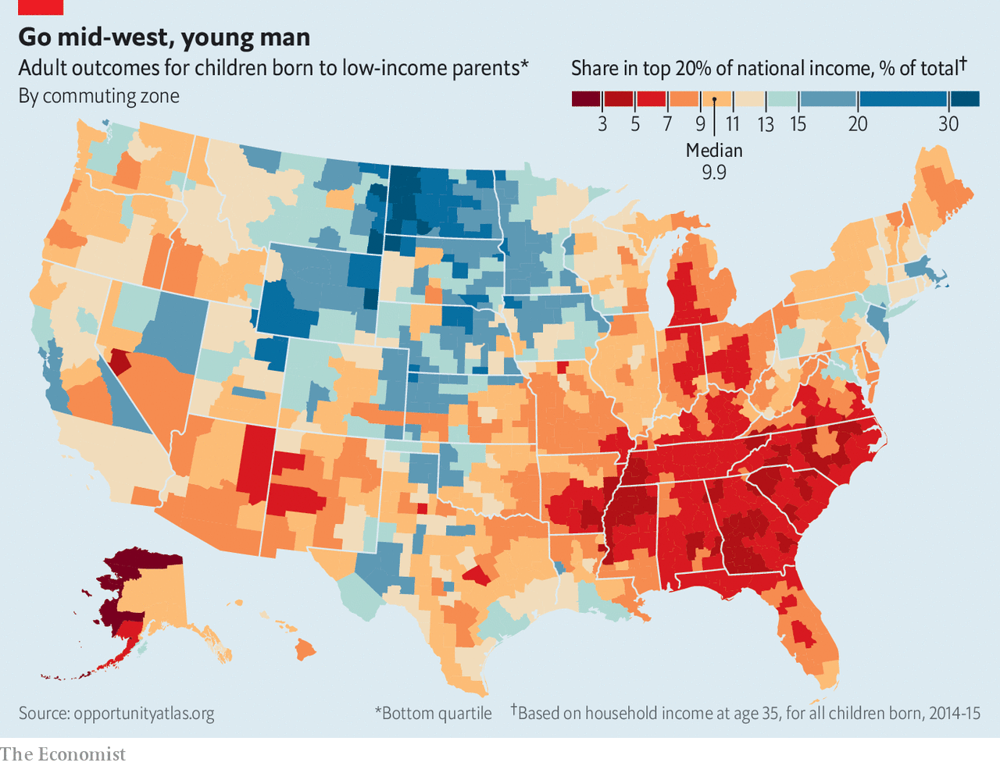
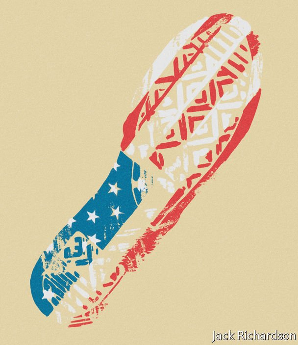

###### Stuck in place

# The Democrats’ social-spending package cannot repair the American Dream 

##### Social mobility has dropped precipitously 

 

> Nov 6th 2021 

IN THE 1940s Joseph Biden senior fell from early wealth to near-destitution. He moved his young family in with his in-laws as he scrabbled for work in Scranton, Pennsylvania, before re-establishing middle-class ease as a used-car salesman in Delaware. For all the weight that his son, President Joe Biden, places on the wellbeing of the middle class he also cares deeply about the opportunity to join it, or rejoin it, and to rise through its ranks.

The president’s personal story chimes with something his country sorely needs: increased social mobility. Addressing the essence of his “Build Back Better” series of bills, originally pitched as a $4trn package over ten years but now being haggled over in Congress at half that level of spending, Mr Biden has said it lies in providing people “a fair chance to build a decent, middle-class life to succeed and thrive, instead of just hanging on by their fingernails.”


If his administration has a signal achievement to date, it is the expanded child-tax credits in the American Rescue Plan (ARP), the stimulus package which was passed in March. They appear to have reduced child poverty by more than 25% since they went into effect in July.

The president’s camp sees helping the disadvantaged as a way to boost the economy as a whole. Janet Yellen, the treasury secretary, argued that the plans would “support families and enable greater inclusion in the workforce and social mobility—helping the disadvantaged and boosting economic growth”. Cecilia Rouse, the chair of the president’s Council of Economic Advisors, put it plainly in an interview with The Economist: “Most would agree that our current rates of social mobility are too low. There is not equality of opportunity. Kids are not starting at the same place.”

Data show that to be inarguable. America, the avowed land of opportunity, now appears a harder place in which to make it than Canada or western Europe, and this is a fundamental flaw in its economy and society. Ameliorating this through public spending is possible, if exceedingly difficult. And, for Mr Biden, the opportunity to do so is coming to an end.

The idea that social and economic status should be conferred according to effort rather than hereditary privilege was long seen as quintessentially American. In the 1830s Alexis de Tocqueville commended the “continual movement which agitates a democratic community”, arguing that it stabilised democracy.

Karl Marx remarked that America’s potential for class consciousness was sadly limited because “though classes, indeed, already exist, they have not yet become fixed, but continually change and interchange their elements.” The country’s social and economic mobility was only really accessible to white men—African-Americans and women of all colours would have to endure much longer before the American Dream could be theirs, too. But the dream was still there.

A runaway American Dream

Today, however, it is receding. What economists call absolute mobility—the probability that a child will grow up to earn more than their parents—has dropped precipitously. In a paper published in 2016, entitled “The fading American Dream”, a team of social scientists found that Americans born in the 1940s had a 90% chance of earning more than their parents had earned at the age of 30; for those born in the 1980s, the chance of that had dropped to 50% (see chart 1).

 


That remarkable drop is down to a few long-running trends, especially the emergence of education as the differentiator between economic precarity and success. National statistics show that workers with college degrees now have real wages 86% higher than those of workers without. What is more, those without a degree have seen little increase in real wages since 1979.

Many less-educated men have dropped out of the labour force. In 2016 “only one-in-two less-skilled men in rural America worked, which was 15 percentage points lower than in metro areas,” writes James Ziliak, an economist at the University of Kentucky. Real wages that have not budged and lower work-force participation have gone hand in hand with ill health, which worsens outcomes further. Anne Case and Angus Deaton of Princeton University recently published research showing that the life expectancy of Americans without a bachelor’s degree is falling.

On top of this precipitous decline in absolute mobility there have also been losses in relative mobility, a measure comparing children’s position in the income distribution with that of their parents. Consider the chance for a child born to parents in the bottom fifth of the income distribution to make it to the top fifth. In a society where origins did not matter one would expect the likelihood of such a rags to riches ascent to be close to random chance, or 20%. In America the chance is just 7.5%.

Comparisons with other countries make this look particularly pernicious. The land of opportunity is badly outpaced by European welfare states such as Britain, France and Sweden (where the chance is above 11%) and also by Canada.

Intergenerational disadvantage is especially stark for black Americans—they have only half as good a chance of escaping from the bottom fifth as poor whites do. One in five black Americans is from a family which has been mired in the bottom fifth of income distribution for three generations; for whites it is just one in a hundred.

Those born rich in America, by contrast, are much likelier to stay rich than their counterparts in other advanced countries. Their children see higher incomes, too. Hereditary persistence in incomes is a measure of how much you can predict about two people’s incomes based on a comparison of what their fathers earned. Bhash Mazumder, an economist at the Federal Reserve Bank of Chicago, calculates that if an American’s father made twice as much as his neighbour’s father, then he would be expected to make 60% more than his neighbour. That is much higher than if they were French (41%), German (32%) or Danish (15%), though less than if they were Brazilians (70%).

We gotta get out while we’re young

Because children must grow up and enter the labour market before their relative performance can be assessed, findings like these are inevitably backwards looking; the most recent data provided by studies of intergenerational mobility come from adults born in the 1980s and entering the labour market in the 2000s. Few experts, though, imagine that the trend to lower social mobility will turn out to have reversed for later cohorts. At best it may have plateaued; it could well have worsened.

The returns to higher education—and, conversely, the penalties for low education—show little sign of declining. And highly educated people are likely to be married to each other, to raise children in stable marriages, to live near excellent schools and to invest a lot in supplementing their children’s education. Miles Corak, an expert on social mobility, argues that rising inequality along these dimensions “will most likely lower the degree of intergenerational earnings mobility for the next generation of Americans coming of age in a more polarised labour market”.

 


One way of trying to see whether things are merely bad or getting worse is to look for a leading indicator of social mobility. Some economists think that this can be provided by inequality levels, though the matter is far from settled. A chart known as the Great Gatsby curve (see chart 2) shows an empirical link, with countries where income inequality is high going on to have low rates of social mobility. The same pattern has been observed within America, too. States with high levels of inequality also have worse mobility outcomes.

The most innovative recent research on this comes from Raj Chetty, Nathaniel Hendren, Patrick Kline and Emmanuel Saez. They used data from millions of tax returns to produce a high-resolution image of mobility outcomes (see map). This uncovered wide variation within cities; the amount of social mobility can depend on the neighbourhood, or even the block, where people live. But it remained inversely related to inequality. Other factors—such as more stable family structure, better schools, lower segregation—were correlated with higher upward mobility.

 


Inequality is, unsurprisingly, particularly persistent among black Americans. In September the Census Bureau reported that the typical income for white households in 2020 was 61% higher than for black households—a gap which has barely changed since 1967, when the data series began. The black-white wealth gap is unchanged as well, at a ratio of one to ten.

If the relationship between inequality and social mobility is causal, rather than just correlational, it augurs ill for today’s young Americans. Since 1989 the Federal Reserve has put out quarterly data on the distribution of national wealth. Its most recent release, for the second quarter of 2021, showed for the first time that the top 1% of earners held more wealth than the middle 60%. Data from the Congressional Budget Office show that the share of national income taken home by the middle 60% of earners in America has fallen, and that taken by the top 20% of earners has risen. In 1979 the middle 60% took home 50.8%, after taxes and transfers. In 2018 that share had fallen to 45.1%—and the top 20% had gone up to 49% of the take.

No country can realistically aspire to the absolute equality of opportunity that would lift social mobility to its theoretical maximum. But America could at least aspire to a less imperfect distribution of opportunity. Several tranches of policy that are especially influential on rates of social mobility are in areas in which America happens to lag behind its rich peers.

The most obvious missed opportunity is the lack of investment in early-childhood education programmes, and as well a welfare state that does little to reduce income poverty among children. Those already about to enter the labour force would benefit from better tailored education and training. A system of progressive taxation can pay for it all. It can also lower potentially unhelpful wealth inequality, particularly through levies on inheritances.

Even a president with huge sway in Congress would have to take his time pursuing such reforms as far as they might go: Denmark was not built in a day. Mr Biden is no such president. Six months ago, when the ARP provided for $1.9trn in new spending, he seemed to labour under the illusion that a Democrat-controlled Congress would give him all he wished. The subsequent strength of internal dissent has shattered that illusion. That does not mean a social-mobility agenda is off the table. It does mean making a series of choices.

Together we could break this trap

Start with the youngsters. “We have pretty unambiguous evidence that more financial resources [for families with small children] have lasting impacts on health and well-being and intergenerational mobility,” says Maya Rossin-Slater, a Stanford economist. But before covid-19 America had one of the highest rates of child poverty in the OECD—almost triple Poland’s.

The reason for this is not a mystery. The typical OECD country spends 2.1% of GDP on child and family benefits; America spends only 0.6%. As originally pitched, Mr Biden’s “Build Back Better” agenda featured a suite of policies intended to make America much less of an outlier, including a generous child-tax credit that mimicked the child allowances many Western countries use to reduce poverty, universal pre-kindergarten and child-care subsidies.

This pillar of spending is not looking as grand as advertised in the framework put out by the White House on October 28th. The expanded child-tax credits which have already reduced child poverty were part of a stimulus package passed in March; as things stand they will be extended for only one more year. Universal pre-kindergarten would be funded for six years, according to the latest negotiations, as would a child-care subsidy programme. Universalist programmes, including the child-tax credit received by most families, were appealing when the Biden administration was working with an effective blank cheque. Choosing a universal but short-lived programme over a targeted and permanent one is harder to justify. As it is, more will probably be spent subsidising care homes for the elderly than on children.

Measures which might have improved social mobility for those already in the workplace are being pared back to something much less consequential. The president had originally envisaged two years of tuition-free community college to every American; spending $80bn on worker retraining; and the creation of a scheme for paid family and medical leave (which America is almost alone in the developed world in lacking). All three proposals have been jettisoned because of the objections of some Democratic senators. There is now roughly as much spending proposed for higher-education and workplace-training ($40bn) as there is on expanding Medicare so as to better cope with deafness ($35bn).

The supports that remain in place are helpful, but comparatively modest and time-limited. The expanded earned-income tax credit, which tops up the wages of working-class Americans, would persist for just another year. Subsidies that allow workers to buy health insurance through the exchanges set up by Obamacare would persist for another four years.

 


This is not the stuff of the GI bill, the vaunted legislation which offered generous education benefits to soldiers returning from the second world war (though in ways that worked to the disadvantage of black veterans) and helped create the high social mobility of Joe Biden’s youth. Nor is it the stuff of the New Deal, an example the administration reached for when it suggested that massive public-works projects on climate-change mitigation and infrastructure building could provide a new kind of stable job to the working classes. Mr Biden promised that 90% of these jobs would not require a four-year degree. As the spending available for these proposals has shrunk, so too has their chance of instigating a Rooseveltian mobilisation.

Convoluted as they are, the Democratic spending plans look crystal clear compared with their plans to raise revenue. European-style welfare states require European levels of taxation. But Mr Biden has promised that no family with an income of less than $400,000 will pay more taxes. And the 50-50 split in the Senate means that Kyrsten Sinema, a Democratic senator from Arizona, has been able to veto conventional alternative ways of raising revenue, like increasing rates of tax on capital gains and corporate profits.

No place left to hide

Gone too is a sensible proposal to eliminate a loophole allowing inherited assets to escape capital-gains tax (which might have raised $204bn). And some Democrats are also threatening to kill the whole proposal unless a tax break allowing the deduction of state and local taxes is reinstated. That $90bn annual break overwhelmingly benefits the rich; (54% of benefits go to the top 1% of earners).

As a result the president’s stalwarts have grasped at more exotic revenue-raising schemes of a sort which should not be designed on the fly, as they have been, and which risk distorting incentives for investment. Among these are a new minimum of 15% of tax on accounting profits for corporations, a penalty for stock buy-backs, and newly created levies of 5-8% on households earning more than $10m.

Bringing together all the president’s ambitions in a single package would have been hard enough even if the original $4trn had been forthcoming. At half that, it is impossible. And besides, very few Americans understand what the unwieldy whole is really meant to achieve. The White House might profitably pare its ambitions down to the investments most suited to equalising opportunity for America’s children. If it did so, it could at the same time clarify its message. The president could claim that the thing he had at least started to build back better was the American Dream itself. ■

