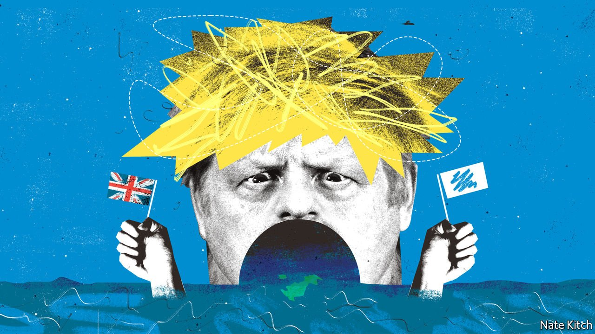

###### Bagehot

# Boris Johnson’s Conservatives plan to create a bigger, busier state 

##### The government is increasingly activist, from raising taxes to stoking culture wars 

 

> Nov 6th 2021 

THE CONSERVATIVES have undergone many transformations in their time: from the party of the landed squirearchy to that of the industrial bourgeoisie; from the post-war consensus to free-market radicalism. Now they are undergoing another. For 40 years, from the choice of Margaret Thatcher as its leader in 1975 to David Cameron stepping down as prime minister in 2016, Tories stood for small government. Today they are the party of big-government conservatism.

The budget provided a vivid illustration. By the mid-2020s public spending will be the highest, as a share of GDP, since the mid-1970s. By the same measure, taxation will be its highest since the early 1950s. But there is more to big-government conservatism than the size of the state. There is the philosophy of the state as well. And under Boris Johnson, the Conservatives have set themselves aims they think can be achieved only by big-state activism.


The most obvious is “levelling up”. The division between prosperous south and deprived north goes back centuries: read Elizabeth Gaskell’s “North and South”, published in 1854. And London’s economic pre-eminence is the result of natural agglomeration. Successful banks attract others, which attract accountants and lawyers, which attract restaurants and art galleries, and so on. Increasingly, the government seems to feel this cannot be countered without it intervening muscularly, for example by splashing out on infrastructure and backing economic clusters.

Levelling up also involves reining in the over-mighty “liberal elite”, from the BBC and academia to the legal system and civil service. Tories like to refer to this elite as the “blob” because its members all live in the same sorts of places (Islingtonia) and believe the same sorts of things (“diversity”, meaning varied ethnicities rather than viewpoints). The government thinks Brexit exposed a dangerous gulf between liberal elites and the masses who pay their salaries. And it worries that a “woke ratchet” is making that gulf wider, as members of the elite try to impress each other by embracing trans rights, critical race theory and cancel culture.

The result is a flurry of state activism, including an academic-freedom bill that is designed to prevent the no-platforming of speakers; a housing bill that gives locals a say over the appearance of new buildings; a judicial review and courts bill that it says will increase democratic oversight; a more confrontational stance towards the BBC and legal profession, and a policy of moving civil servants out of London and into the provinces.

Some of this is political hardball. The Conservative Party captured huge swathes of northern England in 2019, and is pouring resources into these new territories. It is increasingly the party of the working class and the elderly, so picking a fight with young and middle-aged trendies makes sense. But the embrace of state activism also means an evolution in conservative thinking—or perhaps, more accurately, a growing recognition of the difference between conservatism and classical liberalism.

Legend has it that Mrs Thatcher used to pull Friedrich Hayek’s “The Constitution of Liberty” from her handbag and declare: “This is what we believe.” Yet the book’s postscript is called “Why I am not a conservative”. Tories are returning to explicitly conservative thinkers such as Edmund Burke, who said government was a “contrivance of human wisdom to provide for human wants. Men have a right that these wants be provided for by this wisdom.” They are concluding not only that market-first policies do not always produce conservative solutions, but that unleashing market forces in academia and the legal profession coincided with a leftward move in both, as universities embraced critical theory in various guises and lawyers struck gold in human-rights law. Indeed, market forces can undermine a conservative society’s foundations. Big government is then not an aberration, as Thatcherites contend, but a tool to achieve conservative ends.

In a democracy, conservatism relies on equality of opportunity. The race of life, in which only some get prizes, is seen as illegitimate unless everybody gets a fair start. But in the past four decades the starting line has become more uneven, as the successful have hoarded resources for their children, and wealth has become more regionally concentrated. Seen in this light, conservatives are duty-bound to embrace vigorous state action in order to restore faith in the system.

Conservatism also depends on healthy communities, including the nation state. In her glory days, Thatcher saw no tension between market and nation. The orgy of patriotism that followed the Falklands war coincided with an orgy of money-making in the City. But the tensions have increased as Chinese competition has destroyed manufacturing jobs and Amazon has laid waste to bricks-and-mortar retailers. In 2019 the Conservatives’ election manifesto promised government action to spruce up town centres and improve bus services. Mr Johnson has presented labour shortages caused by tighter immigration rules since Britain left the European Union as a chance to increase wages and productivity.

Super-size me

Big-government conservatism is rife with problems and potential problems. The government may pursue narrow party advantage rather than tackle them: the choice of Nadine Dorries, a combatively philistine MP, as culture secretary is hardly encouraging. It may also override the few checks that restrain Britain’s over-mighty executive. The idea that “out-of-touch” lawyers need to be subject to democratic control would be more convincing if the government didn’t treat Parliament with such contempt. And Thatcher’s warning that socialist governments “always run out of other people’s money” applies equally to big-government conservatism. But whatever squalls or shipwrecks lie ahead, Mr Johnson’s Conservative Party is the party of government activism, rather than government restraint. ■

