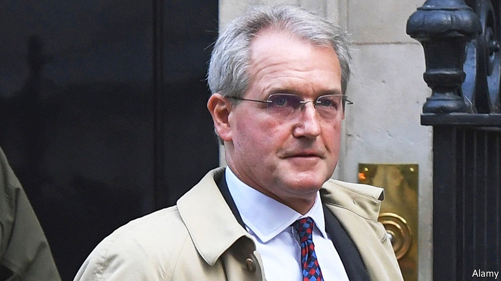

###### Remember, remember the 3rd of November

# Britain’s government goes to disgraceful lengths to protect a Tory MP 

##### Owen Paterson broke lobbying rules. To save him, it wanted to rewrite those rules 

 

> Nov 6th 2021 

THERE ARE things that democratic governments are not supposed to do. They are not supposed to change the rules of the game at the last minute because they are going to lose. They are not supposed to make it easier to take money for favours. They are not supposed to force MPs to do things that make them hang their heads in shame. Yet on November 3rd Boris Johnson’s government did all this and more. The father of the House, Peter Bottomley, declared that he could not in conscience vote with his party. Younger Tory MPs with careers still to make looked embarrassed.

On October 26th Parliament’s standards committee issued a damning report on Owen Paterson, a veteran MP and leading Brexiteer. He was guilty of “an egregious case of paid advocacy” and had “brought the House into disrepute”, it said. He should be suspended for 30 days, long enough to trigger a recall if enough voters demanded it. Mr Paterson had lobbied ministers and officials on behalf of two companies, Randox, a clinical-diagnostics firm, and Lynn’s Country Foods, a meat processor and distributor. They paid him more than £100,000 ($137,000) a year between them for consulting work.


The report brought a furious rebuttal from Mr Paterson and a fusillade of complaints from his friends in Parliament and the media. They accused the standards commissioner, Kathryn Stone, of bias against Tories, particularly Brexiteers, of having used the two-year-long inquiry to torment Mr Paterson (his wife, Rose, took her own life during it) and, in the Daily Telegraph, of wearing a nose-stud and refusing to condemn the IRA.

If the Tories disagreed with the verdict, they could have voted to reject the report or reduce Mr Paterson’s suspension. Instead Dame Andrea Leadsom, a former leader of the Commons, tabled an amendment to create a new committee to fix “potential defects” in the disciplinary system. The government then used its might to rescue Mr Paterson by imposing a three-line whip on its MPs to vote for the amendment.

His allies had little to say about the evidence against him, probably because it was overwhelming. He had lobbied ministers and officials not once but repeatedly, using contacts acquired when he was secretary of state for Northern Ireland and then the environment. He used his parliamentary office for business meetings, and parliament-headed notepaper for lobbying. He claimed in his defence that he raised issues of food safety with the Food Standards Agency. But after that he made further attempts to contact officials and to promote “Randox’s superior technology”. The committee concluded that “no previous case of paid advocacy has seen so many breaches or such a clear pattern of confusion between the private and public interest”.

Instead, Mr Paterson’s supporters criticised the process. Jacob Rees-Mogg, leader of the house, argued that it had denied him the right of appeal as required by “natural justice”, a phrase he and other Tories used with the reverence of Thomist scholars. In fact, the system offers several chances for reconsideration—the standards committee can reject the commissioner’s report and even if it does not, the House of Commons has final say. The committee read all the evidence Mr Paterson presented, and no court is obliged to listen to any and all supporters a defendant nominates.

Whatever the current system’s failings, the government’s plan was worse. The new committee was to dispense with the independent commissioner and consist entirely of MPs, with a built-in Tory majority. It made a nonsense of Mr Rees-Mogg’s talk of an appeals process: what sort of appeal court is controlled by the governing political party? Other parties said that their MPs would refuse to sit on it.

As if to acknowledge these shortcomings, on November 4th the government appeared to back down. It would, Mr Rees-Mogg said, bring about reform on a “cross-party” basis and break the link between Mr Paterson’s case and future cases. Mr Paterson himself resigned as an MP, though he continued to insist he was innocent of wrongdoing.

Today’s system is itself the product of the cash-for-questions imbroglio in 1994 and the parliamentary expenses scandal of 2009. Yet the government is now dismantling it to wish away another money-related scandal. Almost a quarter of the 59 backbenchers who signed Dame Andrea’s amendment had previously been found in breach of parliamentary standards. David Cameron, the prime minister from 2010 to 2016, was recently hauled over the coals for lobbying on behalf of Greensill Capital, a financial company that later failed. Yet the government has now protected yet another Tory MP who used his office to lobby.

The Paterson affair looks likely to further undermine public trust in politicians in general and Tories in particular. How will rich rewards for lobbying go down with the Conservative Party’s new working-class voters in northern constituencies? That MPs voted for the amendment by just 250 to 232, despite a government majority of 80 and a three-line whip, suggests many Tory MPs are uneasy. Mr Rees-Mogg closed his speech by saying that “sometimes to do the right thing, one has to accept a degree of opprobrium”. The government has just earned a great deal of opprobrium by doing the wrong thing. ■

Editor’s note (November 4th 2021): This story has been updated since its initial publication

