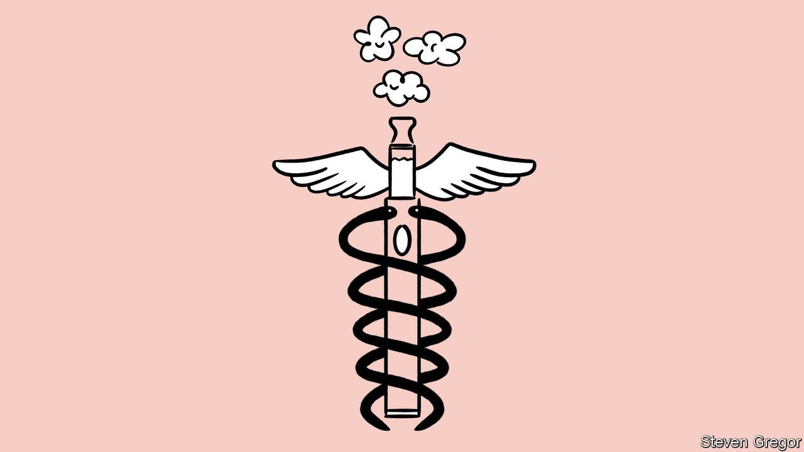
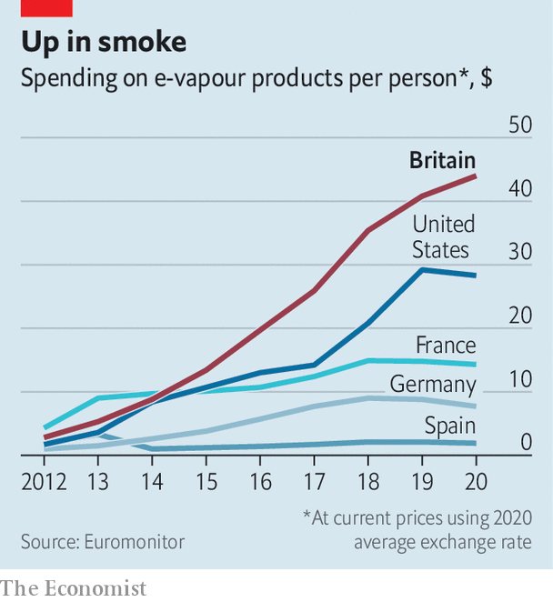

###### Vape nation

# Britons love e-cigarettes—and ministers want to encourage them 

##### How the country became an international outlier 

 

> Nov 4th 2021 

VAPERS DO NOT lack for choice. Options range from a sleek Juul device (“a satisfying alternative to cigarettes”) to a more garish FreeMax product (“Taste the clouds, feel the flavours!”). Now the British government wants to give them another one: a medically licensed e-cigarette.

The aim is to allow doctors to prescribe the devices to patients who want to stop smoking. On October 29th the MHRA, the medicines regulator, encouraged manufacturers to submit products for approval. If all goes to plan, England will be the first country to offer such prescriptions.

 


As a stroll down any high street, littered with vape shops, reveals, the country already loves e-cigarettes. According to Euromonitor, a research firm, Britons shelled out £2.2bn ($3bn) on products in 2020, compared with £680m in France and $470m in Germany. Per person, no country spent more (see chart).

Most use the stuff in order to quit cigarettes. Polling by YouGov for ASH, an anti-smoking outfit, finds that vapers aged over 18 are overwhelmingly former smokers (65%) or current ones (31%). In the past decade the share of adults who smoke cigarettes has fallen from 20% to 14%. The government’s aim is to reach 5% by 2030.

YouGov’s polling finds the most common reasons smokers give for not vaping, aside from not wanting to break their habit, are that they do not want to swap one addiction for another, that they do not think it will help them quit and because of safety concerns. Ministers think prescriptions will help. Sajid Javid, the health secretary, highlights smoking-rate disparities between rich and poor. High taxes on cigarettes mean vaping is already relatively cheap, but a prescription would make it cheaper still. A doctor’s reassurance may help overcome safety worries.

The government’s enthusiasm for vaping makes it an international outlier. The World Health Organisation preaches caution, concerned by the relative newness of e-cigarettes. In May a study group on tobacco-product regulation advocated banning devices in which users can control ingredients, which account for most of those sold in Britain. Both France and Germany take a tough line.

A recent Cochrane Review, which weighed all the evidence, said more was needed but that it was “moderately confident” e-cigarettes help more people to stop smoking than nicotine-replacement therapy or devices without nicotine do. Britain’s greater risk appetite may reflect the fact that lots of work on vaping in smoking cessation was done by British academics.

Some of them argue that international opposition is at heart a moral crusade against both nicotine and tobacco firms, which have invested heavily in the market. Yet there are also more pragmatic explanations for the divergence. Britain already has high taxes and strict controls on sales, including plain packaging. Policymakers thus have greater incentive to innovate.

All this contributes to a very different atmosphere. Whether it will be enough to entice manufacturers into the approval process is unclear, especially given uncertainty about how enthusiastic doctors will be and the size of the market.

One executive says his tobacco firm will look into the details of the MHRA’s announcement. Potential advantages include not only a stamp of approval, but lower taxes, more nicotine and licence to make claims about how the product will help users stop smoking. Britain’s vape market could be about to get bigger still. ■

