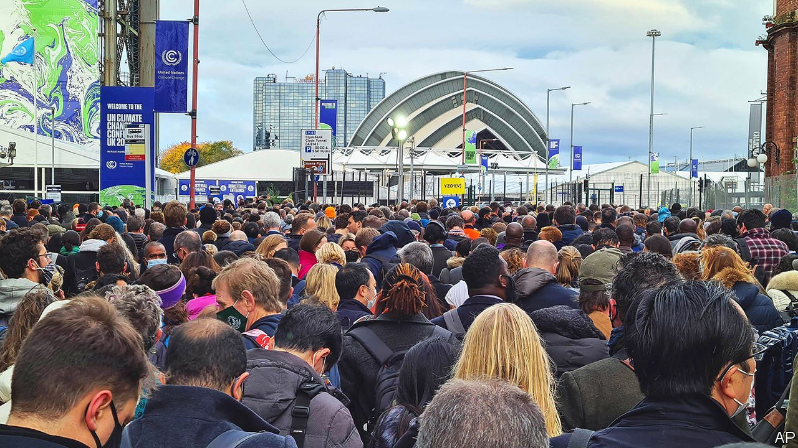

###### Britain’s big moment

# COP26 in Glasgow gets off to a chaotic start 

##### Success or failure depends on more than the host, and will be clear only in hindsight 

 

> Nov 6th 2021 

AFTER THE first two full days of COP26, the UN climate-change summit under way in Glasgow, Boris Johnson, the prime minister, was cautiously optimistic. He highlighted a new global pledge to tackle deforestation and suggested that the number of countries working to bring their net carbon emissions down to zero had trebled since Britain started to plan the event. Meanwhile delegates rehearsed a litany of complaints. A railway strike was averted at the last minute, only for both train lines from London to Glasgow to go down on the peak day for arrivals. Local bin-men have walked out, leaving rubbish to decay on the streets. Queues for security and covid-19 checks snaked back for hours. Social-distancing rules meant many delegates were turned away from meetings.

Even without a pandemic, running a COP summit is stressful. In Copenhagen in 2009, when 45,000 delegates descended on a space fit for 15,000, the queues were epic (and the talks broke down). In The Hague in 2000 America’s lead negotiator was hit in the face by a cream pie thrown by a protester angry at his country’s reluctance to cut emissions. The main upside for the host is the chance to burnish its environmental and diplomatic credentials.


For COP26, that means finding new niches where post-Brexit Britain can display leadership. Greenery is an obvious opportunity, says Sam Hall, the director of the Conservative Environment Network, an independent forum. Britain has cut its carbon emissions faster than any other rich country since 1990. Greenery plays well domestically, too, being popular with all demographic groups—and backbench Tories. The Conservative government also spies opportunities in what Mr Johnson has dubbed a “green industrial revolution”. Britain is the world’s largest generator of offshore wind power, and is investing heavily in clean-hydrogen technology. It wants to export products and know-how, and to lead the way on green finance.

Such considerations create a tension between COP as a public-relations exercise for the host, and COP as an imperfect but essential way to speed up action on climate change internationally. After the G20 summit in Rome that led into COP26 concluded with an uninspiring statement on climate change, Mr Johnson sought to position Britain as far ahead of other countries, whose promises are “starting to sound hollow” when “the solution is clear”. He touts a simplistic recipe for achieving COP26’s unofficial goal of keeping alive the stretch target agreed at COP21 in Paris in 2015, which was to limit the rise in average global temperatures to 1.5°C above pre-industrial levels. The solution, he says, is “coal, cash, cars and trees”.

Though the host of COP can make a difference by keeping everyone talking even if consensus seems distant, skilful summitry is not merely a matter of getting everyone else to do what it asks. Nor does COP26 aim to produce a concrete deal, as COP21 did. Dividing actions into discrete areas blurs the needs and grievances of poor countries, for which climate change is an urgent threat. And adaptation and mitigation depend on support from the rich countries who emitted most of the greenhouse gases already in the atmosphere. The summit’s logistical embarrassments will be for the British government to bear alone. But success or failure—which will be quantifiable only with difficulty, and in hindsight—will belong to everyone. ■

For the latest from COP26 see our . For more coverage of climate change, register for , our fortnightly newsletter, or visit our 

