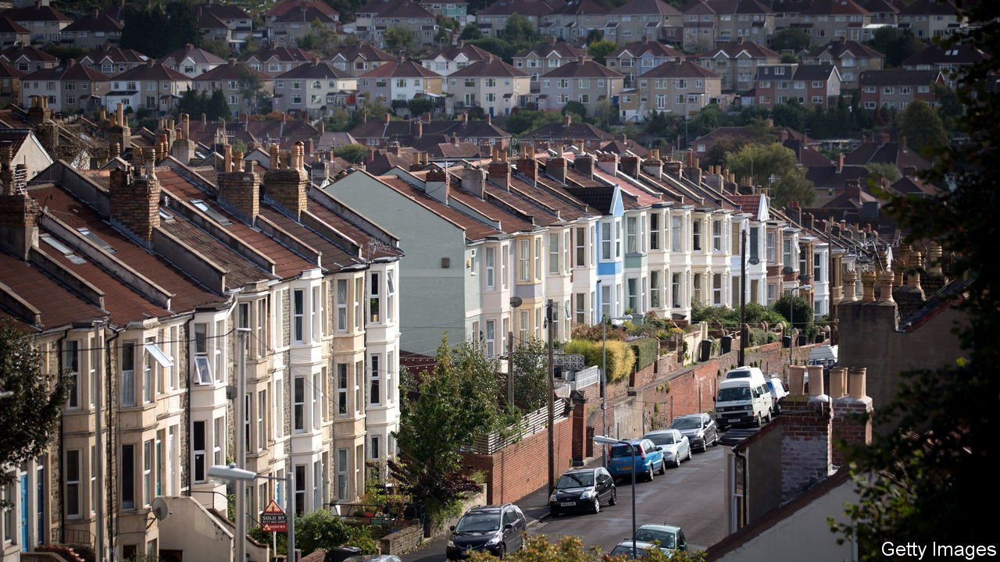
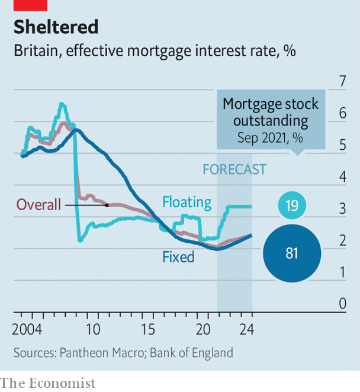

###### Raising the roof

# Higher interest rates mean more expensive mortgages 

##### But changes in the British housing market mute their effect 

 

> Nov 6th 2021 

IF THE ECONOMY is a machine, then monetary policymakers are backroom engineers. On November 4th they held the Bank of England’s interest rate steady at 0.1%, but seem poised to tweak it upwards soon. Investors expect the rate to rise above 1% by the end of 2022, the biggest escalation since 2006. But as the technicians tinker, they face huge uncertainty.

Rising interest rates make saving more lucrative and borrowing dearer. They can drag down asset values, consumer spending and business investment, and cause the pound to appreciate. Most directly, they can also increase mortgage payments, leaving households with less money to spend on other things. Untangling these effects is tricky. A study published in 2019 of British and American households between the 1970s and 2000s, by James Cloyne of the University of California, Davis, Clodomiro Ferreira of the Bank of Spain and Paolo Surico of London Business School, found that mortgage payments grew in response to higher official rates. But Britons’ spending on other things fell by close to four times as much, showing that indirect effects of monetary policy were also at work.


The same study found that how many households have mortgages matters a lot: spending by outright homeowners barely responded to changes in official interest rates. Mortgage terms matter, too. Historically, Britain was a nation of floating-rate mortgages, with payments rising and falling with the official interest rate. In America, however, mortgage interest rates are usually fixed for decades. That helps explain why British mortgage-interest payments were nearly three times as responsive to changes in official interest rates after four years as were American ones.

Today’s monetary policymakers face a very different mortgage market to that 15 years ago. In mid-2006 around 46% of Britons lived in a home with an outstanding mortgage; now, only around 37% do. This shift has been driven by population ageing, which means more homeowners have paid off their mortgages, and by a rise in the average age of first-time buyers. The share of Britons living in homes that are owned outright has risen from 25% in 2006 to 29% this year.

 


Moreover, mortgages with floating rates accounted for over half the stock in 2006, and over 70% in the early 2010s. That share is now less than 20% (see chart). Fixed-rate terms have grown longer, and since mid-2020 the majority of fixed-rate mortgages have been set for five years. According to figures from UK Finance, an industry group, mortgages with fixed rates have relatively large outstanding balances, meaning that the homeowners who would suffer most from higher interest rates are most likely to be shielded from them, at least in the short term.

That leaves first-time buyers and people refinancing their mortgages. Regulatory changes meant to ensure affordability mean that since 2014, they must show that they can cope with a rise of three percentage points within five years of taking out a loan. If the main policy rate increases, says Neal Hudson of BuiltPlace, a consultancy, there could be pressure to weaken that test to avoid shutting first-time buyers out. That would lessen the squeeze on credit associated with higher official rates.

The Bank of England seems confident that interest-rate rises will have plenty of oomph, for example in influencing credit for businesses. Its strategy of raising interest rates before unwinding the asset purchases with which it fought first the global financial crisis and then the effects of covid-19 results partly from its confidence that it understands the effects of the former. An analysis in 2019 of its forecasts by Innes McFee of Oxford Economics, another consultancy, suggested that the bank thought interest-rate rises after 2017 would have a bigger effect on GDP than in the 2000s. (Mr McFee disagreed.) Britain’s economy comes with no instruction manual. Here’s hoping nothing breaks. ■

