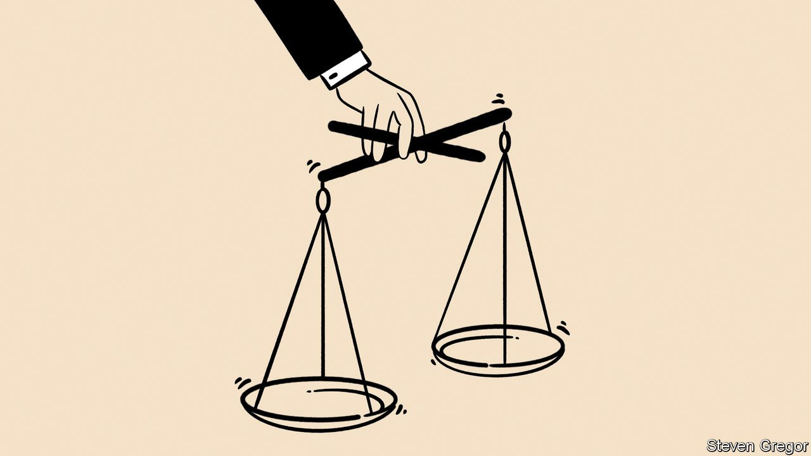

###### Government v judges

# Judicial independence is under threat in Britain 

##### Tory claims that judges intrude too much into politics are wrong and dangerous 

 

> Nov 4th 2021 

MINISTERS NEVER like seeing their decisions overturned. But in a rules-based system, they must usually live with it. Yet Britain’s government has concluded that such reversals happen too often—and wants to change the rules to curb one purported cause, an obstructive judiciary. This raises constitutional concerns.

Exhibit one is a bill now going through Parliament that seeks to curb judicial reviews, in which senior judges consider the legality or otherwise of a public body’s actions. They have certainly become more common in recent decades. Ministers from both parties have at times sought to limit their scope or even stop them altogether, partly to save money. The draft bill is actually quite mild. But it includes an ouster clause that would prevent judicial review of controversial immigration cases.


David Davis, a former Conservative minister, opposes the bill for this reason. He fears that the ouster clause may become a model for obstructing review of employment-tribunal or social-security decisions. Yet some prefer to broaden the bill instead. Richard Ekins, an Oxford academic who runs the judicial-power project at Policy Exchange, a think-tank, says excessive judicial review has led unaccountable judges into areas that should be decided by politicians accountable to Parliament.

Some ministers agree. Dominic Raab, the lord chancellor and justice secretary, has criticised some judicial-review decisions, notably relating to Brexit. He wishes to stop the powers of Parliament being whittled away by what he characterises as “judicial legislation”. To this end, he wants an unspecified mechanism to allow Parliament swiftly to “correct” what ministers deem to be wrong judgments. Mark Elliott, a Cambridge academic specialising in public law, finds this idea deeply troubling, especially if it is done through secondary legislation or applied retrospectively.

Yet it is favoured by Suella Braverman, the attorney-general. In a recent speech she said judicial review was being used “as a political tool by those who have already lost the arguments”, and that litigation must not be the continuation of politics by other means. She took aim at court rulings in two Brexit cases: one that the process for leaving the EU could only be started through primary legislation, the other nullifying a prorogation of Parliament.

It seems bizarre that law officers normally expected to defend the judiciary should attack it instead. It is also misleading of critics to claim that the judges in these two cases were trying to frustrate the Brexit referendum (the Daily Mail headlined its report on one “Enemies of the People”). In fact the judgments sought to bolster the role of Parliament, supposedly a big goal of Brexiteers.

A similar confusion besets another of Mr Raab’s targets: foreign judges. He wants not just to end any role for the European Court of Justice in Luxembourg, but to overhaul the Human Rights Act, which obliges domestic judges to take account of rulings by the separate European Court of Human Rights in Strasbourg. But the ECHR’s role derives from the European Convention on Human Rights, to which Britain is a signatory (indeed, British lawyers wrote most of the treaty). To withdraw would make Britain one of only two significant European countries outside its jurisdiction (the other is Belarus).

David Gauke, a former Tory lord chancellor, points out that gutting the Human Rights Act could, perversely, see more cases going direct to Strasbourg. It would also send an unhelpful signal about the importance of international law. Britain has long been a firm supporter of the concept. Any reversal would be especially unfortunate at a time when countries such as Poland and Hungary are under attack for undermining judicial independence.

This anti-judicial agenda seems at odds with the separation of powers. Britain has never been purist about this (Lord Mackay, another former Tory lord chancellor, used to say he was its antithesis, as a judge serving in the cabinet and also a member of the legislature). But the British constitution broadly accepts that the legislature, executive and judiciary should be separate.

If there is a problem, it is surely an overweening executive. Parliamentary scrutiny of government can be feeble. A good example, as it happens, was the Brexit trade deal, which saw a treaty of over 1,000 pages rushed through with minimal debate (Tory MPs have only just woken up to the implications for Northern Ireland of measures they enthusiastically voted for). Undermining international law and intimidating judges will hardly improve checks on the executive. Some 45 years ago Lord Hailsham, yet another former Tory lord chancellor, talked of the risks of “elective dictatorship”. He had in mind a Labour government, but his words may apply more to a Conservative one.■

