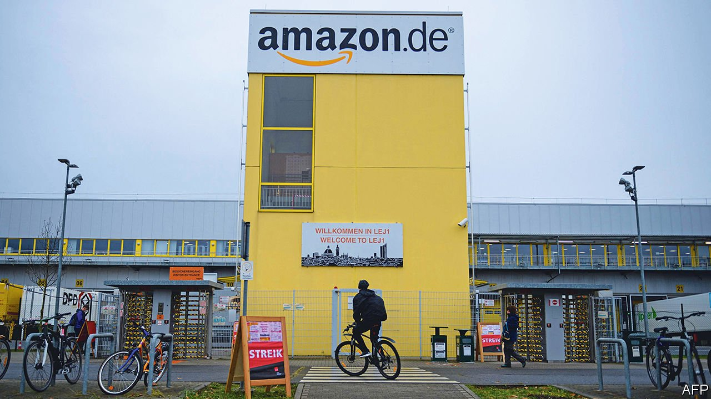

###### Strike season

# A big German union fights to preserve national pay standards 

##### But most Amazon workers are reluctant to join a strike 

 

> Nov 6th 2021 

FOR EIGHT CONSECUTIVE years ver.di, Germany’s second-biggest trade union, has called a strike during the pre-holiday season at Amazon’s fulfilment centres, the vast warehouses where packages are prepared for delivery. This year the tradition continued. Around 2,500 Amazon employees at seven centres walked out on November 2nd. The union warned that the strikes could continue up to Christmas.

Ver.di demands an“immediate” salary increase of 3% this year, followed by 1.7% next year, in line with a collective labour agreement for the retail sector. Amazon is making heaps of money in Germany and cannot continue to “refuse wage increases that other companies in the sector pay”, says Orhan Akman of ver.di. Mr Akman vows not to give up as strikes in previous years yielded results. Union pressure forced Amazon to increase wages several times, he states.


The wider goal of the strike is the preservation of the Tarifvertrag, a periodic agreement between unions and bosses that sets wage levels for each industry. It is credited with playing a big part in Germany’s harmonious labour relations. Such “tariff” agreements have been eroded over the past couple of decades, especially in eastern Germany. Many firms in service industries in particular no longer adhere to them.

“Amazon is an excellent employer without the tariff agreement,” insists Michael Schneider, a company spokesman. In the summer Amazon raised pay for all employees to at least €12 ($14) an hour—the minimum wage is €9.60. After two years workers earn on average €2,750 a month.Half of its 19,000 employees have worked at Amazon for over five years and seem unwilling to walk out.

Amazon is hiring an additional 10,000 temporary employees for the busy Christmas season in its second-biggest market.The company says it can fulfil all orders in spite of the strikes. In likelihood this year’s industrial action will end like the others every year since 2013 with Amazon making some concession. But by not adhering to the Tarifvertrag, the company is further chipping away at wage agreements both for the retail industry and Germany as a whole. ■

For more expert analysis of the biggest stories in economics, business and markets, , our weekly newsletter.

